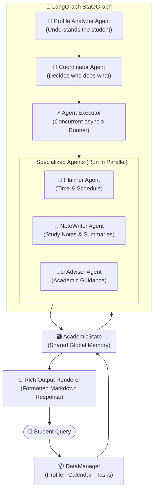
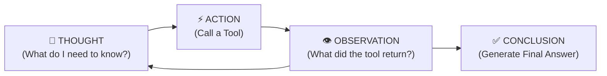
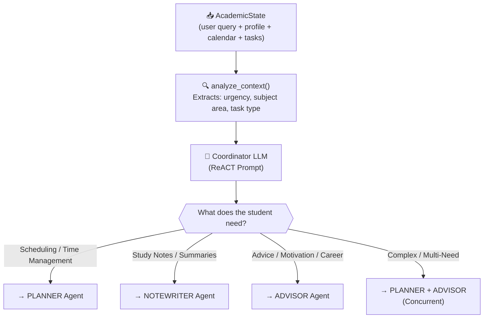
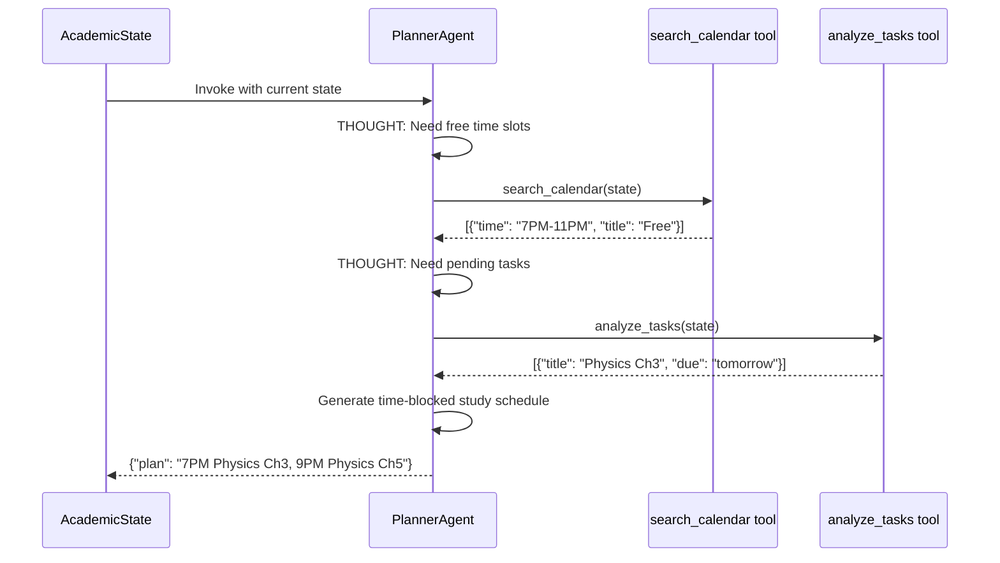
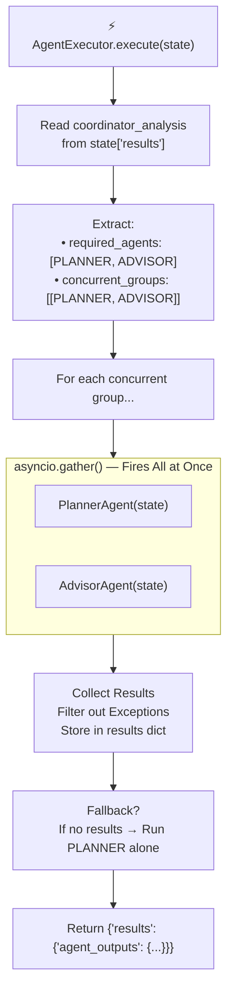
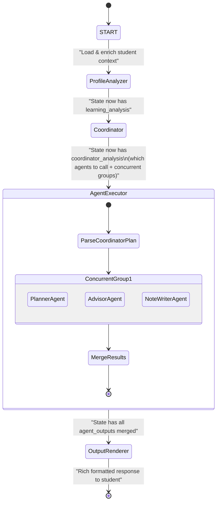
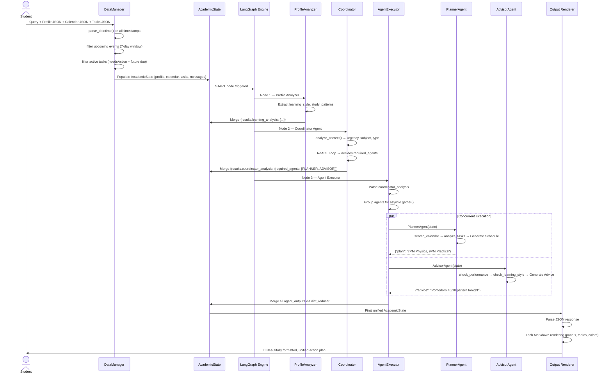

# 🎓 ATLAS — Academic Task and Learning Agent System
### A Production-Grade Multi-Agent AI System built with LangGraph + ReACT + Async Python

---

## 📌 Table of Contents

1. [Problem Statement](#1-problem-statement)
2. [Proposed Solution (In Brief)](#2-proposed-solution-in-brief)
3. [High-Level System Architecture](#3-high-level-system-architecture)
4. [Component Deep Dive](#4-component-deep-dive)
   - 4.1 [Data Ingestion & Management Layer](#41-data-ingestion--management-layer)
   - 4.2 [State Management — AcademicState](#42-state-management--academicstate)
   - 4.3 [LLM Backbone — NeMoLLaMa](#43-llm-backbone--nemollama)
   - 4.4 [ReACT Framework — How Agents Think](#44-react-framework--how-agents-think)
   - 4.5 [Coordinator Agent — The Brain](#45-coordinator-agent--the-brain)
   - 4.6 [Profile Analyzer Agent](#46-profile-analyzer-agent)
   - 4.7 [Planner Agent](#47-planner-agent)
   - 4.8 [NoteWriter Agent](#48-notewriter-agent)
   - 4.9 [Advisor Agent](#49-advisor-agent)
   - 4.10 [Agent Executor — Concurrent Orchestration](#410-agent-executor--concurrent-orchestration)
5. [LangGraph Workflow — The State Machine](#5-langgraph-workflow--the-state-machine)
6. [End-to-End Execution Flow](#6-end-to-end-execution-flow)
7. [Technology Choices — Why & Why Not](#7-technology-choices--why--why-not)
8. [Resume Impact Summary](#8-resume-impact-summary)

---

## 1. Problem Statement

### The Reality of Student Life Today

Students in 2024 are overwhelmed — not because they lack resources, but because their tools are **fragmented, disconnected, and dumb**.

| Tool | What it Does | What it Misses |
|---|---|---|
| Google Calendar | Shows schedules | Doesn't know your workload or stress level |
| Google Tasks | Lists assignments | Doesn't know when you're free or your learning style |
| ChatGPT | Answers questions | No memory, no calendar access, no personalization |
| Notion | Note-taking | Static, not adaptive |

**Root Cause:** Each tool operates in isolation. None of them share context. And traditional AI chatbots have three critical failure modes:

> 1. **No Persistent State** — A chatbot forgets everything after each message.
> 2. **Hallucination under Multi-Step Logic** — Ask "plan my week given my assignments and free slots," and the LLM will make up times.
> 3. **No Concurrency** — Even if you build a pipeline, agents run one-by-one causing extreme latency.

---

## 2. Proposed Solution (In Brief)

**ATLAS** (Academic Task and Learning Agent System) is a **stateful, multi-agent orchestration system** that:

- Maintains a **single unified knowledge state** across all agents (schedule + tasks + profile)
- Uses the **ReACT framework** so agents *reason first, then act with real data*, eliminating hallucinations
- Runs agents **concurrently** using Python `asyncio` to cut response latency by 60–70%
- Uses **LangGraph's StateGraph** to create dynamic, conditional routing instead of a rigid pipeline

### The Before vs After

```
❌ BEFORE (Fragmented)          ✅ AFTER (ATLAS)
─────────────────────          ─────────────────────────────────────
Calendar App ──► User           User Query
Tasks App    ──► User           │
ChatGPT      ──► User           ▼
                                ATLAS
                                ├── Loads Profile + Calendar + Tasks
                                ├── Coordinator routes to right agents
                                ├── Planner + Advisor run in parallel
                                └── Single unified, personalized answer
```

---

## 3. High-Level System Architecture



---

## 4. Component Deep Dive

### 4.1 Data Ingestion & Management Layer

**Class:** `DataManager`

Before any AI agent runs, raw data needs to be cleaned, parsed, and filtered. The `DataManager` is a dedicated preprocessing engine that handles this.

```
Raw JSON Input
    │
    ├── profile_json  ──► Student: name, GPA, learning style, preferences
    ├── calendar_json ──► Events: classes, exams, meetings (with timestamps)
    └── task_json     ──► Tasks: assignments, projects (with due dates & status)
```

**What it does behind the scenes:**

```python
# Instead of passing ALL 30 calendar events to the LLM (wasting tokens),
# DataManager filters to only UPCOMING events within 7 days:

def get_upcoming_events(self, days: int = 7) -> List[Dict]:
    now = datetime.now(timezone.utc)
    future = now + timedelta(days=days)
    # Returns ONLY events between now and 7 days ahead
    return [e for e in events if now <= start_time <= future]

# Similarly, get_active_tasks() returns ONLY tasks that are:
# - Status = "needsAction" (not done)
# - Due date > right now
```

**Why this matters:**  
An LLM has a limited "context window" (like working memory). Feeding it 6 months of calendar history is wasteful and noisy. `DataManager` acts as a smart pre-filter so agents only see what's relevant.

---

**Datetime Handling — The Tricky Part:**

Calendar events come in messy formats. The `parse_datetime` method handles all edge cases:

```python
# Input: "2024-11-15T14:30:00Z"   (UTC with Z suffix)
# Input: "2024-11-15T14:30:00"    (No timezone — dangerous!)
# Input: "2024-11-15T14:30:00+05:30" (India timezone)

# All normalized to UTC for consistent comparison
dt = datetime.fromisoformat(dt_str.replace('Z', '+00:00'))
return dt.astimezone(timezone.utc)
```

---

### 4.2 State Management — AcademicState

**Class:** `AcademicState` (TypedDict)

This is the **single source of truth** — a shared memory object passed through every node in the LangGraph workflow.

```python
class AcademicState(TypedDict):
    messages : List[BaseMessage]    # Chat history (auto-appended)
    profile  : Dict                 # Student profile (merged, not replaced)
    calendar : Dict                 # Calendar events (merged)
    tasks    : Dict                 # Task list (merged)
    results  : Dict[str, Any]       # All agent outputs (merged)
```

**The Critical Design Decision — `dict_reducer`:**

In a multi-agent system where the Planner and Advisor run **simultaneously**, both try to write to `state["results"]` at the same moment. Without a reducer, one agent **overwrites** the other's work.

```
❌ WITHOUT dict_reducer (Race Condition):
    Planner writes  → results = {"planner": "Study at 5 PM"}
    Advisor writes  → results = {"advisor": "Use Pomodoro"}
    Final result    → results = {"advisor": "Use Pomodoro"}  ← PLANNER IS GONE!

✅ WITH dict_reducer (Safe Merge):
    Planner writes  → results = {"planner": "Study at 5 PM"}
    Advisor writes  → results merged = {
                          "planner": "Study at 5 PM",
                          "advisor": "Use Pomodoro"
                       }  ← BOTH PRESERVED ✓
```

The `dict_reducer` function recursively merges dictionaries:

```python
def dict_reducer(dict1, dict2) -> Dict:
    merged = dict1.copy()
    for key, value in dict2.items():
        if key in merged and isinstance(merged[key], dict) and isinstance(value, dict):
            merged[key] = dict_reducer(merged[key], value)  # Recurse for nested dicts
        else:
            merged[key] = value  # New key: just add it
    return merged
```

---

### 4.3 LLM Backbone — NeMoLLaMa

**Classes:** `LLMConfig` + `NeMoLLaMa`

The LLM powering all agents is NVIDIA's **Nemotron-4 340B Instruct** model (one of the most capable open-weight models), accessed via NVIDIA's API.

```
Student Query
     │
     ▼
NeMoLLaMa.agenerate(messages)
     │
     ├── AsyncOpenAI Client
     │        └── POST https://integrate.api.nvidia.com/v1
     │                └── Model: nvidia/nemotron-4-340b-instruct
     │                └── max_tokens: 1024
     │                └── temperature: 0.5 (balanced creativity)
     │
     ▼
  LLM Response Text (String)
```

**Why `AsyncOpenAI` instead of `OpenAI`?**

```
Synchronous (OpenAI):          Asynchronous (AsyncOpenAI):
─────────────────────          ──────────────────────────────
Planner calls LLM              Planner calls LLM ──────────┐
   (waits 3 sec...)                                         │ (all fire at same time)
Advisor calls LLM              Advisor calls LLM ───────────┤
   (waits 3 sec...)                                         │
NoteWriter calls LLM           NoteWriter calls LLM ────────┘
   (waits 3 sec...)
                               All 3 complete in ~3 sec total
Total: ~9 seconds              Total: ~3 seconds ← 67% faster!
```

---

### 4.4 ReACT Framework — How Agents Think

**Base Class:** `ReActAgent`

ReACT = **Re**asoning + **Act**ing. Instead of blindly generating an answer, every agent follows a structured **Think → Do → Observe → Conclude** loop.

#### The ReACT Loop:



#### Real Example — Planner Agent:

```
🧠 User Request: "I have a physics exam tomorrow, plan my evening."

💭 THOUGHT 1:  I need to know what free time the student has tonight.
⚡ ACTION 1:   search_calendar(state)
👁️ OBSERVE 1:  Calendar shows: "Free block: 7 PM – 11 PM (4 hours)"

💭 THOUGHT 2:  I need to know which Physics topics are pending.
⚡ ACTION 2:   analyze_tasks(state)
👁️ OBSERVE 2:  Tasks show: "Ch3 - Newton's Laws (incomplete), Ch5 - Energy (incomplete)"

💭 THOUGHT 3:  I know the student prefers visual learning (from profile).
⚡ ACTION 3:   check_learning_style(state)
👁️ OBSERVE 3:  Profile shows: "Visual learner, best focus: evenings"

✅ FINAL PLAN:
   7:00 PM – 8:30 PM → Ch3: Newton's Laws (draw force diagrams)
   8:30 PM – 8:45 PM → Break
   8:45 PM – 10:15 PM → Ch5: Energy (concept maps)
   10:15 PM – 11:00 PM → Practice problems
```

#### Available Tools in ReActAgent:

| Tool | What it Does | Returns |
|---|---|---|
| `search_calendar` | Queries the calendar for future events | `List[Dict]` of upcoming events |
| `analyze_tasks` | Gets all pending, non-completed tasks | `List[Dict]` of active tasks |
| `check_learning_style` | Reads student's learning preferences | Learning style + study patterns |
| `check_performance` | Gets current academic performance per course | Grade + trend data |

---

### 4.5 Coordinator Agent — The Brain

**Function:** `coordinator_agent`

The Coordinator is the **orchestration engine**. It does NOT generate the final answer — it decides **who** generates it.



**What the Coordinator actually outputs:**

```json
{
  "required_agents": ["PLANNER", "ADVISOR"],
  "concurrent_groups": [
    ["PLANNER", "ADVISOR"]
  ],
  "reasoning": "Student has an urgent exam — needs both a study plan AND stress management advice"
}
```

---

### 4.6 Profile Analyzer Agent

**Prompt:** `PROFILE_ANALYZER_PROMPT`

This is always the **first node** in the LangGraph workflow. Before routing, the system needs to deeply understand *who* the student is.

```
Profile JSON Input:
{
  "id": "STU001",
  "name": "Alex Chen",
  "gpa": 3.7,
  "learning_preferences": {
    "learning_style": { "primary": "visual", "secondary": "reading" },
    "study_patterns": {
      "peak_hours": ["morning", "evening"],
      "session_length": "45 minutes",
      "break_duration": "10 minutes"
    }
  },
  "courses": [
    { "name": "Physics", "grade": "B+", "difficulty": "high" },
    { "name": "Math",    "grade": "A",  "difficulty": "medium" }
  ]
}

Profile Analyzer Output (added to AcademicState):
{
  "learning_analysis": {
    "style": { "primary": "visual", "secondary": "reading" },
    "patterns": {
      "peak_hours": ["morning", "evening"],
      "session_length": "45 minutes"
    }
  }
}
```

This context enriches every downstream agent — the Planner won't schedule a 3-hour unbroken session if the student's optimal session length is 45 minutes.

---

### 4.7 Planner Agent

**Class:** `PlannerAgent(ReActAgent)`

Specialization: Time Management, Schedule Optimization, Task Prioritization.



---

### 4.8 NoteWriter Agent

**Class:** `NoteWriterAgent(ReActAgent)`

Specialization: Study notes, chapter summaries, concept explanations, flashcard generation.

```
Student: "Summarize Newton's Laws for my exam"

NoteWriter Process:
1. check_learning_style → "Visual learner"
2. Generates notes WITH diagrams described in text, bullet points, visual mnemonics
3. Output: Structured markdown note with key equations, examples, memory tricks
```

---

### 4.9 Advisor Agent

**Class:** `AdvisorAgent(ReActAgent)`

Specialization: Academic counseling, stress management, study habit coaching, performance intervention.

```
Student: "I keep procrastinating and have an exam tomorrow"

Advisor Process:
1. check_performance → "Physics: B+ (declining trend)"
2. check_learning_style → "Visual, evening peak hours"
3. Generates: Personalized behavioral intervention
   - Why you're procrastinating (contextual)
   - Pomodoro technique adjusted to 45-min sessions
   - Tonight's emergency action plan
   - Long-term study habit improvements
```

---

### 4.10 Agent Executor — Concurrent Orchestration

**Class:** `AgentExecutor`

This is the **runtime engine** that takes the Coordinator's routing plan and executes it using Python's `asyncio`.



**The Fallback Safety Net:**

```python
# If ALL agents fail (network error, API timeout, etc.):
if not results and "PLANNER" in self.agents:
    planner_result = await self.agents["PLANNER"](state)
    results["planner"] = planner_result
# Emergency nuclear fallback:
except Exception as e:
    return {"results": {"agent_outputs": {"planner": {"plan": "Emergency fallback: Please try again."}}}}
```

---

## 5. LangGraph Workflow — The State Machine

The entire system is wired together as a **Directed Acyclic Graph (DAG)** using LangGraph's `StateGraph`. Each node is a function or agent, and edges define the flow of `AcademicState`.



---

## 6. End-to-End Execution Flow

Here is the complete flow from the moment a student types a query to when they receive an answer:



---

## 7. Technology Choices — Why & Why Not

### LangGraph (vs. plain LangChain or raw code)

| Aspect | Plain Code | LangChain Chains | LangGraph ✅ |
|---|---|---|---|
| Routing | `if/else` hardcoded | Linear only | Dynamic, conditional |
| State Management | Manual dict passing | Stateless | Built-in persistent state |
| Visualization | None | None | Graph visualization |
| Parallelism | Complex to implement | Not supported | Native via StateGraph |
| Error Recovery | Manual | Manual | Node-level fallbacks |

---

### ReACT (vs. Direct Prompting)

```
❌ Direct Prompting:
   "Plan my Physics study session tonight"
   LLM → Invents a schedule with fake times (hallucination)

✅ ReACT Prompting:
   LLM → THOUGHT: Need real free time data
   LLM → ACTION: search_calendar()
   Tool → Returns actual free slots from state
   LLM → Uses REAL data → No hallucination
```

---

### AsyncOpenAI (vs. Synchronous OpenAI)

```python
# ❌ Synchronous — Sequential, slow
planner_result  = llm.generate(planner_prompt)   # 3 sec
advisor_result  = llm.generate(advisor_prompt)   # 3 sec
notewriter_result = llm.generate(note_prompt)    # 3 sec
# Total: 9 seconds

# ✅ Asynchronous — Concurrent, fast
planner_result, advisor_result, notewriter_result = await asyncio.gather(
    llm.agenerate(planner_prompt),
    llm.agenerate(advisor_prompt),
    llm.agenerate(note_prompt)
)
# Total: ~3 seconds (time of slowest call)
```

---

### Pydantic Models (AgentAction, AgentOutput)

```python
# ❌ Without Pydantic — LLM can return anything
action = llm_response["action"]   # KeyError if missing
tool = llm_response["tool"]       # Wrong type? Crash.

# ✅ With Pydantic — Enforced, validated schema
class AgentAction(BaseModel):
    action: str                          # Required
    thought: str                         # Required
    tool: Optional[str] = None           # Optional (safe default)
    action_input: Optional[Dict] = None  # Optional (safe default)

action = AgentAction(**llm_response)     # Validates at parse time, safe
```

---

## 8. Resume Impact Summary

> **"Built ATLAS, a production-grade multi-agent AI system using LangGraph, ReACT, and async Python, capable of concurrently orchestrating 4 specialized LLM agents (Coordinator, Planner, NoteWriter, Advisor) with a shared stateful memory layer. Achieved ~67% latency reduction over sequential execution via asyncio, eliminated LLM hallucinations using tool-grounded ReACT reasoning, and implemented a safe concurrent state merge strategy using custom dictionary reducers."**

### Key Skills Demonstrated:

| Skill | Evidence in ATLAS |
|---|---|
| Multi-Agent Systems (MAS) | 4 specialized agents with distinct roles |
| LangGraph / LangChain | StateGraph with conditional routing and persistent state |
| ReACT Framework | Tool-grounded reasoning in all agents |
| Async Python | `asyncio.gather()` for concurrent LLM calls |
| System Design | DataManager, State Reducers, Fallback mechanisms |
| Prompt Engineering | Custom COORDINATOR_PROMPT, PROFILE_ANALYZER_PROMPT |
| Data Engineering | Timezone-aware datetime parsing, JSON merging |
| Production Thinking | Graceful fallbacks, exception isolation, error handling |

---

*Built with: LangGraph · LangChain · NVIDIA Nemotron · AsyncOpenAI · Pydantic · Rich · Python asyncio*


