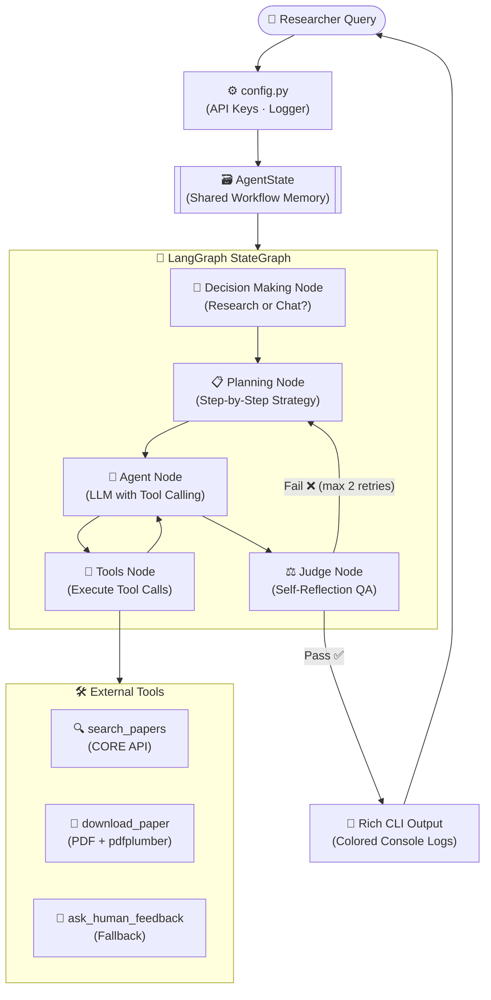
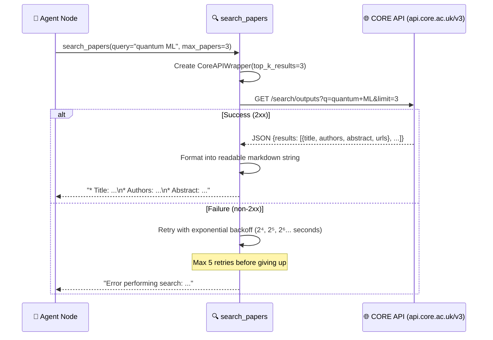
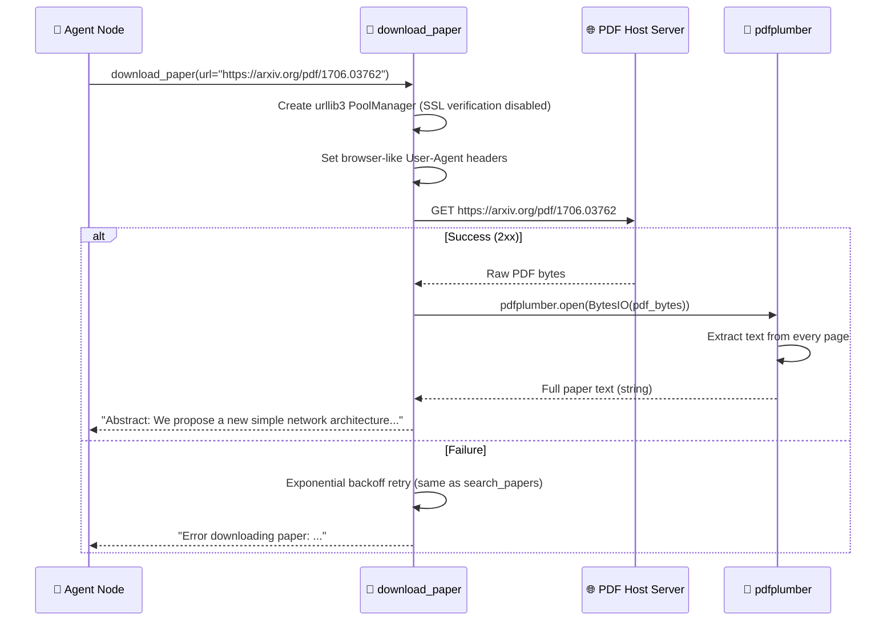
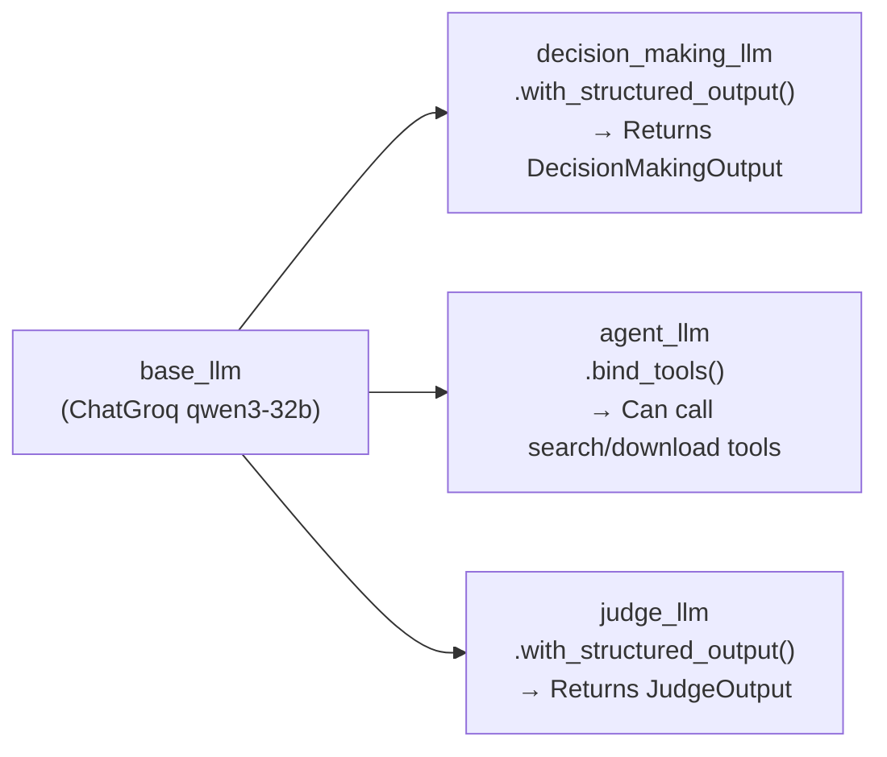
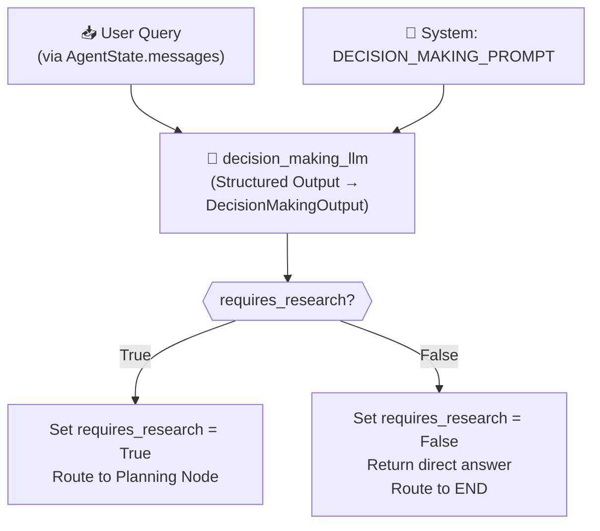
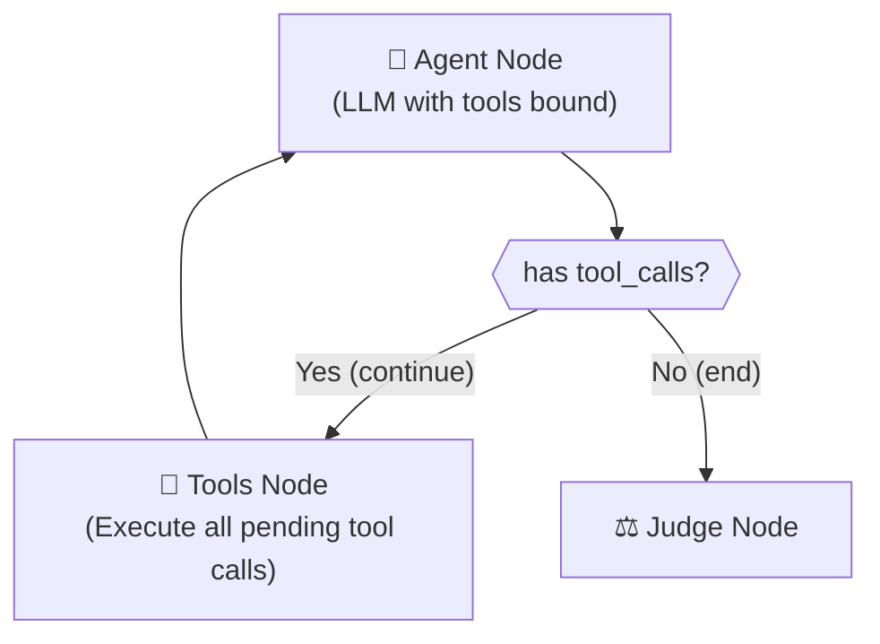
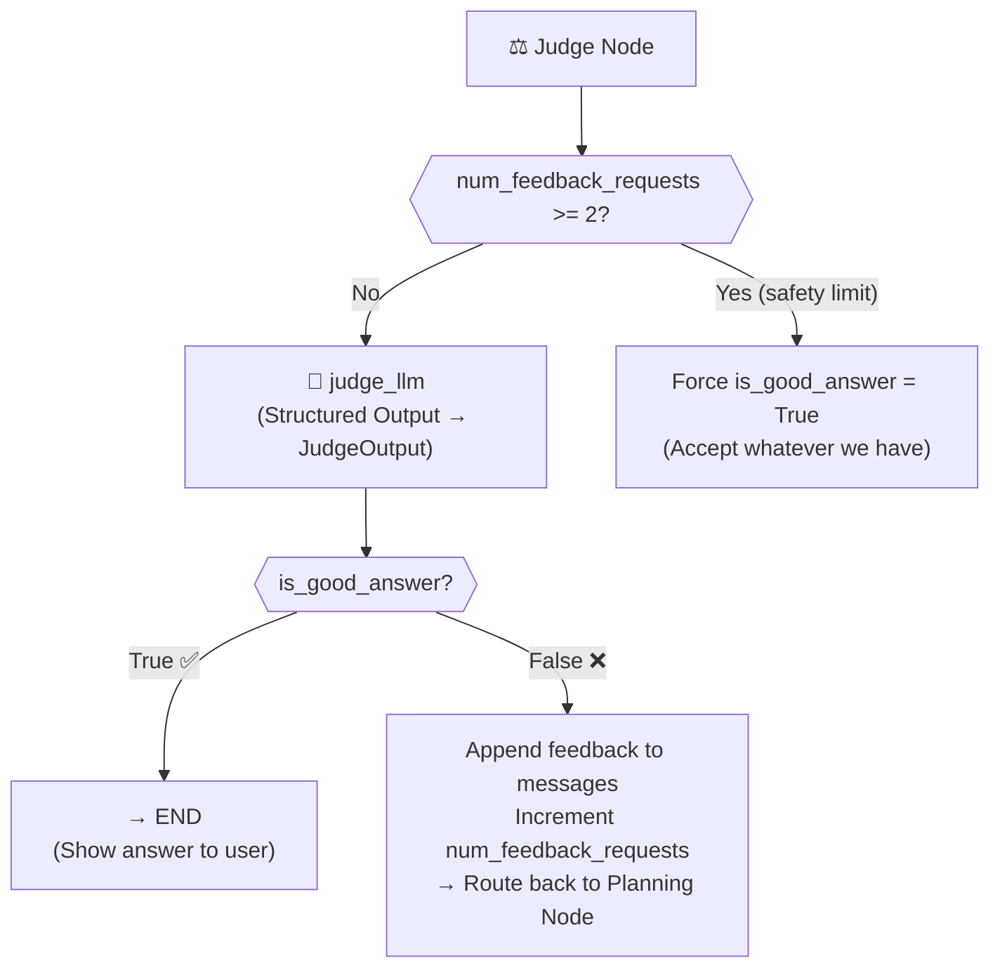
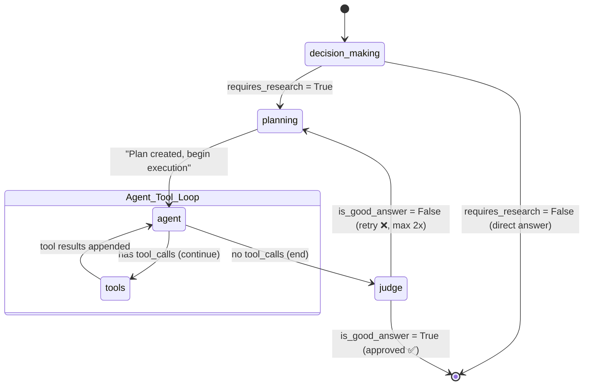
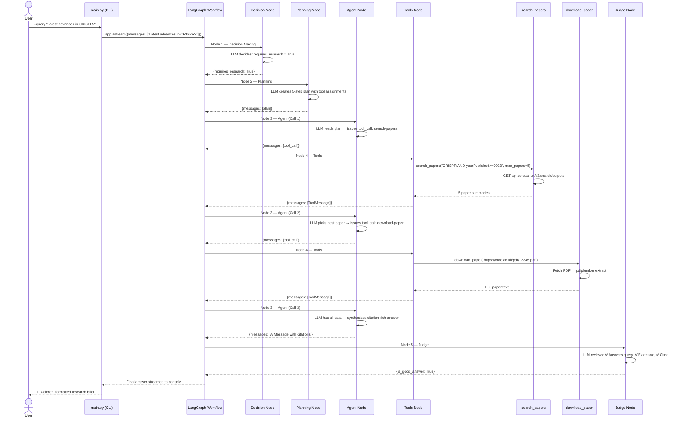

# 🔬 AI Research Assistant — Autonomous Literature Review Engine
### A Production-Grade Agentic AI System built with LangGraph + LangChain + Groq

---

## 📌 Table of Contents

1. [Problem Statement](#1-problem-statement)
2. [Proposed Solution (In Brief)](#2-proposed-solution-in-brief)
3. [High-Level System Architecture](#3-high-level-system-architecture)
4. [Component Deep Dive](#4-component-deep-dive)
   - 4.1 [Configuration & Environment Layer — config.py](#41-configuration--environment-layer--configpy)
   - 4.2 [State Management — AgentState](#42-state-management--agentstate)
   - 4.3 [Pydantic Models — Structured LLM Outputs](#43-pydantic-models--structured-llm-outputs)
   - 4.4 [Tool 1 — search_papers (CORE API Wrapper)](#44-tool-1--search_papers-core-api-wrapper)
   - 4.5 [Tool 2 — download_paper (PDF Extraction)](#45-tool-2--download_paper-pdf-extraction)
   - 4.6 [Tool 3 — ask_human_feedback (Fallback)](#46-tool-3--ask_human_feedback-fallback)
   - 4.7 [Prompt Engineering — The Four System Prompts](#47-prompt-engineering--the-four-system-prompts)
   - 4.8 [LLM Configuration — Groq with Structured Output & Tool Binding](#48-llm-configuration--groq-with-structured-output--tool-binding)
   - 4.9 [Decision Making Node](#49-decision-making-node)
   - 4.10 [Planning Node](#410-planning-node)
   - 4.11 [Agent Node & Tool Execution Loop](#411-agent-node--tool-execution-loop)
   - 4.12 [Judge Node — Self-Reflection & Quality Assurance](#412-judge-node--self-reflection--quality-assurance)
   - 4.13 [CLI Runner — main.py (Async Streaming)](#413-cli-runner--mainpy-async-streaming)
5. [LangGraph Workflow — The State Machine](#5-langgraph-workflow--the-state-machine)
6. [End-to-End Execution Flow](#6-end-to-end-execution-flow)
7. [Technology Choices — Why & Why Not](#7-technology-choices--why--why-not)
8. [Suggested Enhancements — To Stand Out](#8-suggested-enhancements--to-stand-out)
9. [Resume Impact Summary](#9-resume-impact-summary)

---

## 1. Problem Statement

### The Reality of Academic Research Today

Researchers in 2024 are drowning — not from lack of information, but from **too much of it**. Starting a new project or exploring a novel domain requires:

| Step | Manual Effort | Time |
|---|---|---|
| Formulate search queries | Trial-and-error across Google Scholar, PubMed, CORE | 1–2 hours |
| Scan titles & abstracts | Read 50–100 results, discard irrelevant ones | 2–4 hours |
| Download full-text PDFs | Navigate paywalls, broken links, CAPTCHAs | 1–2 hours |
| Read & extract key findings | Manually read 10–20 papers | 8–15 hours |
| Synthesize into a coherent summary | Cross-reference, resolve contradictions, cite | 4–8 hours |
| **Total** | | **16–31 hours** |

**Root Cause:** The tools available today have three critical failure modes:

> 1. **No Agency** — Google Scholar returns links, not answers. The user does ALL the cognitive work.
> 2. **No Quality Control** — ChatGPT will happily produce a polished paragraph with fabricated citations (hallucination).
> 3. **No Iterative Refinement** — If the first answer is bad, the user must manually re-prompt, re-search, and re-read.

---

## 2. Proposed Solution (In Brief)

**This AI Research Assistant** is a **stateful, self-correcting, agentic system** that:

- Maintains a **persistent conversation state** across all nodes (plan, search, download, judge)
- Uses **LangChain tool-calling** so the agent works with *real data from real APIs*, not hallucinated facts
- Employs a **Judge node (self-reflection)** that automatically catches bad answers and triggers re-planning — up to 2 retries
- Uses **LangGraph's StateGraph** for dynamic conditional routing instead of a rigid linear pipeline

### The Before vs After

```
❌ BEFORE (Manual)                    ✅ AFTER (AI Research Assistant)
──────────────────────                ───────────────────────────────────────
Researcher searches Google Scholar    User types one query
Researcher downloads 15 PDFs             │
Researcher reads for 2 days              ▼
Researcher writes notes              AI Research Assistant
Researcher synthesizes answer        ├── Decision: Is this a research task?
                                     ├── Plan: What papers do I need?
                                     ├── Search: Query CORE API
                                     ├── Download: Fetch & parse PDFs
                                     ├── Synthesize: Citation-rich answer
                                     ├── Judge: Is my answer good enough?
                                     │   └── No? → Re-plan & retry (max 2x)
                                     └── Final: Deliver verified answer
Total: 16–31 hours                   Total: ~2–5 minutes
```

---

## 3. High-Level System Architecture



---

## 4. Component Deep Dive

### 4.1 Configuration & Environment Layer — `config.py`

**File:** `src/config.py`

Before any LLM or API call happens, the system needs API keys and a logging infrastructure. `config.py` is the single source of truth for all configuration.

```python
# Load .env file into os.environ
load_dotenv()

# API Configurations — pulled from environment
CORE_API_KEY = os.environ.get("CORE_API_KEY", "")
GROQ_API_KEY = os.environ.get("GROQ_API_KEY", "")

# Centralized logger
logging.basicConfig(
    level=logging.INFO,
    format="%(asctime)s [%(levelname)s] %(name)s: %(message)s"
)
```

**Why this matters:**

```
❌ WITHOUT config.py:
   - API keys hardcoded in 5 different files
   - If one key rotates, you hunt across the entire codebase
   - No logging → silent failures → hours of debugging

✅ WITH config.py:
   - All keys in ONE .env file → change once, works everywhere
   - Structured logging → every node prints timestamped, leveled messages
   - Missing key? Warning at startup, not a cryptic crash at runtime
```

**Safety checks at import time:**

```python
if not CORE_API_KEY:
    logger.warning("CORE_API_KEY is not set. Tools relying on it may fail.")
if not GROQ_API_KEY:
    logger.warning("GROQ_API_KEY is not set. LLM calls will fail.")
```

This means the system **warns you before you waste 2 minutes** discovering the key is missing mid-workflow.

---

### 4.2 State Management — `AgentState`

**Class:** `AgentState` (TypedDict)

This is the **single source of truth** — a shared memory object that flows through every node in the LangGraph workflow.

```python
class AgentState(TypedDict):
    requires_research: bool                                     # Does this need research?
    num_feedback_requests: int                                  # How many times has Judge retried?
    is_good_answer: bool                                        # Did Judge approve?
    messages: Annotated[Sequence[BaseMessage], add_messages]    # Full conversation history
```

**The Critical Design Decision — `add_messages` Reducer:**

In a multi-step workflow, every node adds new messages (plans, tool results, LLM responses). Without a reducer, each node would **overwrite** the message history instead of **appending** to it.

```
❌ WITHOUT add_messages (Overwrite):
    Decision Node writes → messages = [DecisionMessage]
    Planning Node writes → messages = [PlanMessage]        ← Decision is GONE!
    Agent Node writes    → messages = [AgentMessage]        ← Plan is GONE!

✅ WITH add_messages (Append):
    Decision Node writes → messages = [DecisionMessage]
    Planning Node writes → messages = [DecisionMessage, PlanMessage]        ← All preserved ✓
    Agent Node writes    → messages = [DecisionMessage, PlanMessage, AgentMessage]  ← All preserved ✓
```

LangGraph's `add_messages` reducer is imported from `langgraph.graph.message` and applied via Python's `Annotated` type:

```python
messages: Annotated[Sequence[BaseMessage], add_messages]
```

This one line ensures the **entire conversation history** — including tool call results, judge feedback, and re-planning — is preserved end-to-end.

---

### 4.3 Pydantic Models — Structured LLM Outputs

**File:** `src/models.py`

LLMs return raw text by default. Without structure enforcement, parsing becomes fragile and error-prone.

#### `SearchPapersInput` — Tool Input Validation

```python
class SearchPapersInput(BaseModel):
    query: str = Field(description="The query to search for on the selected archive.")
    max_papers: int = Field(
        description="Max number of papers to return. Default 1, max 10.",
        default=1, ge=1, le=10
    )
```

**Why Pydantic here?**

```
❌ WITHOUT Pydantic:
    Agent calls search_papers(query="quantum ML", max_papers=500)
    → API returns 500 papers → context window overflow → LLM crashes

✅ WITH Pydantic (ge=1, le=10):
    Agent calls search_papers(query="quantum ML", max_papers=500)
    → Pydantic raises ValidationError BEFORE the API call
    → System recovers gracefully
```

#### `DecisionMakingOutput` — Structured Routing

```python
class DecisionMakingOutput(BaseModel):
    requires_research: bool = Field(description="Whether the query requires research or not.")
    answer: Optional[str] = Field(
        default=None,
        description="Direct answer if no research needed, else None."
    )
```

Instead of parsing free-text like `"I think this needs research because..."`, the LLM is **forced** to output a clean boolean + optional answer. This is achieved via Groq's `with_structured_output()` which uses function-calling under the hood.

#### `JudgeOutput` — Quality Gate

```python
class JudgeOutput(BaseModel):
    is_good_answer: bool = Field(description="Whether the answer is good or not.")
    feedback: Optional[str] = Field(
        default=None,
        description="Detailed feedback if the answer is not good. None if good."
    )
```

The Judge doesn't return vague prose — it returns a **boolean verdict** plus **actionable feedback** that gets appended to the message history for the next retry.

---

### 4.4 Tool 1 — `search_papers` (CORE API Wrapper)

**File:** `src/tools.py` — Class `CoreAPIWrapper` + function `search_papers`

This tool hooks into the **CORE API** (the world's largest collection of open-access research papers — 200M+ articles) to find relevant literature.



**The Retry Strategy — Exponential Backoff:**

```python
max_retries = 5
for attempt in range(max_retries):
    response = http.request('GET', url, ...)
    if 200 <= response.status < 300:
        return response.json()
    elif attempt < max_retries - 1:
        time.sleep(2 ** (attempt + 2))  # 4s, 8s, 16s, 32s
```

```
Attempt 1: Fails → wait 4 seconds
Attempt 2: Fails → wait 8 seconds
Attempt 3: Fails → wait 16 seconds
Attempt 4: Fails → wait 32 seconds
Attempt 5: Fails → raise Exception (give up)
```

**Why exponential backoff?** The CORE API has rate limits. Hammering it with immediate retries makes the problem worse. Exponential backoff gives the server breathing room and dramatically increases success rates on transient failures.

**Output Formatting:**

```python
# Each result is formatted as a structured markdown block:
f"* ID: {result.get('id', '')},\n"
f"* Title: {result.get('title', '')},\n"
f"* Published Date: {published_date_str},\n"
f"* Authors: {authors_str},\n"
f"* Abstract: {result.get('abstract', '')},\n"
f"* Paper URLs: {result.get('sourceFulltextUrls') or result.get('downloadUrl', '')}"
```

This structured format is critical — the LLM can now **extract the download URL** from the search results to call `download_paper` next.

---

### 4.5 Tool 2 — `download_paper` (PDF Extraction)

**Function:** `download_paper(url: str) -> str`

This tool takes a PDF URL found by `search_papers`, downloads the full document, and extracts raw text — all in memory, no files saved to disk.



**Why Browser-Like Headers?**

Many academic servers block non-browser requests. The tool mimics a real Chrome browser:

```python
headers = {
    'User-Agent': 'Mozilla/5.0 (Windows NT 10.0; Win64; x64) AppleWebKit/537.36 ...',
    'Accept': 'text/html,application/xhtml+xml,application/xml;q=0.9,*/*;q=0.8',
    'Accept-Language': 'en-US,en;q=0.5',
    'Accept-Encoding': 'gzip, deflate, br',
    'Connection': 'keep-alive',
}
```

```
❌ WITHOUT headers:
    Server sees: "Python-urllib/3.11" → 403 Forbidden

✅ WITH browser headers:
    Server sees: "Mozilla/5.0 Chrome/91.0" → 200 OK
```

**In-Memory PDF Parsing (No Disk I/O):**

```python
pdf_file = io.BytesIO(response.data)        # PDF bytes → in-memory file-like object
with pdfplumber.open(pdf_file) as pdf:       # Open without saving to disk
    text = ""
    for page in pdf.pages:
        extracted = page.extract_text()
        if extracted:
            text += extracted + "\n"
```

This avoids littering the filesystem with temporary PDFs and eliminates cleanup logic.

---

### 4.6 Tool 3 — `ask_human_feedback` (Fallback)

**Function:** `ask_human_feedback(question: str) -> str`

A safety net for situations where the agent encounters an unexpected error it can't recover from.

```python
@tool("ask-human-feedback")
def ask_human_feedback(question: str) -> str:
    """Ask for human feedback. Call this when encountering unexpected errors."""
    return input(f"\n[Agent Question] {question}\nYour feedback: ")
```

**When does this trigger?**

```
Agent: "I found a paper URL but it returns a 404. Should I try a different source?"
User: "Yes, try searching for the paper title directly on CORE"
Agent: (uses the feedback to re-plan)
```

This implements a **human-in-the-loop** pattern — the agent is autonomous 99% of the time but can gracefully escalate to a human when stuck.

---

### 4.7 Prompt Engineering — The Four System Prompts

**File:** `src/prompts.py`

Every node in the workflow has a carefully designed system prompt. These prompts are the **brains** of each node.

#### Prompt 1: `DECISION_MAKING_PROMPT`

```
Role:   "You are an experienced scientific researcher."
Task:   Decide if the user query requires research or can be answered directly.
Rules:  - Research needed → requires_research = True
        - Simple conversation ("how are you?") → answer directly
```

**Why a separate Decision Node?** Without it, the system would waste API calls searching for papers when the user says "Hello" or "Thanks".

#### Prompt 2: `PLANNING_PROMPT`

```
Role:   "You are an experienced scientific researcher."
Task:   Create a step-by-step plan to answer the research question.
Rules:  - Subtasks must NOT rely on assumptions or guesses
        - Each subtask must specify which external tool to use
        - If feedback from a previous attempt exists, incorporate it
Input:  Dynamically injected list of available tools + descriptions
```

The `{tools}` placeholder is filled at runtime using `format_tools_description()`:

```python
def format_tools_description(tools: list[BaseTool]) -> str:
    return "\n\n".join([
        f"- {tool.name}: {tool.description}\n Input arguments: {tool.args}"
        for tool in tools
    ])
```

This means if you add a new tool, the Planning prompt **automatically** knows about it.

#### Prompt 3: `AGENT_PROMPT`

```
Role:   "You are an experienced scientific researcher."
Task:   Execute the plan using your tools. Add extensive inline citations.
Extra:  Full CORE API query language reference embedded in the prompt:
        - Boolean operators (AND, OR)
        - Field lookups (yearPublished:2023, authors:Vaswani)
        - Range queries (yearPublished>=2020 AND yearPublished<=2024)
        - Exists queries (_exists_:abstract)
```

**Why embed the CORE query language in the prompt?**

```
❌ WITHOUT query language reference:
    Agent searches: "quantum machine learning recent papers"
    → Returns generic results from any year

✅ WITH query language reference:
    Agent searches: "quantum machine learning AND yearPublished>=2023 AND _exists_:abstract"
    → Returns only recent papers with abstracts → much higher quality
```

#### Prompt 4: `JUDGE_PROMPT`

```
Role:   "You are an expert scientific researcher."
Task:   Review the final answer for quality.
Criteria:
    ✅ Directly answers the user query (not a different topic)
    ✅ Answers extensively (not a one-liner)
    ✅ Incorporates any previous feedback
    ✅ Provides inline sources for every claim
If bad: → Provide clear feedback on what needs improvement
```

---

### 4.8 LLM Configuration — Groq with Structured Output & Tool Binding

**File:** `src/graph.py` (top section)

The project uses **one base LLM** (`qwen/qwen3-32b` via Groq) configured in **three different modes**:

```python
# 1. Base LLM — raw text generation (Planning Node)
base_llm = ChatGroq(model="qwen/qwen3-32b", temperature=0.0)

# 2. Structured Output — forces JSON schema (Decision & Judge Nodes)
decision_making_llm = base_llm.with_structured_output(DecisionMakingOutput)
judge_llm = base_llm.with_structured_output(JudgeOutput)

# 3. Tool-Bound — can call external tools (Agent Node)
agent_llm = base_llm.bind_tools(tools_list)
```



**Why `temperature=0.0`?**

Research synthesis requires **determinism and precision**. A high temperature would cause the LLM to "creatively" invent citations or rephrase findings incorrectly. `temperature=0.0` ensures the most probable (most factual) output every time.

**Why Groq?**

```
Provider     | Speed (tokens/sec) | Cost     | Open Models?
─────────────┼────────────────────┼──────────┼─────────────
OpenAI       | ~80                | $$$      | No
Anthropic    | ~60                | $$$      | No
Groq ✅      | ~500+              | Free/$   | Yes (Qwen, LLaMA)
```

Groq's custom LPU hardware delivers **6–8x faster inference** than GPU-based providers, which is critical when the system may need to do 5+ LLM calls per query (decision + plan + multiple agent calls + judge + potential retry).

---

### 4.9 Decision Making Node

**Function:** `decision_making_node(state: AgentState)`

The entry gatekeeper of the entire workflow.



**Real Examples:**

```
User: "Hello, how are you?"
→ DecisionMakingOutput(requires_research=False, answer="Hello! I'm doing well...")
→ Router → END

User: "What are the latest advancements in CRISPR gene editing?"
→ DecisionMakingOutput(requires_research=True, answer=None)
→ Router → Planning Node
```

---

### 4.10 Planning Node

**Function:** `planning_node(state: AgentState)`

Converts the user's research objective into a concrete step-by-step plan with tool assignments.

```python
system_prompt = SystemMessage(
    content=PLANNING_PROMPT.format(tools=format_tools_description(tools_list))
)
response = base_llm.invoke([system_prompt] + state["messages"])
```

**Real Example Output:**

```
User Query: "What are the latest advancements in quantum machine learning?"

📋 Planning Node Output:
Step 1: Use search-papers to find recent papers on "quantum machine learning AND yearPublished>=2023"
        with max_papers=5
Step 2: Review the abstracts and identify the 2–3 most relevant papers
Step 3: Use download-paper to download the full text of the most relevant papers
Step 4: Synthesize the findings into a comprehensive answer with inline citations
Step 5: Ensure every claim is supported by at least one citation from the downloaded papers
```

**The Feedback Loop:** If the Judge Node rejects the answer, the feedback message is appended to `state["messages"]`. When the Planning Node runs again, it sees:

```
[Previous Plan] → [Agent's Answer] → [Judge Feedback: "Missing citations for claims about quantum error correction"]
```

And generates a **new plan** that specifically addresses the feedback.

---

### 4.11 Agent Node & Tool Execution Loop

**Functions:** `agent_node(state)` + `tools_node(state)` + `should_continue(state)`

This is the **execution engine** — a ReACT-style loop where the LLM reasons, calls tools, observes results, and repeats until it has enough information to draft an answer.



**How the loop works in practice:**

```
🤖 Agent Call 1:
   LLM thinks: "I need to search for quantum ML papers"
   LLM outputs: tool_call = {name: "search-papers", args: {query: "quantum ML...", max_papers: 5}}
   → should_continue() returns "continue" → routes to Tools Node

🔧 Tools Node:
   Executes search-papers → returns 5 paper summaries with URLs
   Result stored as ToolMessage in state["messages"]
   → Routes back to Agent Node

🤖 Agent Call 2:
   LLM sees the 5 results, picks the best paper
   LLM outputs: tool_call = {name: "download-paper", args: {url: "https://..."}}
   → should_continue() returns "continue" → routes to Tools Node

🔧 Tools Node:
   Executes download-paper → returns full paper text
   → Routes back to Agent Node

🤖 Agent Call 3:
   LLM now has: plan + search results + full paper text
   LLM synthesizes a citation-rich answer
   LLM outputs: NO tool_calls (just content)
   → should_continue() returns "end" → routes to Judge Node
```

**Tools Node — Batch Execution:**

```python
def tools_node(state: AgentState):
    outputs = []
    for tool_call in state["messages"][-1].tool_calls:
        tool_result = tools_dict[tool_call["name"]].invoke(tool_call["args"])
        outputs.append(
            ToolMessage(
                content=json.dumps(tool_result),
                name=tool_call["name"],
                tool_call_id=tool_call["id"],
            )
        )
    return {"messages": outputs}
```

If the agent issues **multiple tool calls in one turn** (e.g., search two different queries simultaneously), the Tools Node executes ALL of them and returns ALL results at once.

---

### 4.12 Judge Node — Self-Reflection & Quality Assurance

**Function:** `judge_node(state: AgentState)`

Before the user sees any answer, the Judge LLM reviews it for quality. This is the system's **quality gate**.



**The Safety Cap — Why Max 2 Retries?**

```python
num_feedback_requests = state.get("num_feedback_requests", 0)
if num_feedback_requests >= 2:
    logger.warning("Reached max feedback requests. Ending judge_node.")
    return {"is_good_answer": True}
```

Without a cap, a perfectionist Judge could create an **infinite loop**:

```
❌ WITHOUT safety cap:
    Plan → Agent → Judge: "Not enough citations" → Plan → Agent → Judge: "Still not good" → ...
    (Never terminates)

✅ WITH safety cap (max 2):
    Plan → Agent → Judge: "Not enough citations"
    → Plan → Agent → Judge: "Still not perfect but acceptable"
    → If 2 retries reached: Force-accept → END
    (Always terminates within 3 passes max)
```

**Real Judge Feedback Example:**

```json
{
    "is_good_answer": false,
    "feedback": "The answer discusses quantum machine learning but does not include any inline citations from the papers that were downloaded. Please re-plan and ensure every factual claim references the specific paper (author, year) that supports it."
}
```

This feedback gets appended to `state["messages"]`, and the Planning Node sees it during the next iteration.

---

### 4.13 CLI Runner — `main.py` (Async Streaming)

**File:** `src/main.py`

The entry point uses **async streaming** to show real-time progress as each node completes.

```python
async def run_query(query: str):
    app = create_workflow()
    async for chunk in app.astream({"messages": [query]}, stream_mode="updates"):
        for node_name, updates in chunk.items():
            if messages := updates.get("messages"):
                for message in messages:
                    print(f"\033[95m[Node: {node_name}]\033[0m")
                    message.pretty_print()
```

**What the user sees in their terminal:**

```
--- Starting Research Task ---
Query: What are the latest advancements in quantum machine learning?

[Node: decision_making]  → "Research required."

[Node: planning]  → "Step 1: Search for papers..."

[Node: agent]  → tool_call: search-papers(query="quantum ML AND yearPublished>=2023")

[Node: tools]  → "* Title: Quantum Neural Networks for...\n* Authors: ..."

[Node: agent]  → tool_call: download-paper(url="https://...")

[Node: tools]  → "Abstract: We present a novel framework..."

[Node: agent]  → "Based on recent research, quantum machine learning has seen
                   significant advances in three key areas: [1] variational quantum
                   eigensolvers (Chen et al., 2023), [2] quantum kernel methods..."

[Node: judge]  → "Answer approved ✅"

--- Workflow Completed ---
```

**Color Coding:**
- `\033[96m` — Cyan for workflow start/end
- `\033[95m` — Magenta for node names
- `\033[93m` — Yellow for the query
- `\033[92m` — Green for completion
- `\033[91m` — Red for errors

**Error Handling:**

```python
try:
    asyncio.run(run_query(args.query))
except KeyboardInterrupt:
    print("\033[91mProcess interrupted by user.\033[0m")
    sys.exit(0)
except Exception as e:
    logger.error(f"Execution failed: {e}")
    sys.exit(1)
```

Graceful handling for Ctrl+C and unexpected crashes — no ugly stack traces for the user.

---

## 5. LangGraph Workflow — The State Machine

The entire system is wired together as a **cyclic state graph** using LangGraph's `StateGraph`.



**Graph Construction Code:**

```python
def create_workflow() -> CompiledStateGraph:
    workflow = StateGraph(AgentState)

    # Add all 5 nodes
    workflow.add_node("decision_making", decision_making_node)
    workflow.add_node("planning", planning_node)
    workflow.add_node("tools", tools_node)
    workflow.add_node("agent", agent_node)
    workflow.add_node("judge", judge_node)

    # Entry point
    workflow.set_entry_point("decision_making")

    # Conditional: Decision → Planning or END
    workflow.add_conditional_edges("decision_making", router,
        {"planning": "planning", "end": END})

    # Fixed: Planning → Agent
    workflow.add_edge("planning", "agent")

    # Fixed: Tools → Agent (return results)
    workflow.add_edge("tools", "agent")

    # Conditional: Agent → Tools (continue) or Judge (end)
    workflow.add_conditional_edges("agent", should_continue,
        {"continue": "tools", "end": "judge"})

    # Conditional: Judge → Planning (retry) or END (accept)
    workflow.add_conditional_edges("judge", final_answer_router,
        {"planning": "planning", "end": END})

    return workflow.compile()
```

**Key insight:** This is NOT a simple linear pipeline. It has:
- **2 conditional branch points** (Decision routing, Agent loop check)
- **1 cyclic loop** (Agent ↔ Tools)
- **1 feedback loop** (Judge → Planning for retry)

---

## 6. End-to-End Execution Flow

Complete flow from user input to final answer:



---

## 7. Technology Choices — Why & Why Not

### LangGraph (vs. Plain LangChain or Raw Code)

| Aspect | Raw Python | LangChain Chains | LangGraph ✅ |
|---|---|---|---|
| Routing | `if/else` hardcoded | Linear only | Dynamic, conditional edges |
| State | Manual dict passing | Stateless | Built-in persistent `TypedDict` |
| Loops | Manual `while` | Not supported | Native cyclic graphs |
| Retry Logic | Manual implementation | Not built-in | Judge → Planning feedback loop |
| Visualization | None | None | Graph visualization & debugging |

---

### Structured Output (vs. Free-Text Parsing)

```
❌ Free-Text Parsing:
    LLM returns: "I believe this query requires research because..."
    Code: response.split("because")[0].strip().endswith("research")  ← Fragile!

✅ Structured Output (with_structured_output):
    LLM returns: {"requires_research": true, "answer": null}
    Code: response.requires_research  ← Clean, typed, validated!
```

---

### CORE API (vs. Google Scholar, Semantic Scholar)

| Aspect | Google Scholar | Semantic Scholar | CORE ✅ |
|---|---|---|---|
| Open Access | Mixed | Mixed | 200M+ open-access papers |
| Official API | No (scraping only) | Yes (limited) | Yes (full REST API) |
| PDF Access | Indirect | Indirect | Direct download URLs |
| Query Language | Basic | Basic | Advanced (boolean, field, range) |
| Rate Limits | Aggressive | Moderate | Generous (free tier) |

---

### pdfplumber (vs. PyPDF2, PyMuPDF)

```
Library      | Text Quality | Table Extraction | Speed    | Reliability
─────────────┼──────────────┼──────────────────┼──────────┼────────────
PyPDF2       | Poor         | None             | Fast     | Low
PyMuPDF      | Good         | Basic            | Fast     | Medium
pdfplumber ✅ | Excellent    | Built-in         | Medium   | High
```

`pdfplumber` was chosen for its **superior text extraction quality** on academic papers, which often have complex layouts (two-column, equations, footnotes).

---

### Groq + Qwen3-32B (vs. OpenAI GPT-4, Anthropic Claude)

```
Provider     | Model          | Speed (tok/s) | Function Calling | Cost
─────────────┼────────────────┼───────────────┼──────────────────┼──────
OpenAI       | GPT-4          | ~80           | ✅               | $$$
Anthropic    | Claude 3       | ~60           | ✅               | $$$
Groq ✅      | Qwen3-32B      | ~500+         | ✅               | Free/$
```

Groq's LPU hardware delivers **6–8x faster inference**, critical for a multi-call workflow (5+ LLM calls per query).

---

## 8. Suggested Enhancements — To Stand Out

| Area | Enhancement | Impact |
|---|---|---|
| **Web UI** | Add a Streamlit/Gradio frontend with real-time node progress indicators | Makes it demo-ready and accessible to non-technical users |
| **Citation Export** | Generate BibTeX/RIS files automatically for every answer | Directly usable in LaTeX/Word academic workflows |
| **RAG + Vector Store** | Cache downloaded papers in FAISS/ChromaDB with embeddings | Eliminates re-downloading; enables cross-query knowledge accumulation |
| **Multi-Source Search** | Add arXiv, PubMed Central, Semantic Scholar alongside CORE | Increases literature coverage from 200M to 400M+ papers |
| **Persistent Memory** | Add LangGraph checkpointing (SQLite/Redis backend) | Resume interrupted research sessions; build long-term memory |
| **Evaluation Suite** | Automated tests comparing answers against gold-standard Q&A pairs | Measurable benchmarks for future model/prompt improvements |
| **Docker + CI/CD** | Dockerfile + GitHub Actions for reproducible builds and testing | Professional-grade DevOps; simplifies onboarding for collaborators |
| **PDF Table Extraction** | Use pdfplumber's table extraction for data-heavy papers | Captures quantitative results that text-only extraction misses |

---

## 9. Resume Impact Summary

> **"Built an AI Research Assistant — a production-grade, self-correcting agentic system using LangGraph, LangChain, and Groq that automates the entire academic literature review pipeline. Engineered a 5-node cyclic workflow (Decision → Planning → Agent/Tools Loop → Judge) with conditional routing, tool-grounded execution via the CORE API (200M+ open-access papers), and an automated self-reflection loop that catches low-quality answers and triggers iterative refinement (max 2 retries). Leveraged Pydantic structured outputs for type-safe LLM responses, pdfplumber for in-memory PDF extraction, and exponential-backoff retry strategies for robust API integration. Reduced literature-review turnaround from 16–31 hours (manual) to under 5 minutes."**

### Key Skills Demonstrated:

| Skill | Evidence in This Project |
|---|---|
| Agentic AI Systems | 5-node LangGraph workflow with cyclic tool-calling loop |
| LangGraph / LangChain | StateGraph with 3 conditional edge routers + persistent state |
| Tool-Grounded Reasoning | LLM uses real CORE API data, not hallucinated facts |
| Self-Reflection (Judge) | Automated quality gate with feedback-driven retry loop |
| Prompt Engineering | 4 specialized system prompts (Decision, Planning, Agent, Judge) |
| Structured Outputs | Pydantic models enforce typed, validated LLM responses |
| API Integration | CORE API wrapper with exponential backoff + browser-like headers |
| PDF Processing | In-memory PDF download + text extraction via pdfplumber |
| Async Python | asyncio-based CLI streaming for real-time node progress |
| Production Thinking | Safety caps, graceful error handling, centralized config/logging |

---

*Built with: LangGraph · LangChain · Groq (Qwen3-32B) · CORE API · pdfplumber · Pydantic · Python asyncio*
