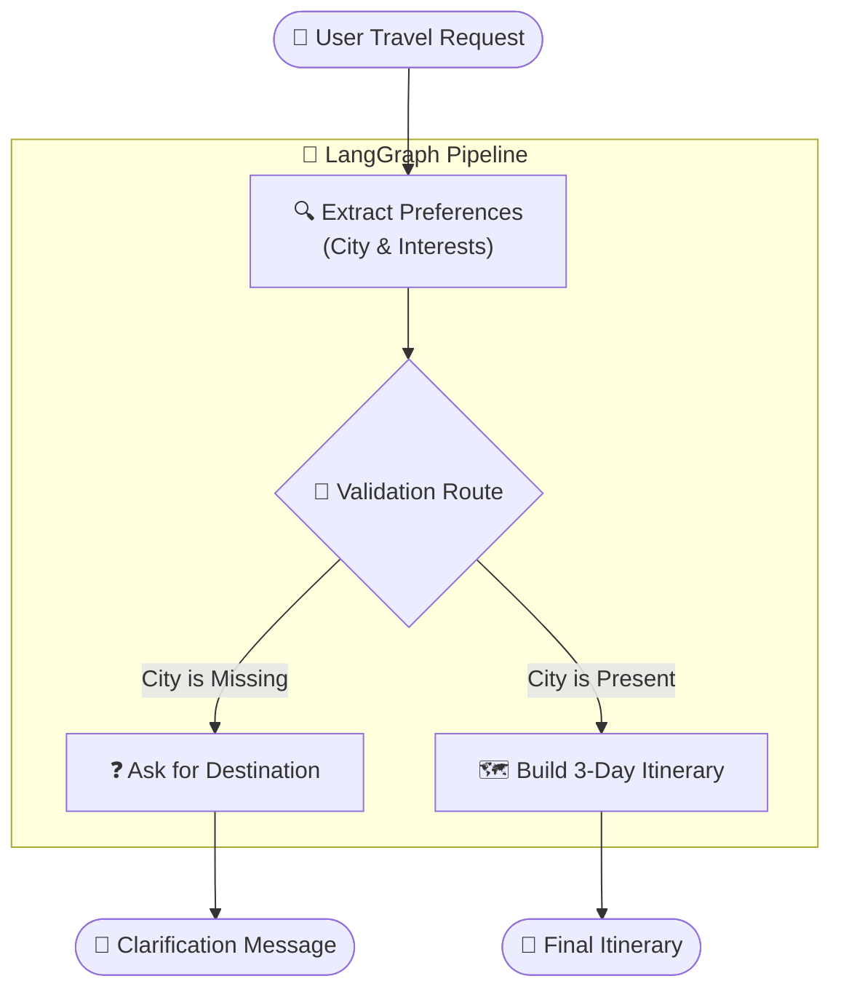
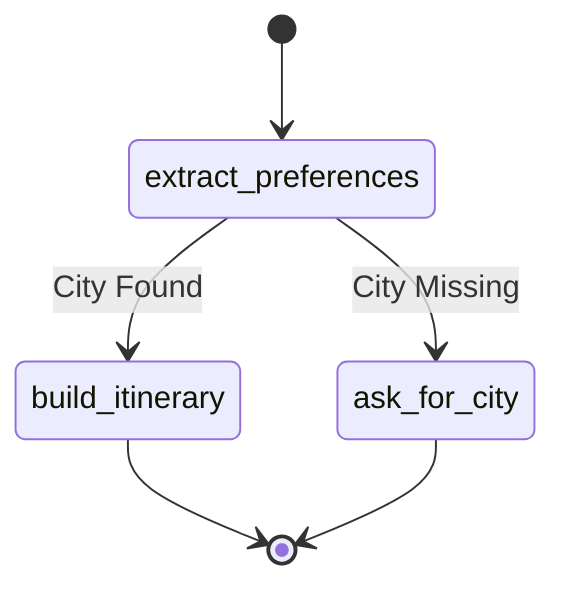

# 🌍 Travel Planner Agent
### An Automated, LangGraph-Powered Itinerary Generator

---

## 📌 Table of Contents

1. [Problem Statement](#1-problem-statement)
2. [Proposed Solution & Impact](#2-proposed-solution--impact)
3. [High-Level System Architecture](#3-high-level-system-architecture)
4. [Component Deep Dive](#4-component-deep-dive)
   - 4.1 [State Management — The Planner State](#41-state-management--the-planner-state)
   - 4.2 [Extraction Node](#42-extraction-node)
   - 4.3 [Conditional Routing (Data Validation)](#43-conditional-routing-data-validation)
   - 4.4 [Itinerary Generation](#44-itinerary-generation)
5. [LangGraph Workflow — The State Machine](#5-langgraph-workflow--the-state-machine)
6. [Technology Choices — Why & Why Not](#6-technology-choices--why--why-not)
7. [Future Enhancements](#7-future-enhancements)
8. [Resume Impact Summary](#8-resume-impact-summary)

---

## 1. Problem Statement

### The Complexity of Travel Planning
Planning a trip requires synthesizing a destination, personal interests, and logistical constraints. When users ask general-purpose chatbots to plan trips:
1. **Generic Responses:** If a user forgets to specify a destination, the bot either hallucinates a generic city or gives a vague, unhelpful response.
2. **Lack of Structure:** Standard LLMs often mix up the "understanding" phase with the "generation" phase, leading to itineraries that miss the user's core interests.
3. **Data Extraction Challenges:** In programmatic workflows, it is difficult to reliably extract structured JSON data (city, interests) from conversational natural language.

---

## 2. Proposed Solution & Impact

The **Travel Planner Agent** utilizes a multi-step LangGraph orchestration pipeline to decouple data extraction from content generation.

- **Extracts Preferences:** Parses the natural language query into structured JSON data (`city`, `interests`).
- **Validates Data:** Uses conditional routing to ensure a `city` was actually provided. If missing, it short-circuits to ask for clarification rather than hallucinating an itinerary.
- **Generates Tailored Content:** Uses the extracted, validated data to prompt a specialized itinerary generation node.

### Impact
- **Zero Hallucination on Missing Data:** Eliminates the risk of the LLM guessing a destination.
- **Hyper-Personalization:** By forcing the LLM to explicitly extract a list of `interests` first, the final itinerary generation node is tightly constrained to focus *only* on those interests.

---

## 3. High-Level System Architecture



---

## 4. Component Deep Dive

### 4.1 State Management — The Planner State

**Type:** `TypedDict`

The `PlannerState` holds the conversational history (`messages`), the structured data extracted by the agent (`city`, `interests`), and the final output (`itinerary`).

```python
class PlannerState(TypedDict):
    messages: List[BaseMessage]
    city: str
    interests: List[str]
    itinerary: str
```

### 4.2 Extraction Node

**Function:** `extract_preferences(state: PlannerState)`

This node acts as a Natural Language Understanding (NLU) parser. It reads the raw user message and forces the LLM to return a strict JSON payload containing the `city` and an array of `interests`. 

### 4.3 Conditional Routing (Data Validation)

**Function:** `route_preferences(state: PlannerState)`

This acts as a programmatic guardrail. 
```python
def route_preferences(state: PlannerState) -> str:
    if not state["city"]:
        return "ask_for_city"
    return "build_itinerary"
```
If the LLM failed to extract a city (e.g., the user just said "I like museums and food"), the workflow routes to a fallback node instead of trying to build a trip to nowhere.

### 4.4 Itinerary Generation

**Function:** `build_itinerary(state: PlannerState)`

A specialized generation node that takes the explicitly parsed `city` and `interests` strings and injects them into a highly specific travel-planning prompt.

---

## 5. LangGraph Workflow — The State Machine



---

## 6. Technology Choices — Why & Why Not

### Explicit Data Parsing vs End-to-End Generation
We could have simply passed the user's prompt directly to a single LLM call. However, by breaking it into `extract` -> `validate` -> `generate`, we ensure programmatic control. We can log analytics on popular destinations, easily inject database lookups between extraction and generation, and handle edge cases safely.

### JSON Output Parsing
The extraction node uses basic string manipulation (`json.loads`) to parse the LLM's output. In a stricter enterprise environment, this would be enhanced using LangChain's `StructuredOutputParser` or Pydantic models to guarantee schema adherence.

---

## 7. Future Enhancements

1. **API Integration (Flights & Hotels):**
   - *Enhancement:* Add a node between extraction and generation that queries real-time APIs (like Amadeus or Google Flights) to inject actual flight prices and hotel availability into the itinerary.
2. **Multi-Turn Conversational Memory:**
   - *Enhancement:* Right now the agent resets after every query. Modifying the graph to loop back and utilizing `checkpointing` would allow users to iteratively refine their itinerary ("Change day 2 to focus on parks").
3. **Structured Output Enforcement:**
   - *Enhancement:* Upgrade the extraction node to use OpenAI/Groq function calling (`with_structured_output`) paired with a Pydantic model to eliminate JSON parsing errors.

---

## 8. Resume Impact Summary

> **"Designed and implemented an automated Travel Planner Agent using LangGraph and LangChain. Architected a multi-step Natural Language Understanding (NLU) pipeline that safely extracts structured JSON entities (destination, interests) from unstructured conversational inputs. Implemented deterministic conditional routing to validate data presence, preventing LLM hallucinations and reducing erroneous API calls. The system generates hyper-personalized, context-aware itineraries using specialized generation prompts."**

### Key Skills Demonstrated:

| Skill | Evidence in System |
|---|---|
| **Data Extraction** | Prompting LLMs to return strict JSON and parsing the results programmatically. |
| **Pipeline Guardrails** | Using conditional routing to halt execution if critical data (city) is missing. |
| **Separation of Concerns** | Decoupling the "understanding" phase from the "generation" phase in LLM workflows. |
| **Prompt Engineering** | Dynamic prompt injection for highly tailored content generation. |
