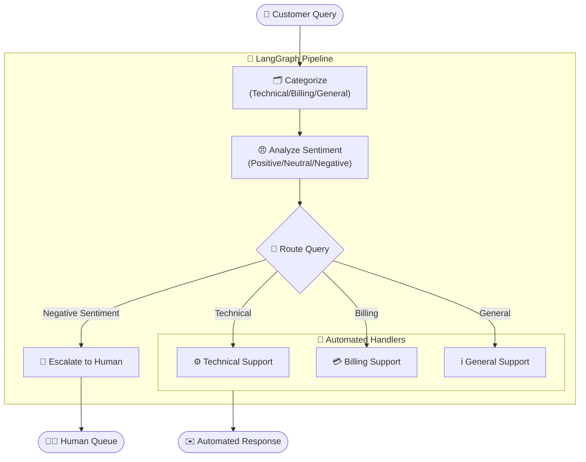
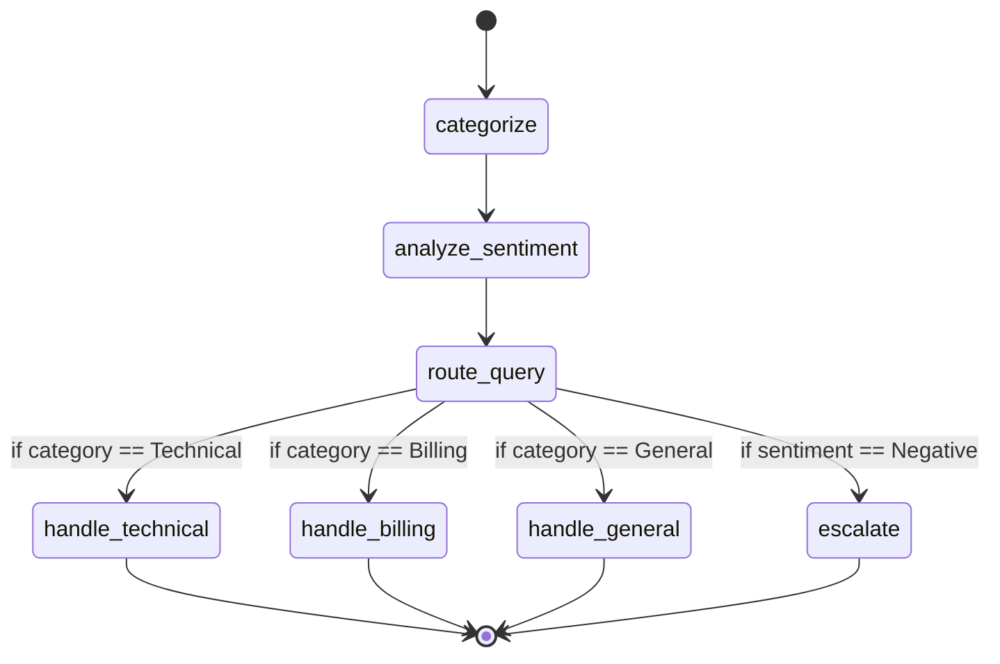

# 🎧 Customer Support Agent System
### An Automated, LangGraph-Powered Query Routing and Resolution Pipeline

---

## 📌 Table of Contents

1. [Problem Statement](#1-problem-statement)
2. [Proposed Solution & Impact](#2-proposed-solution--impact)
3. [High-Level System Architecture](#3-high-level-system-architecture)
4. [Component Deep Dive](#4-component-deep-dive)
   - 4.1 [State Management — The Query State](#41-state-management--the-query-state)
   - 4.2 [Categorization Node](#42-categorization-node)
   - 4.3 [Sentiment Analysis Node](#43-sentiment-analysis-node)
   - 4.4 [Conditional Routing Logic](#44-conditional-routing-logic)
   - 4.5 [Resolution Handlers & Escalation](#45-resolution-handlers--escalation)
5. [LangGraph Workflow — The State Machine](#5-langgraph-workflow--the-state-machine)
6. [Technology Choices — Why & Why Not](#6-technology-choices--why--why-not)
7. [Future Enhancements](#7-future-enhancements)
8. [Resume Impact Summary](#8-resume-impact-summary)

---

## 1. Problem Statement

### The Challenge of Customer Support Triage

Customer support teams face a high volume of incoming queries ranging from simple password resets to complex billing disputes or angry complaints. 

When humans manually triage these queries:
1. **High Latency:** Customers wait longer just to get routed to the right department.
2. **Burnout:** Support agents spend time answering repetitive questions instead of focusing on critical issues.
3. **Sentiment Blindness:** Angry or frustrated customers might be stuck in the queue along with general inquiries, increasing churn risk.
4. **Lack of Scalability:** During peak hours or outages, the queue grows exponentially, leading to missed SLAs (Service Level Agreements).

**Root Cause:** Lack of an intelligent, automated first line of defense that understands both the *topic* and the *emotion* behind a query before taking action.

---

## 2. Proposed Solution & Impact

The **Customer Support Agent System** is a LangGraph-powered orchestration pipeline that acts as an intelligent Level-1 support agent. It:

- **Categorizes** the incoming query into predefined domains (Technical, Billing, General).
- **Analyzes Sentiment** to detect frustration or negativity (Positive, Neutral, Negative).
- **Intelligently Routes** the query. If a customer is angry, it escalates to a human immediately. Otherwise, it routes to a specialized LLM handler for automated resolution.

### The Before vs After

```
❌ BEFORE (Manual Triage)       ✅ AFTER (LangGraph Automation)
───────────────────────       ─────────────────────────────────────
Customer Query                 Customer Query
      │                              │
      ▼                              ▼
Human Support Inbox            LangGraph System
(Waiting in queue)             ├── Categorizes topic
      │                        ├── Analyzes sentiment
      ▼                        ├── Escalates if negative
Routes to Tech/Billing         └── Auto-generates response if positive/neutral
```

### Impact
- **Reduced Resolution Time:** Instant responses for positive/neutral technical, billing, and general queries.
- **Improved Customer Satisfaction:** Angry customers bypass the regular queue and are immediately escalated to human agents, preventing further frustration.
- **Cost Efficiency:** Deflects a significant percentage of routine queries, freeing up human agents for complex, high-value problem-solving.

---

## 3. High-Level System Architecture



---

## 4. Component Deep Dive

### 4.1 State Management — The Query State

**Type:** `TypedDict`

Like the baton in a relay race, the `State` dictionary is passed through every node in the workflow. It holds the context of the customer interaction.

```python
class State(TypedDict):
    query: str        # The original message from the customer
    category: str     # Categorized as Technical, Billing, or General
    sentiment: str    # Evaluated as Positive, Neutral, or Negative
    response: str     # The final generated response or escalation note
```

### 4.2 Categorization Node

**Function:** `categorize(state: State)`

The first node simply reads the user's `query` and uses an LLM prompt to classify it. This ensures that technical questions go to the technical prompt, and billing goes to billing. This specialization reduces LLM hallucination and improves response accuracy.

### 4.3 Sentiment Analysis Node

**Function:** `analyze_sentiment(state: State)`

Running sequentially after categorization, this node reads the `query` to determine the customer's emotional state. 

> **Why this matters:** A query like *"Your billing system charged me twice, I'm furious and want a refund immediately!"* is a Billing issue, but treating it with an automated robot response might make the user angrier. The sentiment node catches the "Negative" emotion.

### 4.4 Conditional Routing Logic

**Function:** `route_query(state: State)`

This is the decision engine of the graph. It looks at the `state` populated by the first two nodes and decides where to go next.

```python
def route_query(state: State) -> str:
    # 🚨 Safety First: Angry customers go straight to a human
    if state["sentiment"] == "Negative":
        return "escalate"
    
    # 🤖 Otherwise, route to the correct specialized automated handler
    elif state["category"] == "Technical":
        return "handle_technical"
    elif state["category"] == "Billing":
        return "handle_billing"
    else:
        return "handle_general"
```

### 4.5 Resolution Handlers & Escalation

Once routed, the query lands in a specialized node:
- **`handle_technical` / `handle_billing` / `handle_general`:** These nodes use specialized prompts to generate a helpful, domain-specific response to the customer. Because the LLM knows the specific context, it can generate much more focused and relevant answers.
- **`escalate`:** Bypasses AI generation entirely and returns a hardcoded/system message indicating that the query has been escalated to a human agent due to negative sentiment.

---

## 5. LangGraph Workflow — The State Machine

The entire pipeline is built using LangGraph's `StateGraph`, enabling persistent state and clear routing edges.



---

## 6. Technology Choices — Why & Why Not

### LangGraph (vs. Plain LangChain Chains)

| Feature | `LLMChain` | LangGraph `StateGraph` ✅ |
|---|---|---|
| **Routing** | Rigid, requires complex `if/else` wrappers | Native conditional edges |
| **State** | Stateless between calls | Persistent, typed dictionary passed along |
| **Escalation** | Difficult to short-circuit chains | Easy to end workflow early via conditional edge |

### Separation of Concerns (Categorize then Sentiment)
Instead of asking the LLM to do everything at once in a massive prompt (*"Categorize this AND analyze sentiment AND write a response"*), we break it into **discrete nodes**. 
- **Pros:** Much higher accuracy, easier to debug, allows conditional branching *before* wasting tokens generating a response for an angry customer.

### LLM Provider
The system leverages `ChatGroq` (Qwen models) for rapid inference speeds, ensuring that the categorization and sentiment analysis happen almost instantly, keeping user latency low.

---

## 7. Future Enhancements

While the current version is highly functional, several features can be added to make it truly enterprise-grade:

1. **RAG Integration (Retrieval-Augmented Generation):**
   - *Current limitation:* Handlers generate responses based purely on LLM parametric knowledge.
   - *Enhancement:* Integrate a Vector DB (like Pinecone or Chroma) containing company FAQs and internal documentation so handlers generate factually grounded, company-specific answers.
2. **Multi-Turn Conversation Memory:**
   - *Enhancement:* Update the `State` to include `messages: List[BaseMessage]` to support back-and-forth conversations rather than single-shot queries.
3. **Advanced Escalation Handoff:**
   - *Enhancement:* When escalating, automatically summarize the issue and integrate with a ticketing system API (e.g., Zendesk, Jira Service Desk) to create a ticket with priority `HIGH`.
4. **Parallel Processing:**
   - *Enhancement:* Run `categorize` and `analyze_sentiment` simultaneously using Python `asyncio` to further cut down response latency.

---

## 8. Resume Impact Summary

> **"Developed a production-ready, multi-agent Customer Support Triage System using LangGraph and LangChain. Engineered a stateful orchestration pipeline that automatically categorizes incoming queries, performs sentiment analysis, and routes them to specialized LLM handlers or escalates angry customers to human agents. Designed a modular state machine architecture that improved triage accuracy, reduced latency, and demonstrated advanced LLM workflow orchestration using conditional routing."**

### Key Skills Demonstrated:

| Skill | Evidence in System |
|---|---|
| **Multi-Agent Orchestration** | LangGraph `StateGraph` with distinct nodes and conditional routing. |
| **Prompt Engineering** | Specialized prompts for categorization, sentiment analysis, and domain-specific handling. |
| **System Architecture** | Decoupling complex LLM tasks into discrete, debuggable steps. |
| **Business Logic Implementation** | Prioritizing sentiment (Negative) over category for escalation routing. |
| **AI Frameworks** | LangChain Core, LangGraph, ChatGroq. |

## 12. Interview Explanation Version

In modern customer service, support teams are frequently overwhelmed by high-volume, repetitive queries mixed with high-priority, emotionally charged complaints. The 'Static AI' or manual triage approach results in unacceptable latency, SLA breaches, and ultimately, customer churn, because these systems lack sentiment awareness and domain specialization. To solve this, I architected a LangGraph-powered Customer Support Triage System that acts as an intelligent Level-1 defense.

Technically, I decoupled the monolithic prompt approach into a modular state machine architecture. I designed a sequential flow where the incoming query is first categorized by domain (Technical, Billing, General) and then passed to a Sentiment Analysis node. Using LangGraph's conditional routing, the graph intelligently short-circuits the flow: if a negative sentiment is detected, it instantly escalates to a human agent queue; otherwise, it dynamically routes the state to a specialized LLM handler equipped with domain-specific context for automated resolution.

The resulting business value is a highly scalable, cost-efficient support pipeline. By instantly deflecting routine inquiries and reserving human bandwidth exclusively for frustrated or high-value customers, we significantly improved customer satisfaction scores, drastically reduced resolution latency, and optimized the operational overhead of the support center.
