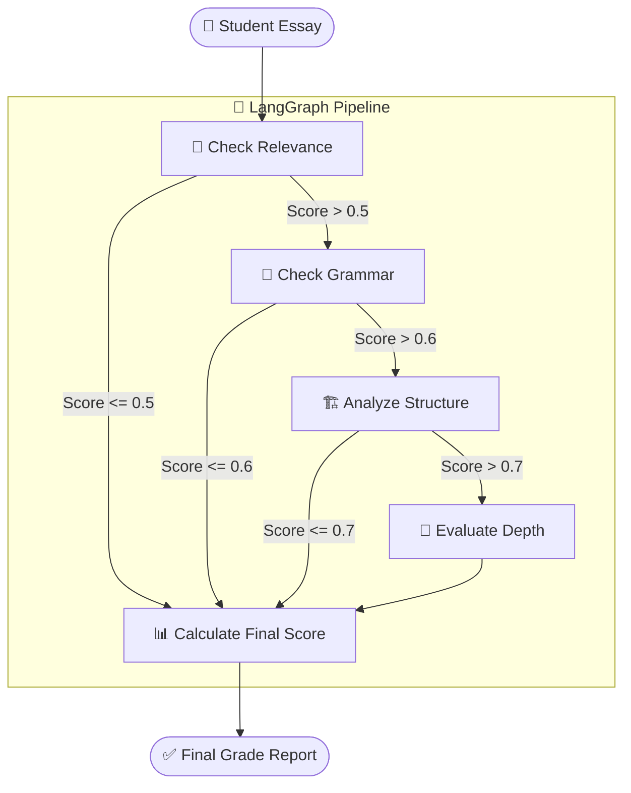
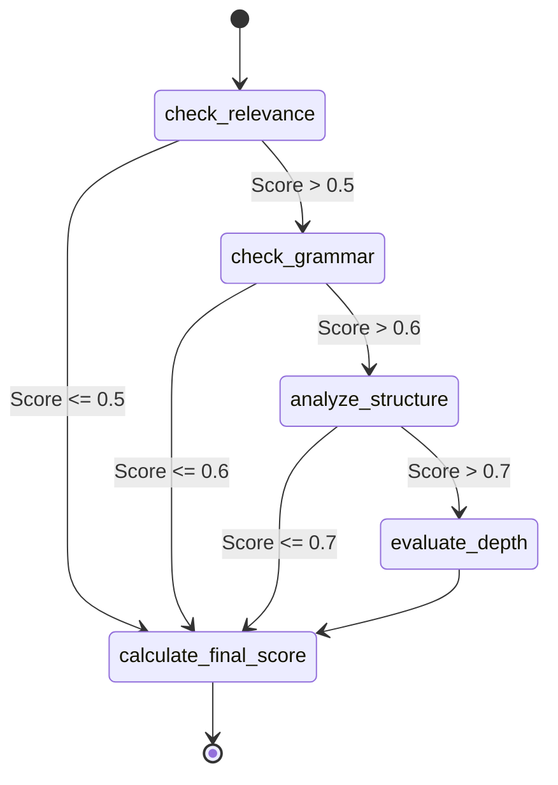

# 📝 Thesis & Essay Grading Agent
### An Automated, LangGraph-Powered Academic Evaluation Pipeline

---

## 📌 Table of Contents

1. [Problem Statement](#1-problem-statement)
2. [Proposed Solution & Impact](#2-proposed-solution--impact)
3. [High-Level System Architecture](#3-high-level-system-architecture)
4. [Component Deep Dive](#4-component-deep-dive)
   - 4.1 [State Management — The Grading State](#41-state-management--the-grading-state)
   - 4.2 [Sequential Evaluation Nodes](#42-sequential-evaluation-nodes)
   - 4.3 [Conditional Routing (Early Exit Logic)](#43-conditional-routing-early-exit-logic)
   - 4.4 [Final Score Calculation](#44-final-score-calculation)
5. [LangGraph Workflow — The State Machine](#5-langgraph-workflow--the-state-machine)
6. [Technology Choices — Why & Why Not](#6-technology-choices--why--why-not)
7. [Future Enhancements](#7-future-enhancements)
8. [Resume Impact Summary](#8-resume-impact-summary)

---

## 1. Problem Statement

### The Challenge of Academic Evaluation at Scale

Teachers, professors, and academic reviewers spend a massive amount of time grading essays and theses. 

When humans manually grade high-volume written submissions:
1. **High Latency:** Students wait days or weeks for feedback.
2. **Subjectivity & Inconsistency:** A grader might be harsher at the end of the day than at the beginning, leading to inconsistent scoring.
3. **Burnout:** Reading hundreds of essays is mentally exhausting, often reducing the quality and depth of the feedback provided.
4. **Inefficiency:** Graders spend time reading deeply flawed essays (e.g., totally off-topic or unreadable) that should be failed immediately, wasting time that could be spent giving nuanced feedback to better submissions.

**Root Cause:** Manual grading is an unscalable, sequential human process that lacks an automated mechanism to quickly filter and evaluate base-level requirements.

---

## 2. Proposed Solution & Impact

The **Thesis Grading Agent** is a LangGraph-powered orchestration pipeline that acts as an automated teaching assistant. It evaluates essays sequentially across four core dimensions:

- **Relevance (30% weight)**
- **Grammar (20% weight)**
- **Structure (20% weight)**
- **Depth of Analysis (30% weight)**

It features an **"Early Exit" mechanism**: If an essay performs disastrously on a foundational metric (e.g., completely off-topic), the pipeline skips the remaining rigorous checks and immediately assigns a final score.

### The Before vs After

```
❌ BEFORE (Manual Grading)       ✅ AFTER (LangGraph Automation)
───────────────────────        ─────────────────────────────────────
Student Essay                  Student Essay
      │                              │
      ▼                              ▼
Teacher reads whole essay      LangGraph System
      │                        ├── 1. Checks Relevance (Skip if < 50%)
      │                        ├── 2. Checks Grammar (Skip if < 60%)
      ▼                        ├── 3. Checks Structure (Skip if < 70%)
Teacher assigns score          └── 4. Evaluates Depth
(High time investment)               │
                                     ▼
                               Calculates Final Weighted Score
```

### Impact
- **Extreme Efficiency:** Instantly grades essays, providing real-time feedback to students.
- **Cost / Token Optimization:** The "Early Exit" logic prevents wasting expensive LLM API calls (checking "depth" or "structure") on essays that are completely off-topic or unreadable.
- **Objective Consistency:** Applies the exact same strict rubrics to the first essay and the thousandth essay.

---

## 3. High-Level System Architecture



---

## 4. Component Deep Dive

### 4.1 State Management — The Grading State

**Type:** `TypedDict`

The `State` holds the raw essay and accumulates the scores as the essay passes through the evaluation nodes.

```python
class State(TypedDict):
    essay: str
    relevance_score: float
    grammar_score: float
    structure_score: float
    depth_score: float
    final_score: float
```

### 4.2 Sequential Evaluation Nodes

Each node uses a focused LLM prompt to evaluate a single dimension. A regular expression utility (`extract_score`) parses the numeric score from the LLM's text explanation.

1. **`check_relevance`:** Does the essay address the prompt?
2. **`check_grammar`:** Is the syntax and spelling correct?
3. **`analyze_structure`:** Does it have a logical flow, introduction, and conclusion?
4. **`evaluate_depth`:** Does it demonstrate critical thinking and thorough analysis?

### 4.3 Conditional Routing (Early Exit Logic)

This is the optimization engine of the graph. We use `add_conditional_edges` to route the state.

```python
workflow.add_conditional_edges(
    "check_relevance",
    lambda x: "check_grammar" if x["relevance_score"] > 0.5 else "calculate_final_score"
)
```
If relevance is poor, there is no point in paying the API cost to evaluate structure or depth. The pipeline short-circuits straight to the end.

### 4.4 Final Score Calculation

**Function:** `calculate_final_score(state: State)`

A deterministic, mathematical node (no LLM involved) that applies a weighted formula to the accumulated scores:
`(Relevance * 0.3) + (Grammar * 0.2) + (Structure * 0.2) + (Depth * 0.3)`

---

## 5. LangGraph Workflow — The State Machine



---

## 6. Technology Choices — Why & Why Not

### LangGraph State Machine
Using LangGraph over standard functional Python code provides a rigid, visualizable, and fault-tolerant framework. The graph makes it trivial to insert new grading rubrics (e.g., "Check Plagiarism") as new nodes without refactoring nested `if/else` statements.

### "Chain of Thought" Scoring Prompt
The prompt demands: *"Your response should start with 'Score: [number]', then provide your explanation."*
- **Why?** Forcing the LLM to provide the score first, followed by the explanation, ensures predictable parsing while still generating the reasoning required for transparency.

### ChatGroq Integration
We use `ChatGroq` (Qwen models) for near-instantaneous inference, allowing a large essay to be processed through 4 complex LLM calls in seconds.

---

## 7. Future Enhancements

1. **Feedback Generation:**
   - *Enhancement:* Currently, the system drops the LLM's text explanation and only extracts the numeric score. We should update the `State` to store the text feedback (e.g., `grammar_feedback: str`) and present a comprehensive qualitative report alongside the numeric grade.
2. **Dynamic Rubric Ingestion:**
   - *Enhancement:* Allow teachers to upload a grading rubric PDF. A preliminary node would parse the rubric and dynamically adjust the LLM prompts and mathematical weights based on the teacher's specific criteria.
3. **Plagiarism / Hallucination Check Node:**
   - *Enhancement:* Add a node that uses web search tools or vector search to verify citations and check for AI-generated or plagiarized content before grading relevance.

### Architecture Diagram

```text
┌─────────────────────────────────────────────────────────────┐
│                       LANGGRAPH WORKFLOW                    │
│                                                             │
│                      ┌──────────────┐                       │
│                      │    START     │                       │
│                      └──────┬───────┘                       │
│                             │                               │
│                             ▼                               │
│                   ┌───────────────────┐                     │
│                   │  check_relevance  │                     │
│                   └─────────┬─────────┘                     │
│                             │                               │
│            ┌────────────────┴────────────────┐              │
│            │          (Score > 0.5?)         │              │
│            └──────┬───────────────────┬──────┘              │
│                   │                   │                     │
│                 [Yes]                [No]                   │
│                   │                   │                     │
│                   ▼                   │                     │
│                   ┌───────────────────┐                     │
│                   │   check_grammar   │                     │
│                   └─────────┬─────────┘                     │
│                             │                               │
│            ┌────────────────┴────────────────┐              │
│            │          (Score > 0.6?)         │              │
│            └──────┬───────────────────┬──────┘              │
│                   │                   │                     │
│                 [Yes]                [No]                   │
│                   │                   │                     │
│                   ▼                   │                     │
│                 ┌───────────────────┐                       │
│                 │ analyze_structure │                       │
│                 └─────────┬─────────┘                       │
│                           │                                 │
│          ┌────────────────┴────────────────┐                │
│          │          (Score > 0.7?)         │                │
│          └──────┬───────────────────┬──────┘                │
│                 │                   │                       │
│               [Yes]                [No]                     │
│                 │                   │                       │
│                 ▼                   │                       │
│                ┌──────────────────┐ │                       │
│                │  evaluate_depth  │ │                       │
│                └────────┬─────────┘ │                       │
│                         │           │                       │
│                         └─────┬─────┘                       │
│                               │                             │
│                               ▼                             │
│                    ┌───────────────────────┐                │
│                    │ calculate_final_score │◀───────────────┘
│                    └──────────┬────────────┘                │
│                               │                             │
│                               ▼                             │
│                         ┌───────────┐                       │
│                         │    END    │                       │
│                         └───────────┘                       │
└─────────────────────────────────────────────────────────────┘
```

---

## 8. Resume Impact Summary

> **"Built an automated Thesis and Essay Grading System utilizing LangGraph and LangChain. Engineered a 1.  **Sequential State Machine**: Grading works best when criteria are checked linearly. If relevance fails, grammar doesn't matter.
2.  **Score Thresholds**: Hardcoding threshold limits (`> 0.5`, `> 0.6`, `> 0.7`) prevented unnecessary API calls for objectively bad essays.
3.  **Modular Evaluation**: By separating grammar, structure, and depth, the final score becomes a weighted, transparent metric rather than a black-box guess from a single LLM prompt.

### Architecture Diagram

```text
┌─────────────────────────────────────────────────────────────┐
│                       LANGGRAPH WORKFLOW                    │
│                                                             │
│                      ┌──────────────┐                       │
│                      │    START     │                       │
│                      └──────┬───────┘                       │
│                             │                               │
│                             ▼                               │
│                   ┌───────────────────┐                     │
│                   │  check_relevance  │                     │
│                   └─────────┬─────────┘                     │
│                             │                               │
│            ┌────────────────┴────────────────┐              │
│            │          (Score > 0.5?)         │              │
│            └──────┬───────────────────┬──────┘              │
│                   │                   │                     │
│                 [Yes]                [No]                   │
│                   │                   │                     │
│                   ▼                   │                     │
│                   ┌───────────────────┐                     │
│                   │   check_grammar   │                     │
│                   └─────────┬─────────┘                     │
│                             │                               │
│            ┌────────────────┴────────────────┐              │
│            │          (Score > 0.6?)         │              │
│            └──────┬───────────────────┬──────┘              │
│                   │                   │                     │
│                 [Yes]                [No]                   │
│                   │                   │                     │
│                   ▼                   │                     │
│                 ┌───────────────────┐                       │
│                 │ analyze_structure │                       │
│                 └─────────┬─────────┘                       │
│                           │                                 │
│          ┌────────────────┴────────────────┐                │
│          │          (Score > 0.7?)         │                │
│          └──────┬───────────────────┬──────┘                │
│                 │                   │                       │
│               [Yes]                [No]                     │
│                 │                   │                       │
│                 ▼                   │                       │
│                ┌──────────────────┐ │                       │
│                │  evaluate_depth  │ │                       │
│                └────────┬─────────┘ │                       │
│                         │           │                       │
│                         └─────┬─────┘                       │
│                               │                             │
│                               ▼                             │
│                    ┌───────────────────────┐                │
│                    │ calculate_final_score │◀───────────────┘
│                    └──────────┬────────────┘                │
│                               │                             │
│                               ▼                             │
│                         ┌───────────┐                       │
│                         │    END    │                       │
│                         └───────────┘                       │
└─────────────────────────────────────────────────────────────┘
```put parsing to ensure consistent, objective grading at scale."**

### Key Skills Demonstrated:

| Skill | Evidence in System |
|---|---|
| **Pipeline Optimization** | Implementing 'Early Exit' conditional logic to save API costs. |
| **Output Parsing** | Using Regex to extract structured numeric data from unstructured LLM output. |
| **State Machine Design** | Utilizing LangGraph to build a multi-stage sequential evaluation flow. |
| **Algorithmic Scoring** | Combining deterministic mathematical weighting with probabilistic AI evaluation. |
| **Prompt Engineering** | Structuring prompts to evaluate specific rubrics (Relevance, Depth, Structure). |

## 12. Interview Explanation Version

One of the major bottlenecks in academic institutions is the sheer volume of essays that human graders must manually evaluate. The manual process is not only subjective and susceptible to grader fatigue but also highly inefficient, as reviewers often waste time thoroughly reading fundamentally flawed or completely off-topic submissions. To resolve this, I built an automated Thesis Grading Agent that functions as a highly scalable, objective teaching assistant.

To solve the efficiency problem, I engineered a sequential LangGraph state machine with a built-in 'Early Exit' conditional routing mechanism. Instead of pushing an entire essay through a massive, expensive LLM prompt, the system evaluates the text linearly across modular nodes (Relevance, Grammar, Structure, Depth). If an essay scores disastrously low on foundational metrics like Relevance, the LangGraph workflow mathematically short-circuits the evaluation, bypassing the expensive deeper analysis nodes and routing directly to the final score calculation.

The business impact is a highly optimized, cost-efficient grading pipeline that guarantees objective consistency. By instantly assigning grades to hundreds of essays while simultaneously reducing LLM token waste on off-topic submissions, we dramatically accelerated the feedback loop for students and entirely eliminated grader burnout, allowing educators to focus their energy on personalized, high-value student interventions.
