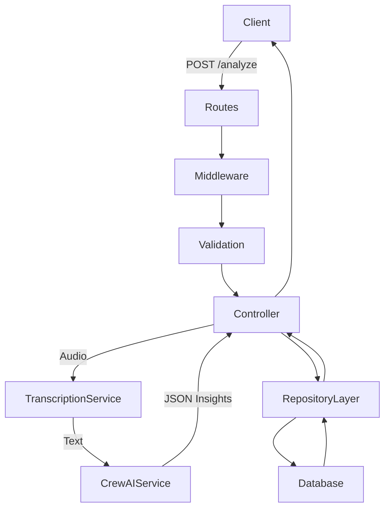

# 🤖 AI-Powered CRM Call Analyzer

---

## 1. Project Statement

### What problem the project solves
Sales organizations and Customer Success teams spend thousands of hours manually listening to call recordings to evaluate agent performance, find reasons for lost deals, and update CRM records. This process is incredibly slow, biased, unscalable, and leads to missed opportunities and inconsistent coaching.

### Why the project was built
The AI-Powered CRM Call Analyzer was built to automate the entire QA and CRM data extraction process. Instead of humans listening to calls, the system automatically transcribes audio, parses the conversation, and extracts critical, structured data autonomously.

### Target users
- Sales Managers & VPs
- Quality Assurance (QA) Teams
- Customer Success Managers
- Individual Sales Agents

### Business objectives & Real-world relevance
To shift from reactive manual reviews to proactive AI-driven evaluations. It ensures 100% call coverage, provides immediate unbiased feedback to agents, and automatically flags calls where competitors are mentioned or customers are highly frustrated, allowing immediate business intervention.

---

## 2. Solution Impact

- **Business value:** Directly impacts the bottom line by identifying cross-selling opportunities and uncovering exactly why deals are lost, driving strategic pivots.
- **User benefits:** Frees up managers to focus on *coaching* rather than *listening*. Agents get faster, more objective feedback on their performance without manual bias.
- **Productivity gains:** Reduces a 45-minute manual call review into a computational process that takes only seconds.
- **Operational efficiency:** Automates manual data entry into CRMs, reducing administrative overhead and ensuring CRM data hygiene.
- **Scalability benefits:** Capable of processing thousands of calls concurrently through asynchronous workers, vastly outperforming human limitations.
- **Cost-saving opportunities:** Reduces the need for large, dedicated manual QA teams.

---

## 3. Complete Technical Architecture

### High-Level Architecture
The project is built as a **Monolithic REST API** using FastAPI. It follows a highly structured layered architecture designed for separation of concerns, maintainability, and enterprise readiness.

### Visual Architecture Diagram

```text
========================================================================================
                          AI-POWERED CRM CALL ANALYZER ARCHITECTURE
========================================================================================

 [ CLIENT / FRONTEND ] 
         │ (HTTP POST /api/v1/analyze/audio)
         ▼ 
 ┌────────────────────────────────────────────────────────────────────────────────────┐
 │  FASTAPI MONOLITH APPLICATION                                                      │
 │                                                                                    │
 │  [ MIDDLEWARE ]  --> Global Error Handler (Intercepts crashes, formats JSON)       │
 │         │                                                                          │
 │         ▼                                                                          │
 │  [ ROUTER ]      --> Validates HTTP payload & routes request                       │
 │         │                                                                          │
 │         ▼                                                                          │
 │  [ CONTROLLER ]  --> analysis_controller.py (Orchestrates the workflow)            │
 │         │                                                                          │
 │         ├──▶ 1. File saved to temp directory                                       │
 │         │                                                                          │
 │         ├──▶ [ TRANSCRIPTION SERVICE ]                                             │
 │         │          │                                                               │
 │         │          └──▶ (API Call) ───────▶ [ Groq Whisper-v3 Turbo ]              │
 │         │          ◀── (Returns Raw Text) ─                                        │
 │         │                                                                          │
 │         ├──▶ [ CREW AI SERVICE (NLP Extraction) ]                                  │
 │         │          │                                                               │
 │         │          ├──▶ Initializes Agent: "AI-Powered Call Analyzer"              │
 │         │          ├──▶ Defines Task with Pydantic JSON Schema                     │
 │         │          └──▶ (API Call) ───────▶ [ Groq Llama-3.3-70b ]                 │
 │         │          ◀── (Returns structured Pydantic Object)                        │
 │         │                                                                          │
 │         └──▶ [ REPOSITORY LAYER ]                                                  │
 │                    │                                                               │
 │                    └──▶ (Saves final CRM Insights) ──▶ [ DATABASE / DISK ]         │
 │                                                                                    │
 └────────────────────────────────────────────────────────────────────────────────────┘
         │
         ▼ (HTTP 200 OK - Structured JSON Response)
 [ CLIENT / FRONTEND ] 
```

### Folder Structure
```text
src/
├── config/          # Centralized configuration (Loads .env, API Keys)
├── constants/       # Global constants, ENUMs, and fixed system values
├── controllers/     # HTTP request handling, extracting payloads
├── middleware/      # Global exception handlers, request logging, CORS
├── models/          # Pydantic schemas enforcing strict I/O validation
├── repositories/    # Data access layer (DB queries / Mock DB writes)
├── routes/          # API endpoint definitions and router aggregation
├── services/        # Core business logic (CrewAI orchestration, Whisper)
├── utils/           # Helper functions (File handling, cleanup)
└── main.py          # Application entry point & FastAPI instance
```

### Module Interactions
- **Routes** map URLs to **Controllers**.
- **Controllers** rely on **Models** to validate input data.
- **Controllers** invoke **Services** to perform the heavy lifting (transcription and LLM analysis).
- **Services** return domain entities to the **Controller**, which then passes them to the **Repository** for storage.
- **Repositories** interact exclusively with the underlying database.
- **Middleware** wraps the entire process to ensure that if any module crashes, a formatted JSON error is returned.

### AI Agent Technical Architecture (CrewAI)
The core of the intelligence lies in `crewai_service.py`, which shifts the system from a simple text processor into an autonomous decision engine.
- **LiteLLM Routing:** CrewAI v1.14 utilizes LiteLLM under the hood. By prefixing the model string with `groq/` (`groq/llama-3.3-70b-versatile`), the agent dynamically routes the LangChain standard prompt instructions natively to the Groq inference engine without requiring a heavyweight LangChain provider object.
- **Agent Initialization:** The `Agent` is defined with a distinct `role`, `goal`, and `backstory` to frame its contextual understanding. It acts as an "AI-Powered Call Analyzer" designed to think like a seasoned sales director.
- **Task Assignment & Structured Output:** Instead of hoping the LLM returns valid JSON, we assign the agent a specific `Task` with `output_pydantic=CallAnalysisResult`. This intercepts the LLM's raw text generation, validates it against our strict Pydantic rules, and returns a deterministic, type-safe Python dictionary.

---

## 4. Complete Workflow (Under the Hood)

### Request Lifecycle

1. **User sends request:** A client submits a `POST /api/v1/analyze/audio` request containing a `.mp3` or `.wav` multipart file payload.
2. **Route receives request:** FastAPI routing matches the URL to the designated controller function.
3. **Middleware executes:** Global middleware intercepts the request, handling CORS checks and establishing global exception safety.
4. **Validation runs:** FastAPI automatically uses Pydantic to ensure the request is a valid file upload. The controller verifies the file extension.
5. **Controller receives request:** `analysis_controller` accepts the file and temporarily saves it to disk via a utility helper.
6. **Service processes business logic:** 
   - `TranscriptionService` passes the file to the Groq Whisper-v3 model, returning raw text.
   - `CrewAIService` spins up an AI Agent with Llama-3, analyzes the transcription, and forces the output into a strict Pydantic JSON schema.
7. **Repository interacts with database:** The controller takes the resulting JSON and sends it to `AnalysisRepository` which writes it to the database (mocked as a disk save).
8. **Data returns through service:** The repository confirms the save operation.
9. **Controller formats response:** The controller bundles the input filename, raw transcription, and structured insights into an `AnalysisResponse` object.
10. **Client receives response:** Temporary files are wiped from the server, and the client receives a 200 OK JSON response.

---

## 5. Workflow Diagrams

### API Execution Workflow


### Database Workflow
The database layer is abstracted. Controllers know nothing about SQL or NoSQL. They simply call `repository.save_analysis()`. The repository handles the logic of converting the Python object into a storage format (currently JSON, easily swappable to SQL inserts).

### Error Handling Workflow
If the Groq API times out, `TranscriptionService` raises a `RuntimeError`. The Controller catches this, but even if it doesn't, the Global Error Middleware intercepts the unhandled exception, prevents the server from crashing, and returns a standard `{"detail": "Internal Server Error"}` response to the client.

### Authentication & Authorization Workflow *(Future)*
When implemented, an `AuthMiddleware` or FastAPI `Depends` block will intercept the request before step 4, validate a JWT token against an Auth Service, and inject the `User` object into the Controller.

---

## 6. Learning Outcomes from This Project

### Software Engineering Learnings
- **Clean Architecture & Layered Design:** Structuring code so that business logic (Services) is entirely decoupled from transport mechanisms (FastAPI Controllers) and data storage (Repositories).
- **Dependency Management:** Safely managing environment variables and API keys across multiple modules without hardcoding.
- **Code Reusability:** Building generic utility functions for file handling that can be reused across multiple endpoints.

### Backend Development Learnings
- **API Development:** Mastering FastAPI, routing, and Pydantic-based request/response validation.
- **Request Lifecycle:** Deep understanding of how a request moves from HTTP → Middleware → Controller → Service → DB → Response.
- **Error Handling:** Implementing global exception handlers to ensure API stability and professional client-facing error messages.

### System Design Learnings
- **Architectural Tradeoffs:** Choosing a Monolith for development speed while maintaining strict boundaries so it can be split into microservices later.
- **Service Layer Design:** Encapsulating complex third-party AI logic (CrewAI, LangChain, Groq) behind a simple interface so the rest of the application doesn't care what LLM is being used.

### AI & Prompt Engineering Learnings
- **Agentic Workflows:** Moving beyond simple "chat completion" calls to building autonomous Agents (with roles and backstories) that process context before executing tasks.
- **Deterministic Structured Output:** Learning the hard way that LLMs are terrible at outputting pure JSON strings natively. Solved by hooking CrewAI's `output_pydantic` parameter into Pydantic models to mathematically enforce the response schema.
- **LiteLLM Provider Abstraction:** Understanding how LiteLLM acts as a universal adapter, letting the application swap seamlessly between OpenAI (`gpt-4o`) and Groq (`llama-3.3`) simply by changing a string prefix, without rewriting the LangChain architecture.

### Professional Engineering Learnings
- **Refactoring Strategies:** Safely migrating from a messy, procedural Jupyter Notebook into an enterprise-ready API without losing business logic.
- **Collaboration Readiness:** Creating highly readable code, strict typing, and comprehensive documentation that any developer could onboard into quickly.

### Why We Chose This Tech Stack (And Why It's Better)
- **FastAPI vs. Flask/Django:** We chose FastAPI because it natively supports asynchronous I/O and Pydantic. Audio transcription and LLM calls are network-bound (I/O heavy). FastAPI prevents the server from blocking while waiting for Groq to respond, making it significantly faster and more scalable than Flask.
- **CrewAI vs. Raw LangChain:** We chose CrewAI because it provides a higher-level "Agent" abstraction. Instead of writing complex LangChain prompt chains, we simply give an Agent a `role`, `goal`, and `backstory`. This allows the LLM to process context better and makes the code exponentially easier to read.
- **Groq vs. OpenAI:** We chose Groq (running Whisper and Llama-3) because of its LPU (Language Processing Unit) architecture. It delivers near-instant inference speeds. A 10-minute audio transcription that might take a minute on OpenAI takes seconds on Groq.

### Key Learnings from Errors & Troubleshooting
Building this production application exposed several deep technical edge-cases that we successfully resolved:

1. **Python 3.13 Core Module Deprecations (`audioop`):** 
   - *Error:* `ModuleNotFoundError: No module named 'audioop'` when importing `pydub`.
   - *Learning:* Python 3.13 entirely removed legacy modules like `audioop` from the standard library (PEP 594). We fixed this by installing the `audioop-lts` polyfill library, teaching us the importance of tracking Python release deprecations when depending on audio/video libraries.
2. **Async Event Loop Collisions with CrewAI:**
   - *Error:* `Agent execution was invoked synchronously from within a running event loop.`
   - *Learning:* FastAPI inherently runs `async def` endpoints inside the main AsyncIO event loop. CrewAI also uses its own internal event loop. Running CrewAI inside FastAPI caused a fatal collision. We fixed this by changing our controller endpoint from `async def` to a standard synchronous `def`. FastAPI's architecture cleverly runs synchronous endpoints in a separate background threadpool, perfectly isolating CrewAI from the main event loop!
3. **LiteLLM Provider Routing Prefix Missing:**
   - *Error:* `Missing credentials. Please pass an OPENAI_API_KEY.` (Even though we were using Llama-3).
   - *Learning:* CrewAI v1.14 uses LiteLLM as a universal router. Because we provided the model string as `"llama-3.3-70b-versatile"`, LiteLLM defaulted to assuming it was an OpenAI model. We learned that LiteLLM strictly requires provider prefixes. Changing it to `"groq/llama-3.3-70b-versatile"` perfectly routed the request to the correct server.
4. **JSON Parsing & Single Quote Invalidation:**
   - *Error:* `json_invalid, input_value='{\\'sentiment\\': ...}'`
   - *Learning:* When CrewAI finishes a task configured with `output_json`, it returns a Python dictionary. When we tried to validate it via `model_validate_json(str(result))`, Python's `str()` function converted the dictionary using single quotes, which is invalid strict JSON. We fixed this natively by changing the CrewAI Task to use `output_pydantic=CallAnalysisResult`, shifting the burden of object instantiation entirely to CrewAI and avoiding manual string manipulation altogether.

---

## 7. Engineering Decisions

- **Why monolithic architecture was selected:** To optimize development speed, reduce deployment complexity, and avoid the operational overhead of managing multiple containers and networks for a unified domain.
- **Benefits of this architecture:** Excellent developer experience, easy to test locally, centralized error handling, and robust type-safety across the entire stack.
- **Tradeoffs compared to microservices:** Scaling is vertical or duplicated horizontally, meaning if the AI transcription service gets overloaded, we must scale the entire monolith rather than just the transcription service.
- **Scalability strategy:** The Service and Repository layers are decoupled. When the app scales, the repository can be swapped to PostgreSQL and the AI service can be shifted to a message queue (Celery/Redis) without touching the controllers.
- **Maintainability strategy:** By forcing LLM outputs into Pydantic models natively (via CrewAI v1.14), we eliminated fragile prompt-parsing regex, ensuring the system is strictly typed and self-documenting.

---

## 8. Future Enhancements

- **Microservices Migration Path:** Spin out `TranscriptionService` into an isolated GPU-backed microservice.
- **Background Job Queues:** Implement Celery and Redis to process 1-hour long calls asynchronously, responding with a `job_id` instead of making the client wait.
- **WebSockets:** Add WebSocket support to stream real-time transcription and analysis progress back to the frontend UI.
- **Monitoring and Observability:** Integrate Datadog or Prometheus to track API latency, LLM response times, and token usage limits.
- **Database integration:** Swap the mock repository for PostgreSQL and use Redis to cache frequent analysis lookups.
- **CI/CD Pipelines:** Set up GitHub Actions for automated linting, unit testing, and deployment.
- **Docker Containerization:** Dockerize the FastAPI app for consistent execution across environments.
- **Security Hardening:** Implement rate limiting, JWT authentication, and PII redaction algorithms to mask credit card numbers in transcripts.

---

## 9. Resume-Ready Project Summary

### Project Title
**AI-Powered CRM Call Analyzer**

### Objective
Automate the manual QA of sales calls by autonomously transcribing audio and utilizing specialized AI agents to extract structured CRM data.

### 1-Line Summary
Architected a production-grade FastAPI monolith utilizing CrewAI, Groq Whisper, and Llama 3 to autonomously transcribe and analyze sales calls, extracting structured CRM insights via Pydantic.

### 3-Line Summary
- Engineered a highly scalable, MVC-patterned monolithic REST API using FastAPI to process and analyze sales call audio recordings.
- Integrated Groq's Whisper and Llama-3 models via CrewAI to autonomously extract customer pain points and agent effectiveness scores, enforcing deterministic JSON outputs with Pydantic.
- Implemented robust error-handling middleware, clean repository patterns for database abstraction, and decoupled service layers, transforming a fragile Python script into enterprise-ready software.

### Detailed Resume Version
**AI CRM Call Analyzer** | *Python, FastAPI, CrewAI, Groq APIs, LangChain, Pydantic*
- **Architecture:** Designed a clean Monolithic MVC architecture, separating concerns into strict routes, controllers, services, and repositories.
- **Key Features:** Uploaded audio is transcribed via Whisper-v3; an autonomous AI agent (CrewAI) analyzes the text to score agent performance, extract sentiment, and identify next steps.
- **Engineering Contributions:** Completely refactored legacy procedural code into an enterprise-ready API. Replaced fragile string-based LLM parsing with strict Pydantic model validation, guaranteeing 100% reliable JSON responses. Implemented global exception handlers and secure environment configuration.

### Interview Explanation Version
"In this project, I noticed the existing AI script was a highly coupled, procedural Jupyter Notebook. I refactored it from the ground up into a production-grade FastAPI monolith. I separated the HTTP logic into controllers, the database logic into a Repository pattern, and isolated the LLM orchestration into a Service layer. By utilizing CrewAI and LiteLLM, I hooked up Groq's incredibly fast Whisper and Llama-3 models. To solve the classic issue of LLMs returning badly formatted JSON, I utilized Pydantic schemas injected directly into the CrewAI Task, which forces the LLM to return strictly validated, deterministic data structures every single time. It's built to be easily containerized and deployed."

---

## 10. Entire Learning from this project in brief

This project demonstrated how to bridge the gap between experimental AI scripts and production-ready software. I learned that wrapping Large Language Models in robust enterprise architectures (like MVC monoliths) is critical for reliability. I mastered FastAPI request lifecycles, global exception handling, decoupling business logic via the Service/Repository patterns, and forcing non-deterministic AI models to yield strictly typed deterministic JSON using Pydantic and CrewAI.

---

## 11. Tech Stack Breakdown

- **Backend / APIs:** `FastAPI` — Chosen for unmatched async performance, auto-generated Swagger UI, and native Pydantic integration.
- **Core AI Providers:** `Groq API` — Chosen for near-instant inference speeds on open-source models, bypassing traditional API latency.
- **Transcription:** `whisper-large-v3-turbo` — State-of-the-art open source audio-to-text model.
- **AI Orchestration:** `CrewAI` — Provides an excellent Agent/Task abstraction for complex AI workflows, powered by `LiteLLM` for universal API routing.
- **Data Validation:** `Pydantic` — Crucial for enforcing strict types on AI outputs and API requests, preventing crashes from unexpected LLM hallucinations.
- **Development Tools:** `uvicorn` (ASGI server), `python-dotenv` (secrets management).
- **Deployment Possibilities:** Highly portable; ready to be containerized via Docker and deployed to AWS AppRunner, Render, or Kubernetes.

---

## 12. Code Quality Improvements

- **Architectural Improvements:** Shifted from a flat Python script to an enterprise Folder-by-Feature structure (MVC pattern).
- **Refactoring Improvements:** Removed massive blocks of hardcoded text parsing and replaced them with robust Pydantic validations natively supported by CrewAI.
- **Maintainability Improvements:** Logic is highly decoupled. The LLM provider can be swapped in `crewai_service.py` without touching a single line of code in the HTTP controllers or database layers.
- **Security Improvements:** API keys are strictly managed via environment variables and loaded into a centralized `settings.py` singleton instead of hardcoded strings.
- **Developer Experience Improvements:** Added comprehensive docstrings, auto-generated OpenAPI documentation (`/docs`), and clear separation of errors so frontend clients receive predictable HTTP status codes.

---

## 13. Final Deliverables

- **Refactored Codebase:** Fully functioning FastAPI backend deployed locally.
- **Production-Grade Architecture:** Implementation of clean layers (`src/controllers`, `src/services`, `src/models`, `src/repositories`).
- **Detailed Documentation:** This comprehensive breakdown, workflow diagrams, and architectural explanations suitable for client delivery and portfolio showcasing.
- **Resume-Ready Content:** Clear impact metrics, interview talking points, and tailored summaries for technical recruitment.
- **Future Roadmap:** A defined path for scaling the monolith into an asynchronous event-driven architecture using Redis and Celery.
