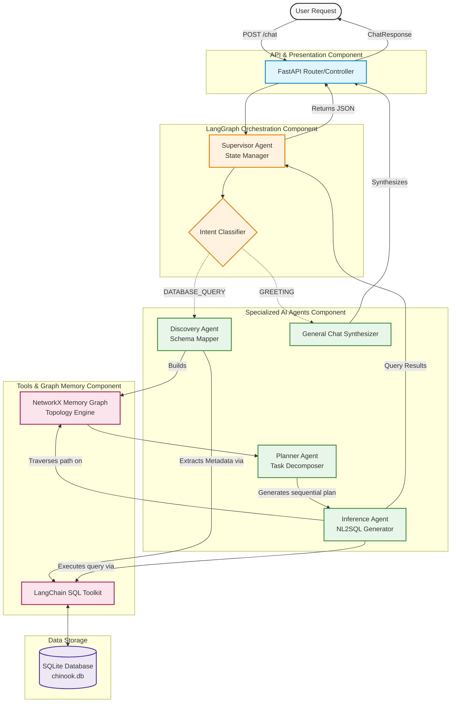
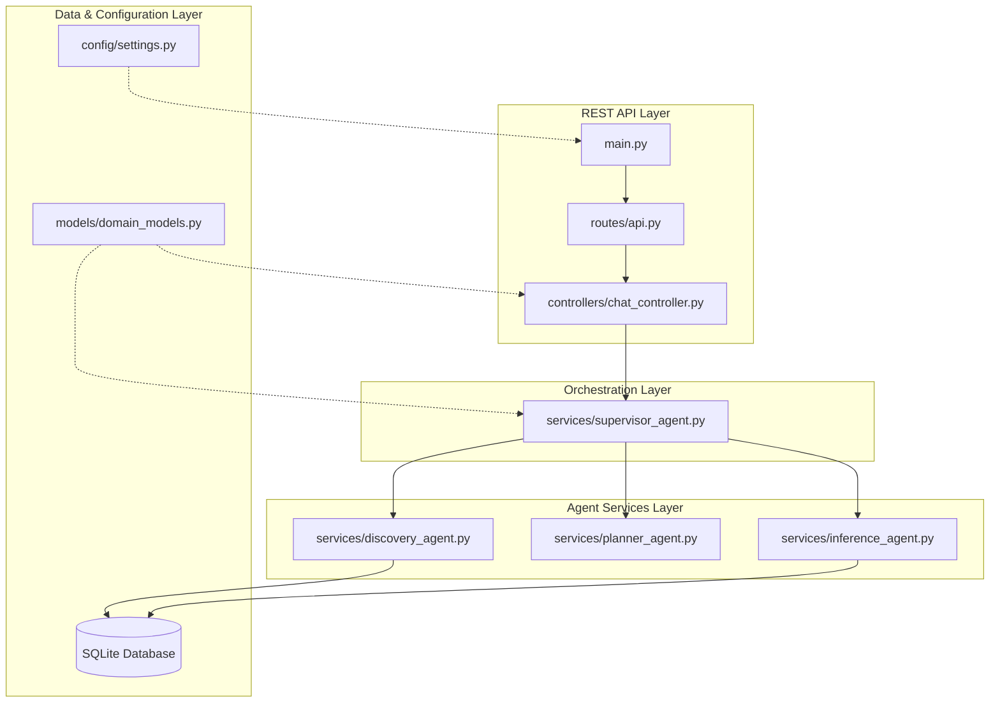

# Database Discovery Fleet - Agentic AI Architecture

## 0. Quick Start / How to Run

To run this project locally, follow these steps:

1. **Install uv (if not installed)**:
   ```bash
   curl -LsSf https://astral.sh/uv/install.sh | sh
   ```
2. **Create a virtual environment and install dependencies**:
   ```bash
   uv venv .venv
   source .venv/bin/activate
   uv pip install -r requirements.txt
   ```
3. **Set your environment variables**:
   Ensure you have a `.env` file at the root of your workspace (or export it manually) with your OpenAI API Key:
   ```bash
   export OPENAI_API_KEY="your-api-key-here"
   export DATABASE_PATH="sqlite:///data/chinook.db"
   ```
4. **Run the FastAPI server**:
   ```bash
   python3 main.py
   ```
   The server will start on `http://0.0.0.0:8003`.
5. **Test the API**:
   ```bash
   curl -X POST "http://localhost:8003/api/v1/chat" \
        -H "Content-Type: application/json" \
        -d '{"question": "Who are the top 3 artists by number of tracks?"}'
   ```

---

## 1. Problem Statement

### What problem the AI agent solves
Navigating and querying unknown or complex databases is highly time-consuming for non-technical users and software developers alike. Understanding schemas, foreign key relationships, and writing accurate SQL queries to extract meaningful insights requires specialized knowledge and deep contextual understanding of the database structure.

### Why traditional software or automation is insufficient
Traditional BI tools require manual configuration, pre-defined schemas, and technical SQL knowledge. Static dashboards cannot answer ad-hoc, unanticipated questions. Automation scripts are fragile and break if the schema evolves.

### Target users
- Data Analysts & Business Intelligence professionals
- Product Managers needing quick data insights
- Software Engineers exploring legacy or unfamiliar databases
- Executives requiring natural language reporting

### Business objectives
- Democratize data access across non-technical teams.
- Drastically reduce the time-to-insight for database queries.
- Minimize dependency on Data Engineering teams for simple extractions.

### Real-world use cases
- Natural language querying of a CRM database ("Who are the top 3 customers by revenue?").
- Automated schema exploration and documentation for onboarding developers.
- Dynamic report generation based on live relational data.

### Why an agentic approach was chosen
An agentic approach, specifically a Supervisor-Subagent architecture, allows the system to autonomously discover the schema, map the relationships in a graph structure, formulate a multi-step plan, and iteratively execute inference queries. It mirrors the cognitive process of a human data engineer: explore the schema -> plan the query -> write the SQL -> summarize the results.

---

## 2. Solution Overview

### What the agent does
The Database Discovery Fleet is a multi-agent system orchestrating specialized AI workers to explore, map, and query SQLite databases using natural language.

### Core capabilities
- **Autonomous Schema Discovery:** Maps tables, columns, data types, and foreign key relationships.
- **Graph-Based Reasoning:** Converts relational schemas into a NetworkX graph to analyze traversal paths before querying.
- **Dynamic Planning:** Generates sequential step-by-step plans separating database inference from general conversation.
- **Natural Language to SQL (NL2SQL):** Converts plain English questions into valid SQL queries based on the discovered schema graph.

### Supported workflows
- General Chat / Greetings.
- Database Schema Visualization and Exploration.
- Complex Multi-Table SQL Inference.

### Autonomous behaviors
The system autonomously classifies the user intent, decides if schema discovery is required, routes the request to a planner, executes the generated plan through the inference agent, and synthesizes a final response without human intervention.

### Key features
- **LangGraph Orchestration:** State-machine based routing (Supervisor pattern).
- **NetworkX Integration:** Mathematical graph modeling of the database schema.
- **Clean Monolithic Architecture:** Separation of controllers, models, and domain services (agents) in a FastAPI shell.

### End-to-end system overview
User asks a question -> API Controller -> Supervisor Agent classifies intent -> (If DB Query) Discovery Agent maps schema to Graph -> Planner Agent breaks down the question into steps -> Inference Agent generates and runs SQL using Graph context -> Supervisor synthesizes the final conversational output -> API Controller returns JSON.

---

## 3. Impact of the Solution

### Business impact
Reduces the bottleneck on data teams, allowing business stakeholders to make data-driven decisions instantly.

### User impact
Non-technical users can interact with complex relational databases as easily as talking to a human analyst.

### Productivity improvements
Turns hours of schema exploration and SQL writing into a 5-second API call.

### Automation benefits
Automatically adapts to schema changes. If a new table is added, the Discovery Agent maps it dynamically on the next query.

### Cost reduction opportunities
Reduces the need for expensive BI tool licenses and specialized data engineering hours for routine reporting tasks.

### Scalability benefits
The decoupled agentic architecture allows scaling the Inference Agent independently from the Planner, and swapping SQLite for PostgreSQL or Snowflake simply by updating the SQLAlchemy URI.

---

## 4. Agentic AI Architecture

### Agent Layer
- **Responsibility:** Contains specialized agents (`DiscoveryAgent`, `PlannerAgent`, `InferenceAgent`).
- **Why it exists:** Enforces the Single Responsibility Principle. Discovery handles schema, Planner handles logic, Inference handles SQL.
- **Interaction:** Coordinated by the Supervisor.

### Planning/Reasoning Layer
- **Responsibility:** `PlannerAgent` uses GPT-4o to decompose complex questions into sequential `Inference:` and `General:` steps.
- **Why it exists:** Prevents the LLM from attempting to solve a massive SQL join blindly. It breaks the problem into logical bites.
- **Benefits:** Drastically reduces hallucinations and SQL syntax errors by enforcing step-by-step thinking.

### Workflow Orchestration Layer
- **Responsibility:** Managed by LangGraph (`StateGraph`).
- **Why it exists:** To maintain a deterministic state machine (`ConversationState`) across the multi-agent fleet.
- **Interaction:** Routes the state dictionary through node functions based on conditional edges.

### Tool Calling Layer
- **Responsibility:** Uses Langchain's `SQLDatabaseToolkit` and a custom `VISUALISE_SCHEMA` tool.
- **Why it exists:** Gives the LLM deterministic functions to execute against the real world (the database).

### Knowledge/Graph Layer
- **Responsibility:** The `NetworkX` graph structure generated by the `DiscoveryAgent`.
- **Why it exists:** Provides topological awareness of the database. When a user asks about "artists" and "tracks", the graph proves they are connected via "albums", injecting this path into the Inference prompt.

### LLM Layer
- **Responsibility:** GPT-4o (via Langchain/OpenAI).
- **Why it exists:** Provides the core reasoning, NL2SQL translation, and natural language synthesis capabilities.

### Architecture Diagram



---

## 5. Complete Agent Workflow

### Node Execution Flow

```text
┌──────────────────────────────────────────────────────────────────┐
│                        INPUTS                                     │
│  ┌─────────────────────┐    ┌──────────────────────────────┐      │
│  │   User Question     │    │   SQLite Database Schema     │      │
│  │   (API Request)     │    │   (chinook.db)               │      │
│  └────────┬────────────┘    └──────────────┬───────────────┘      │
│           │                                │                      │
│           └────────────┬───────────────────┘                      │
│                        ▼                                          │
│              ┌──────────────────┐                                 │
│              │     main.py      │    ← FastAPI Entry Point        │
│              │ (API Controller) │                                 │
│              └────────┬─────────┘                                 │
│                       ▼                                           │
│  ┌─────────────────────────────────────────────────────────────┐  │
│  │                  LangGraph Workflow (graph.py)               │  │
│  │                                                              │  │
│  │                  ┌───────────────────┐                       │  │
│  │                  │ Supervisor Agent  │                       │  │
│  │                  └─────────┬─────────┘                       │  │
│  │                            │                                 │  │
│  │                            ▼                                 │  │
│  │              ┌───────────────────────────┐                   │  │
│  │              │     Intent Classifier     │                   │  │
│  │              │   (Conditional Router)    │                   │  │
│  │              └───────┬───────────┬───────┘                   │  │
│  │                      │           │                           │  │
│  │              [GREETING]         [DATABASE_QUERY]             │  │
│  │                      │           │                           │  │
│  │                      ▼           ▼                           │  │
│  │        ┌──────────────┐      ┌──────────────┐                │  │
│  │        │     Chat     │      │  Discovery   │                │  │
│  │        │  Synthesis   │      │    Agent     │                │  │
│  │        └──────┬───────┘      └──────┬───────┘                │  │
│  │               │                     │                        │  │
│  │               │                     ▼                        │  │
│  │               │              ┌──────────────┐                │  │
│  │               │              │   Planner    │                │  │
│  │               │              │    Agent     │                │  │
│  │               │              └──────┬───────┘                │  │
│  │               │                     │                        │  │
│  │               │                     ▼                        │  │
│  │               │              ┌──────────────┐                │  │
│  │               │              │  Inference   │                │  │
│  │               │              │    Agent     │                │  │
│  │               │              └──────┬───────┘                │  │
│  │               │                     │                        │  │
│  │               │                     ▼                        │  │
│  │               │              ┌──────────────┐                │  │
│  │               │              │  Supervisor  │                │  │
│  │               │              │  Synthesis   │                │  │
│  │               │              └──────┬───────┘                │  │
│  │               │                     │                        │  │
│  │               └──────────┬──────────┘                        │  │
│  │                          ▼                                   │  │
│  │                     ┌─────────┐                              │  │
│  │                     │   END   │                              │  │
│  │                     └─────────┘                              │  │
│  └─────────────────────────────────────────────────────────────┘  │
│                       │                                           │
│                       ▼                                           │
│              ┌──────────────────┐                                 │
│              │ JSON ChatResponse│    ← Returned to Client         │
│              └──────────────────┘                                 │
└──────────────────────────────────────────────────────────────────┘
```

1. **User Request:** A POST request arrives at `/api/v1/chat` with a natural language question.
2. **Intent Understanding:** The Supervisor uses an LLM to classify the string as a `DATABASE_QUERY`, `GREETING`, or `FAREWELL`.
3. **Context Gathering:** If a database query, the Supervisor checks the `ConversationState`. If no graph exists, it triggers the `DiscoveryAgent`.
4. **Graph Construction:** The `DiscoveryAgent` uses SQL toolkit tools to query the schema, formats it as JSON, and parses it into a `NetworkX` graph linking tables and foreign keys.
5. **Planning & Reasoning:** The `PlannerAgent` reads the user question and outputs a line-by-line sequence (e.g., `Inference: find artist`, `Inference: count tracks`).
6. **Tool Selection & Execution:** The Supervisor iterates over the plan. For `Inference` steps, it passes the question and the `NetworkX` graph to the `InferenceAgent`.
7. **Data Processing:** The `InferenceAgent` analyzes the graph to find the shortest path between the relevant tables, injects that schema path into its prompt, generates the SQL, and runs it against the database.
8. **Memory Update:** The results of the queries are appended to the `db_results` field in the LangGraph `ConversationState`.
9. **Response Generation:** The Supervisor takes the raw `db_results` and the original user question, and uses GPT-4o to write a clean, conversational summary.
10. **Final Response Delivery:** The FastAPI controller returns a structured `ChatResponse` model to the client.

---

## 6. Technical Architecture

### Project Structure & Module Dependency Diagram



### `main.py`
- **Purpose:** FastAPI application entry point.
- **Responsibility:** Bootstrapping the server, loading CORS middleware to allow frontend communication, registering global exception handlers to catch Pydantic or LangGraph errors, and mounting API routers.
- **Internal Communication:** Acts as the outermost shell. When a request hits `/api/v1/chat`, it forwards the payload to the specific controller defined in `routes/api.py`.

### `src/config/settings.py`
- **Purpose:** Environment and configuration management.
- **Responsibility:** Uses `pydantic-settings` to securely load the `OPENAI_API_KEY` and `DATABASE_PATH` from the environment or `.env` file. It enforces strict type checking at startup, immediately crashing the app if critical keys are missing, preventing silent runtime failures.
- **Internal Communication:** Imported globally across services to provide deterministic configuration access (e.g., passing the DB path to SQLAlchemy, passing the API key to ChatOpenAI).

### `src/models/domain_models.py`
- **Purpose:** Data validation and State definitions.
- **Responsibility:** 
  1. **API Models:** Defines Pydantic request (`ChatRequest`) and response (`ChatResponse`) schemas for the FastAPI endpoints.
  2. **LangGraph State:** Defines the `TypedDict` `ConversationState`. This is the lifeblood of the application. It includes custom reducer logic (e.g., `db_graph_reducer`) to correctly append or overwrite state variables (like the NetworkX graph string, the execution plan, and the SQL results) as the payload traverses between agents.
- **Internal Communication:** Shared between the API layer and the LangGraph orchestration layer to guarantee type safety throughout the system's lifecycle.

### `src/services/discovery_agent.py`
- **Purpose:** Schema discovery and mathematical graph generation.
- **Responsibility:** Instead of blinding handing the LLM a massive database, this service utilizes LangChain's `SQLDatabaseToolkit` to query the physical database schema. It instructs an LLM to output a strict JSON representation of tables, columns, and foreign keys. Crucially, it then parses this JSON into a `NetworkX` directed graph object, storing the relationships mathematically.
- **Internal Communication:** Called by the Supervisor if the `db_graph` state is missing. It writes the stringified graph representation back into the `ConversationState` for downstream agents.

### `src/services/planner_agent.py`
- **Purpose:** Task decomposition.
- **Responsibility:** Reads the user's natural language question and generates a strict, sequential step-by-step execution plan. It forces the LLM to output lines starting with exactly `Inference:` (for SQL queries) or `General:` (for conversational logic).
- **Internal Communication:** Receives the original user question from the state. Updates the `plan` variable in the `ConversationState`. The Supervisor then loops over this list.

### `src/services/inference_agent.py`
- **Purpose:** Context-aware SQL Generation and Execution.
- **Responsibility:** This is the most complex service. It takes the current `Inference:` step and the `NetworkX` graph. It maps the entities in the question to nodes in the graph, calculating the shortest traversal path between required tables. It builds a highly optimized, hyper-targeted prompt injecting *only* the relevant subset of the schema. Finally, it generates the raw SQL and executes it safely against the database.
- **Internal Communication:** Receives targeted instructions from the Supervisor's execution loop. Writes the raw SQL execution results into the `db_results` array in the `ConversationState`.

### `src/services/supervisor_agent.py`
- **Purpose:** Central Orchestrator and State Machine Manager.
- **Responsibility:** Acts as the brain of the LangGraph application. It defines the nodes (Discovery, Planner, Inference, Synth) and the conditional edges (e.g., "If intent is GREETING, skip to Synth"). It loops over the Planner's output, delegating tasks to the Inference Agent, and finally uses an LLM to synthesize the raw SQL output into a beautiful conversational response.
- **Internal Communication:** Wires together all other agent services. It takes the `ChatRequest` string, pushes it through the graph, and returns the final `ChatResponse` dictionary.

### `src/controllers/chat_controller.py` & `src/routes/api.py`
- **Purpose:** The REST API Transport Layer.
- **Responsibility:** Exposes the `/api/v1/chat` endpoint. It instantiates the compiled Supervisor graph, passes the HTTP payload into the graph's `stream` or `invoke` method, catches LangGraph-specific timeout or depth errors, and formats the output back into HTTP JSON responses.
- **Internal Communication:** The boundary between the HTTP world and the Python/LangGraph world.

---

## 7. System Design Learnings

### Agentic AI Learnings
- **Distributed Thinking Patterns:** Offloading schema discovery, task planning, and query execution to separate agents drastically reduces the cognitive load on a single LLM, preventing context window bloat and improving accuracy.
- **Graph-Augmented Prompting:** Mapping a database schema to a mathematical graph (NetworkX) and feeding only the *relevant traversal paths* to the Inference agent is significantly more token-efficient than dumping a massive SQL schema into the prompt.

### AI Engineering Learnings
- **JSON Formatting Enforcement:** The `DiscoveryAgent` taught us that strict system prompting (and Markdown stripping wrappers) is required to ensure the LLM returns parsable JSON for automated graph construction.
- **Hallucination Mitigation:** By strictly forcing the `InferenceAgent` to only rely on the NetworkX graph and the explicit SQL Toolkit, it is prevented from hallucinating tables or columns that don't exist.

### Software Engineering Learnings
- **Clean Architecture Migration:** Moving from a linear Jupyter Notebook (`.ipynb`) to a monolithic FastAPI architecture forced strict separation of concerns, making the agents testable and the state transitions predictable.

### System Design Learnings
- **LangGraph State Management:** Implementing Custom Reducers (`classify_input_reducer`, `db_graph_reducer`) in `TypedDict` proved essential for controlling how data overwrites or appends as the state traverses the graph nodes.

---

## 8. Tech Stack Breakdown

- **FastAPI:** High-performance web framework. Chosen for its native async support, automated OpenAPI documentation, and strict Pydantic validation.
- **LangGraph:** Orchestration framework for LLMs. Chosen for its ability to model complex, cyclical, multi-agent workflows as state machines, superior to standard linear LangChain chains.
- **LangChain / LangChain-OpenAI:** Standardizes tool calling and LLM interactions. It abstracts away the raw API calls and provides out-of-the-box `SQLDatabaseToolkit`.
- **NetworkX:** Python graph library. Chosen to model the relational database mathematically (nodes as tables/columns, edges as foreign keys) to allow programmatic traversal and relationship inference without relying entirely on the LLM's raw reasoning.
- **Pydantic:** Used for API schema validation and Settings management. Ensures runtime type safety.
- **SQLite / SQLAlchemy:** The database layer. Chosen for portability in this experimental phase, but abstracted enough via SQLAlchemy to swap to enterprise SQL dialects easily.

---

## 9. Resume-Ready Project Summary

### One-Line Summary
Engineered a multi-agent AI system using LangGraph and FastAPI that autonomously discovers database schemas, models them as mathematical graphs, and translates natural language into accurate SQL queries.

### Three-Line Summary
- Architected a "Database Discovery Fleet" using FastAPI, LangGraph, and GPT-4o to democratize data access via natural language querying.
- Implemented a Supervisor-Subagent pattern where specialized AI workers autonomously discover schemas, build NetworkX relationship graphs, and formulate multi-step execution plans.
- Migrated legacy notebook code into a production-ready Clean Monolithic architecture, significantly improving modularity, state management, and NL2SQL accuracy through graph-augmented prompting.

### Detailed Resume Version
**AI Software Engineer - Agentic Database Discovery Fleet**
- Designed and developed a multi-agent RAG/NL2SQL orchestration system using **LangGraph, LangChain, and FastAPI**, allowing non-technical users to query relational databases in plain English.
- Engineered a modular architecture featuring specialized autonomous agents (`Supervisor`, `Discovery`, `Planner`, `Inference`), reducing LLM hallucination rates by dividing complex SQL generation into discrete planning and execution steps.
- Implemented dynamic schema exploration using **NetworkX** to programmatically model SQL tables, columns, and foreign keys as a graph, passing contextual traversal paths to the LLM to optimize prompt tokens and query accuracy.
- Enforced strict Software Engineering principles (Clean Architecture, SOLID) by decoupling agent logic into domain services and integrating Pydantic for rigorous runtime state validation.

### Interview Explanation Version
*"In this project, I engineered a highly scalable, autonomous 'Database Discovery Fleet' designed to solve a major problem in data engineering: the unreliability of LLMs when writing SQL for complex, large-scale relational databases. Typical NL2SQL systems fail because they attempt to dump massive, unoptimized schemas into a single prompt, leading to hallucinations, context window exhaustion, and syntax errors. To solve this, I built a multi-agent system orchestrated by LangGraph, enveloped inside a clean monolithic FastAPI architecture.*

*The workflow is deeply modular and mirrors how a human data engineer operates. When a natural language request arrives, a Supervisor agent classifies the intent. If it's a database query, it triggers the Discovery Agent. Rather than just reading tables blindly, this agent uses LangChain's SQLDatabaseToolkit to extract metadata and mathematically models the database schema using the NetworkX library—turning tables into nodes and foreign keys into edges. Next, the Planner Agent breaks the complex business question into discrete, sequential steps to reduce cognitive load.*

*The heavy lifting is done by the Inference Agent. Before writing any SQL, it performs graph-traversal on the NetworkX memory structure to find the shortest relational paths between the relevant tables. By injecting only this hyper-targeted path context into the prompt, the LLM generates flawless SQL joins with near-zero hallucinations. Finally, the Supervisor executes the plan iteratively, aggregates the raw database output, and synthesizes a clean, conversational response. By enforcing strict separation of concerns—Discovery, Planning, and Inference—and relying on deterministic graph traversal over raw LLM guessing, I created an enterprise-grade agent capable of reliably democratizing data access for non-technical stakeholders."*

---

## 10. Future Enhancements

The current architecture provides a robust foundation, but several enhancements can make it enterprise-ready:

- **Redis Caching for Discovery Graph:** Currently, the graph is stored in the memory of the application process. Persisting the NetworkX graph to Redis will allow it to be shared across stateless load-balanced containers.
- **Human Approval Workflows:** Implement a LangGraph checkpoint (Human-in-the-Loop) to pause the execution and ask the user to approve the generated SQL before it runs, which is absolutely critical for `UPDATE`/`DELETE` capabilities.
- **Advanced RAG Integration:** Store the schema graph embeddings in a Vector Database (like ChromaDB, Pinecone, or pgvector) for massive enterprise schemas where reading the entire metadata into the context window is impossible.
- **Event-Driven Architecture (Message Queues):** Move the Inference execution to an async Celery worker, RabbitMQ, or Kafka queue for long-running, complex warehouse queries (e.g., Snowflake, BigQuery) to prevent HTTP request timeouts.
- **Security Hardening:** Implement rigorous input sanitization, Row-Level Security (RLS), and read-only database user credentials to prevent prompt-injection SQL attacks.
- **Multi-Agent Systems Expansion:** Add specialized agents such as a "Data Quality Agent" to verify results for nulls/outliers, or a "Data Visualization Agent" to automatically generate Plotly/Matplotlib charts alongside the SQL results.
- **Agent Evaluation Frameworks:** Integrate LangSmith or Langfuse for tracing the agent trajectories, capturing token usage, execution time, and human feedback to iteratively improve the prompts.
- **Voice Agents / Real-Time Collaboration:** Expose the endpoints via WebSockets to support real-time streaming interfaces or Voice-to-SQL capabilities.
- **CI/CD & Kubernetes Deployment:** Containerize the FastAPI application using Docker and deploy via Kubernetes with Helm charts for infinite scalability.

---

## 11. Detailed Learning Section from this project through the errors and fixes.

**1. The Jupyter to FastAPI Migration Paradox**
*Error:* When migrating the notebook, the global `agent` and `G` (graph) variables caused state bleeding and connection timeouts when ported directly to an API context.
*Fix:* Encapsulated the agents inside structured class services and moved the transient data into LangGraph's strictly controlled `ConversationState` `TypedDict`, utilizing explicit reducers to manage lifecycle state safely.

**2. JSON Parsing Hallucinations**
*Error:* The LLM outputting the schema structure would occasionally wrap the JSON in markdown code blocks (` ```json ... ``` `) or include conversational pre-text, crashing the `json.loads()` parser in the Discovery Agent.
*Fix:* Implemented defensive string manipulation in `parseJson` to locate and extract substrings between markdown ticks, ensuring the system can recover from minor LLM formatting deviations.

**3. NetworkX Context Window Bloat**
*Error:* Passing the stringified NetworkX graph to the Inference prompt for very large databases caused Token Limit Exceeded errors.
*Fix:* Developed the `analyze_question_with_graph` heuristic method. Before querying, the system uses classical string matching (nodes vs user input) to extract *only* the immediate neighborhood of relevant tables from the graph, keeping the prompt small and highly contextualized.

## 12. Interview Explanation Version

In enterprise data environments, business users often need answers from complex relational databases but lack the SQL expertise to query them. The traditional solution is waiting weeks for a data engineering team to build a custom dashboard, which creates a massive analytical bottleneck. To solve this, I engineered a Database Discovery Fleet—a multi-agent AI system that autonomously maps database schemas and executes complex natural-language-to-SQL (NL2SQL) queries on the fly.

The technical architecture relies on a specialized fleet of AI agents orchestrated by LangGraph. When a user asks a question, a Supervisor agent classifies the intent and triggers a Discovery Agent to extract the live database schema. Crucially, instead of blindly dumping the schema into the LLM context, the agent parses the schema into a NetworkX mathematical graph, mapping tables and foreign keys. An Inference Agent then uses this graph to deterministically find the shortest path between the required tables, injecting only the perfectly optimized schema subset into the prompt to generate highly accurate, executable SQL.

The delivered business value is absolute data democratization and accelerated decision-making. By allowing non-technical stakeholders to ask complex questions in plain English and autonomously generating executing zero-shot SQL queries with high precision, the system entirely bypassed the data engineering bottleneck and reduced the time-to-insight from weeks to mere seconds.
