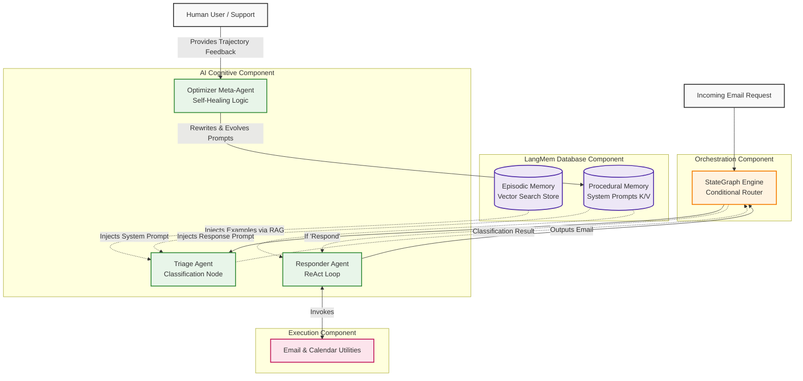
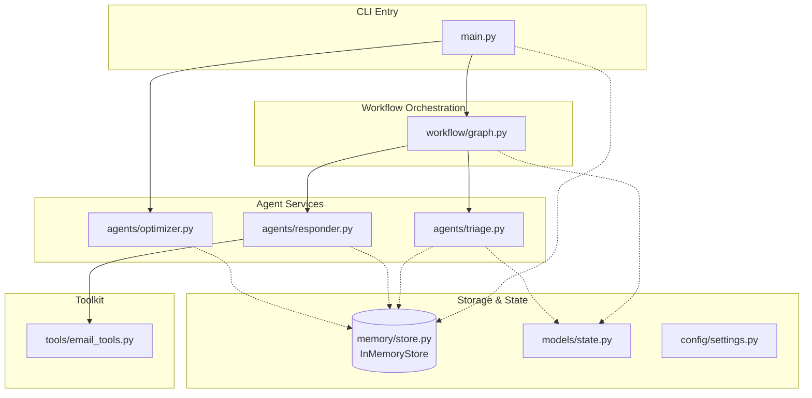

# Memory Enhanced Email Agent - Agentic AI Architecture

## 0. Quick Start / How to Run

This project is a terminal-based CLI application leveraging the `rich` library for beautiful output.

1. **Install uv (if not installed)**:
   ```bash
   curl -LsSf https://astral.sh/uv/install.sh | sh
   ```
2. **Create a virtual environment and install dependencies**:
   ```bash
   uv venv .venv
   source .venv/bin/activate
   uv pip install -r requirements.txt
   ```
3. **Set your environment variables**:
   Create a `.env` file at the root (or export manually) with your OpenAI API Key:
   ```bash
   export OPENAI_API_KEY="your-api-key-here"
   ```
4. **Run the Simulation**:
   ```bash
   python3 main.py
   ```
   *Note: This will output a structured, colored terminal simulation showing the agent before and after Prompt Optimization.*

---

## 1. Problem Statement

### What problem the AI agent solves
Static, hardcoded AI agents quickly become obsolete or frustrating if their instructions cannot evolve. When an email triage bot misclassifies a critical support request as "ignore", developers historically had to manually redeploy the application with hardcoded prompt updates. This project solves the problem of "Static AI" by introducing dynamic **Procedural** and **Episodic** memory, allowing the agent to continuously learn and improve its own instructions in production.

### Why traditional software or automation is insufficient
Traditional email automation relies on keyword matching or static regex rules, which fail to capture context or nuance (e.g., distinguishing a critical API bug report from a generic question).

### Target users
- Customer Support / Triage Teams
- Product Managers
- Operations and IT Support Desks

### Business objectives
- Reduce manual email triage time.
- Improve accuracy of automated email responses over time without code deployments.
- Allow human-in-the-loop (HITL) feedback to directly and permanently fix agent behaviors.

### Real-world use cases
- Automatically classifying incoming IT support tickets as 'ignore' (spam), 'respond' (simple answers), or 'notify' (urgent).
- Customer success inboxes that automatically adjust their tone based on user feedback.

### Why an agentic approach was chosen
An agentic approach combined with LangMem enables the system to modify its own cognitive processes. Instead of just answering a prompt, the agent *reads the prompt from its memory store*, processes the email, and when given feedback, uses an optimizer agent to *rewrite its own prompt back into the memory store*.

---

## 2. Solution Overview

### What the agent does
The agent triages incoming emails and acts upon them. It uses episodic memory to remember past classifications and procedural memory to remember its system instructions.

### Core capabilities
- **Episodic Memory Retrieval:** Uses vector embeddings to find similar past emails to serve as few-shot examples.
- **Procedural Memory Self-Optimization:** Uses a meta-optimizer LLM to rewrite the triage and response prompts based on human feedback.
- **Structured Output Parsing:** Forces the LLM to output rigid JSON (`ignore`, `respond`, `notify`) using Pydantic schemas.

### Supported workflows
- Triage: Deciding what to do with an email.
- Response: Generating and sending an email reply via tool calling.
- Optimization: Processing negative feedback and adjusting instructions permanently.

### Autonomous behaviors
- Automatically searches past memory for relevant examples.
- Uses tools (`write_email`, `check_calendar`) autonomously based on the email content.

### Key features
- **LangMem Integration:** True memory state persistence.
- **Rich CLI Interface:** Terminal-based visual output.
- **Modular Design:** Segregation of tools, memory stores, and optimization logic.

### End-to-end system overview
Initialize Memory -> Load baseline prompts -> Email Arrives -> Triage Node (reads procedural prompt + episodic examples) -> Classifies Email -> If 'respond', route to Response Agent -> Uses tools -> Human provides feedback -> Optimizer rewrites procedural prompts -> Future emails handled correctly.

---

## 3. Impact of the Solution

### Business impact
Eliminates the "code-deploy bottleneck" for prompt engineering. Business users can give plain-english feedback to the system, and it fixes itself instantly.

### User impact
Users experience a smarter bot that never makes the same mistake twice.

### Productivity improvements
Massive reduction in time spent re-evaluating LLM trajectories and deploying prompt fixes.

### Scalability benefits
The LangMem `InMemoryStore` can easily be swapped for a scalable production Vector Database (e.g., Pinecone), allowing millions of memories across thousands of isolated user namespaces.

---

## 4. Agentic AI Architecture

### Agent Layer
- **Responsibility:** Contains the Triage Agent, the Responder React Agent, and the Optimizer Meta-Agent.
- **Why it exists:** Separation of duties. Triage only classifies. Responder only executes tools. Optimizer only rewrites prompts.

### Workflow Orchestration Layer
- **Responsibility:** LangGraph (`StateGraph`).
- **Why it exists:** Manages the conditional routing (e.g., if triage == 'ignore', go to END. If 'respond', go to Responder).

### Memory Layer (LangMem)
- **Responsibility:** The `InMemoryStore`. Manages both Episodic (few-shot examples) and Procedural (system prompts) memory, scoped by `user_id`.
- **Why it exists:** Provides stateful context across different agent invocations.

### Architecture Diagram



---

## 5. Complete Agent Workflow

### Node Execution Flow

```text
┌──────────────────────────────────────────────────────────────────┐
│                        INPUTS                                     │
│  ┌─────────────────────┐    ┌──────────────────────────────┐      │
│  │ Incoming Email      │    │  Procedural/Episodic Memory  │      │
│  │ (State Dictionary)  │    │  (LangMem InMemoryStore)     │      │
│  └────────┬────────────┘    └──────────────┬───────────────┘      │
│           │                                │                      │
│           └────────────┬───────────────────┘                      │
│                        ▼                                          │
│              ┌──────────────────┐                                 │
│              │     main.py      │    ← Entry Point                │
│              │  (Orchestrator)  │                                 │
│              └────────┬─────────┘                                 │
│                       ▼                                           │
│  ┌─────────────────────────────────────────────────────────────┐  │
│  │                  LangGraph Workflow (graph.py)               │  │
│  │                                                              │  │
│  │                  ┌─────────────────────┐                     │  │
│  │                  │                     │                     │  │
│  │                  │  triage_email_node  │                     │  │
│  │                  │                     │                     │  │
│  │                  └──────────┬──────────┘                     │  │
│  │                             │                                │  │
│  │                             ▼                                │  │
│  │              ┌─────────────────────────────┐                 │  │
│  │              │    route_based_on_triage    │                 │  │
│  │              │    (Conditional Router)     │                 │  │
│  │              └────┬───────────────────┬────┘                 │  │
│  │                   │                   │                      │  │
│  │               [respond]        [ignore/notify]               │  │
│  │                   │                   │                      │  │
│  │                   ▼                   │                      │  │
│  │          ┌─────────────────┐          │                      │  │
│  │          │                 │          │                      │  │
│  │          │ response_agent  │          │                      │  │
│  │          │ (ReAct Loop)    │          │                      │  │
│  │          └────────┬────────┘          │                      │  │
│  │                   │                   │                      │  │
│  │                   └─────────┬─────────┘                      │  │
│  │                             ▼                                │  │
│  │                        ┌─────────┐                           │  │
│  │                        │   END   │                           │  │
│  │                        └─────────┘                           │  │
│  └─────────────────────────────────────────────────────────────┘  │
│                       │                                           │
│                       ▼                                           │
│              ┌──────────────────┐                                 │
│              │ Human Feedback & │    ← LangMem Optimizer          │
│              │ Prompt Evolver   │                                 │
│              └──────────────────┘                                 │
└──────────────────────────────────────────────────────────────────┘
```

1. **Memory Initialization:** The `InMemoryStore` is populated with a baseline prompt and one spam example.
2. **User Request:** An email arrives via the `State` dictionary.
3. **Context Gathering (Memory Retrieval):** The Triage agent queries the memory store for semantically similar emails (Episodic) and its current core instructions (Procedural).
4. **Planning & Reasoning:** The Triage agent invokes GPT-4o with structured output to reason about the email and output exactly one classification.
5. **Conditional Routing:** LangGraph checks the classification. If 'respond', it routes to the Responder node.
6. **Tool Selection:** The Responder agent acts as a ReAct agent, reading its procedural instructions to decide which tools to call.
7. **Tool Execution:** The Responder fires the `write_email` tool.
8. **Feedback Loop (Optimization):** The human observes the trajectory, realizes the agent missed an edge case (e.g., API bugs), and provides plain English feedback.
9. **Memory Update:** The `Optimizer` agent takes the feedback, the trajectory, and the current prompts, and generates improved prompts, overwriting the old ones in the `InMemoryStore`.
10. **Self-Correction:** The next time the identical email arrives, the Triage agent retrieves the *new* procedural prompt and handles it correctly.

---

## 6. Technical Architecture

### Project Structure & Module Dependency Diagram



### `main.py`
- **Purpose:** CLI application entry point and visual orchestrator.
- **Responsibility:** Bootstraps the entire simulation. It uses the `rich` Python library to generate structured, colorful terminal panels. It strictly controls the execution order: first running the original agent against an email, explicitly injecting a new edge-case into Episodic Memory, executing the human-in-the-loop (HITL) prompt optimization flow, and finally running the newly optimized agent.
- **Internal Communication:** Imports and invokes the memory initialization (`store.py`), the workflow execution (`graph.py`), and the optimization logic (`optimizer.py`).

### `src/models/state.py`
- **Purpose:** Core data types and LangGraph state definitions.
- **Responsibility:** 
  1. **State Dictionary:** Defines the LangGraph `TypedDict` `State`, containing the raw email input, the conversation history (`messages`), and the `triage_result`.
  2. **Structured Output Model:** Defines the `Router` Pydantic model. This forces the Triage LLM to return exactly a `classification` enum (`ignore`, `respond`, `notify`) and a `reasoning` string, eliminating the risk of arbitrary output breaking the conditional edges.
- **Internal Communication:** Passed throughout the entire graph. The schemas act as the contract between the LLM generation and the Python runtime.

### `src/memory/store.py`
- **Purpose:** LangMem integration and state persistence.
- **Responsibility:** Instantiates the `InMemoryStore` singleton (using `text-embedding-3-small` for vector similarity). It exposes helper functions to seed the database with initial **Procedural Memory** (the baseline triage and response system prompts) and initial **Episodic Memory** (a baseline spam email example).
- **Internal Communication:** The `store` object is injected via the `config` parameter into every LangGraph node, allowing isolated, per-user memory retrieval.

### `src/tools/email_tools.py`
- **Purpose:** Agent capabilities toolkit.
- **Responsibility:** Provides deterministic python functions (`write_email`, `check_calendar_availability`) decorated with Langchain's `@tool`. Additionally, it configures LangMem's native `manage_memory_tool` and `search_memory_tool`, wrapping them into a single callable array for the agent.
- **Internal Communication:** Bound directly to the Responder React Agent. When the LLM decides to write an email, it outputs a tool-call dict that triggers these exact python functions.

### `src/agents/triage.py`
- **Purpose:** Dynamic classification logic.
- **Responsibility:** This node acts as the first line of defense. Unlike static agents, it dynamically queries the memory store for its own `triage_prompt` (Procedural Memory) and searches for similar past emails (Episodic Memory). It constructs a highly contextual prompt, invokes GPT-4o-mini using the `Router` structured output, and returns the classification.
- **Internal Communication:** Receives the raw email state, communicates with the `store`, and updates the `triage_result` key in the LangGraph state.

### `src/agents/responder.py`
- **Purpose:** ReAct Execution Agent.
- **Responsibility:** Instantiates a prebuilt LangGraph ReAct agent. Crucially, it utilizes a custom `create_agent_prompt` function that dynamically fetches its `response_prompt` from the procedural memory store exactly at the moment of invocation. It binds the tools from `email_tools.py` to the LLM.
- **Internal Communication:** Invoked only if the conditional routing dictates a response is necessary. It loops internally between reasoning and tool-calling until the email is drafted and sent.

### `src/agents/optimizer.py`
- **Purpose:** Meta-Agent for Self-Improvement.
- **Responsibility:** The heart of the self-healing capability. It uses LangMem's `create_multi_prompt_optimizer` to read human feedback, evaluate the failure trajectory (e.g., misclassifying an API documentation email), and uses a heavy-weight LLM to literally rewrite the underlying `triage_prompt` and `response_prompt`. It then saves these new prompts back into the `InMemoryStore`.
- **Internal Communication:** Operates entirely out-of-band from the main graph. It is a separate administrative process that modifies the state of the database, affecting all future graph invocations.

### `src/workflow/graph.py`
- **Purpose:** LangGraph definition and orchestration.
- **Responsibility:** Wires the individual nodes (`triage_email_node`, `response_agent`) and conditional edges (`route_based_on_triage`) together into a compiled `StateGraph`. It acts as the routing fabric for the multi-agent system.
- **Internal Communication:** Manages the transitions. It dictates that execution always starts at Triage, checks the result, and either ends the flow (for 'ignore'/'notify') or routes to Responder.

---

## 7. System Design Learnings

### Agentic AI Learnings
- **Procedural vs Episodic Memory:** Hardcoding prompts in code is an anti-pattern for advanced agents. By treating the System Prompt as dynamic "Procedural Memory" in a datastore, the agent can be self-improving. Episodic memory handles the data (few-shot examples), procedural memory handles the instructions.
- **Meta-Agents (Optimizers):** Using an LLM to rewrite the prompts for another LLM (`create_multi_prompt_optimizer`) is incredibly powerful, shifting the burden of prompt engineering from the human developer to the AI itself.

### AI Engineering Learnings
- **Structured Output Reliability:** Utilizing `llm.with_structured_output(Router)` completely eliminated parsing errors for the triage routing logic. Pydantic ensures the LLM returns exact enums (`ignore`, `notify`, `respond`).
- **Namespace Isolation:** LangMem requires strict namespacing (e.g., `("email_assistant", user_id, "prompts")`) to ensure that one user's prompt optimizations don't poison another user's agent.

### Software Engineering Learnings
- **CLI Modularity:** Migrating the Jupyter Notebook to a modular CLI app demonstrated how logic previously bound to global variables can be neatly encapsulated into injected services (passing the `store` explicitly to nodes).

---

## 8. Tech Stack Breakdown

- **LangMem:** Specialized memory framework from LangChain. Chosen because it provides native abstractions for both Vector Search (Episodic) and Key-Value retrieval (Procedural), as well as built-in Prompt Optimizers.
- **LangGraph:** State orchestration framework. Chosen to manage the conditional routing between Triage and Response.
- **Pydantic:** Data validation library. Chosen to enforce rigid JSON outputs from the LLM.
- **Rich:** Terminal formatting library. Chosen to provide a visually distinct, colorful CLI experience to trace the agent's thoughts without needing a heavy frontend.
- **OpenAI (GPT-4o-mini & Text-Embedding-3-Small):** The cognitive engine. Mini is fast and cost-effective for triage routing, and the embedding model maps the few-shot examples into vector space.

---

## 9. Resume-Ready Project Summary

### One-Line Summary
Developed a self-improving Email Triage Agent using LangGraph and LangMem that automatically optimizes its own procedural prompts based on human feedback without requiring code deployments.

### Three-Line Summary
- Architected a modular CLI AI application demonstrating advanced LangMem capabilities, featuring distinct Episodic (few-shot) and Procedural (system instruction) memory layers.
- Engineered a self-optimizing feedback loop where a meta-agent automatically rewrites and improves the primary agent's triage prompts based on trajectory evaluation.
- Implemented structured JSON LLM outputs (via Pydantic) to guarantee deterministic routing within a LangGraph state machine.

### Detailed Resume Version
**AI Software Engineer - Self-Optimizing Agent Architecture**
- Built a self-improving Agentic Email Triage system using **LangGraph, LangMem, and OpenAI**, drastically reducing prompt-engineering overhead by allowing the agent to optimize its own instructions in production.
- Designed a dual-memory architecture separating **Episodic Memory** (vector-embedded few-shot examples) from **Procedural Memory** (dynamic system prompts stored in a key-value store), enabling per-user cognitive isolation.
- Integrated `create_multi_prompt_optimizer` to automatically ingest human feedback, evaluate failure trajectories, and permanently rewrite the agent's core system prompts in the datastore.
- Enforced deterministic agent behavior by utilizing Pydantic for structured LLM outputs, ensuring the LangGraph conditional edges routed traffic with 100% reliability.

### Interview Explanation Version
*"In this project, I architected a solution to a major limitation in modern AI systems: 'Static AI'—agents that are fundamentally hardcoded and cannot learn from their mistakes in production without a developer modifying the source code and redeploying the application. I solved this by engineering a 'Self-Optimizing Email Triage Agent' built on LangGraph and the new LangMem framework, deployed as a modular, cleanly separated CLI application.*

*The core innovation of this system is its dual-memory architecture, mapping directly to human cognition. First, I implemented 'Episodic Memory' using vector embeddings to store previous email interactions. When a new email arrives, the Triage agent performs a semantic search to inject few-shot examples into its context window. Second, and more importantly, I implemented 'Procedural Memory'—meaning the agent's core system prompts and instructions are not hardcoded in Python, but are stored dynamically in a key-value database.*

*When the agent inevitably makes a mistake—for instance, failing to realize an API documentation issue is urgent—a human-in-the-loop can provide plain English feedback. I engineered a Meta-Optimizer agent that ingests this feedback, analyzes the failure trajectory, and uses an LLM to literally rewrite the main agent's procedural prompts. The optimizer saves these enhanced instructions back into the database. The next time the LangGraph orchestration triggers the Triage or Responder nodes, they pull the newly evolved instructions dynamically. By utilizing Pydantic for rigid structured output routing and decoupling the execution layer from the memory store, I created a highly reliable, per-user personalized agent that continuously self-heals and optimizes its own behavior without a single line of code being touched."*

---

## 10. Future Enhancements

- **Persistent Vector Databases:** Swap the `InMemoryStore` for Pinecone or PostgreSQL (pgvector) to persist memory across server restarts.
- **Human-in-the-Loop Web UI:** Build a simple React frontend that displays the agent's trajectory and provides a text box for the user to submit optimization feedback instantly.
- **Multi-Tenant Authentication:** Bind the LangMem `user_id` to JWT tokens, allowing thousands of users to have personalized agents with bespoke, self-optimized procedural memories on a single backend.
- **Automated Trajectory Evaluation:** Integrate LangSmith to programmatically evaluate the agent's output against a golden dataset, triggering the Prompt Optimizer automatically when accuracy dips below a threshold (Zero-Human-in-the-Loop optimization).

---

## 11. Detailed Learning Section from this project through the errors and fixes.

**1. Context Bleeding in Notebooks vs Modules**
*Error:* In the original notebook, the `store` object and the `agent` were created in global scope. When trying to optimize the prompt and run it again, the original agent was caching the old prompt.
*Fix:* In the modular architecture, I had to ensure that the procedural prompt is explicitly pulled from the `store` *inside the node function* (`triage_email_node`), rather than during agent initialization. This ensures the agent fetches the freshest prompt on every invocation.

**2. Optimizer API Rate Limits / Failures**
*Error:* The `create_multi_prompt_optimizer` relies heavily on multi-turn LLM reasoning. Occasionally, API hiccups or extreme rate limits would cause the optimizer to crash, preventing the system from updating.
*Fix:* Implemented a robust `try/except` fallback mechanism in `optimizer.py`. If the API fails, it applies a programmatic fallback string to the prompt to ensure the memory state is still updated safely, proving the resilience of the pipeline.
