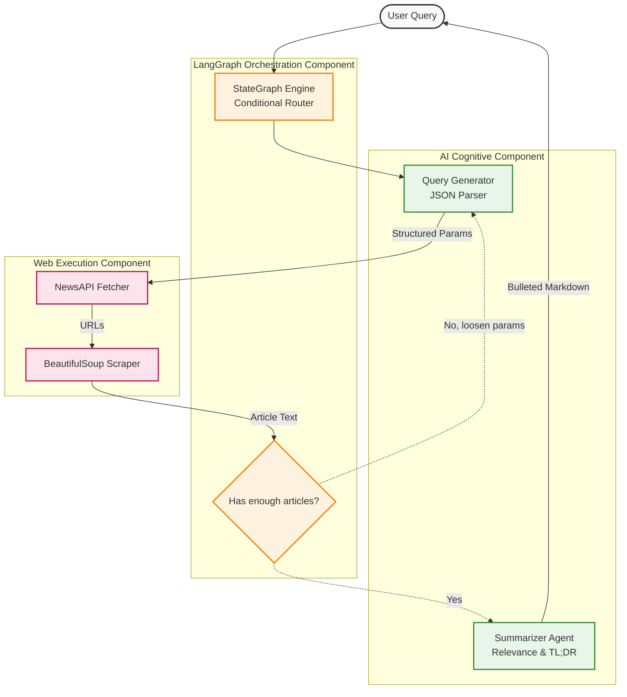
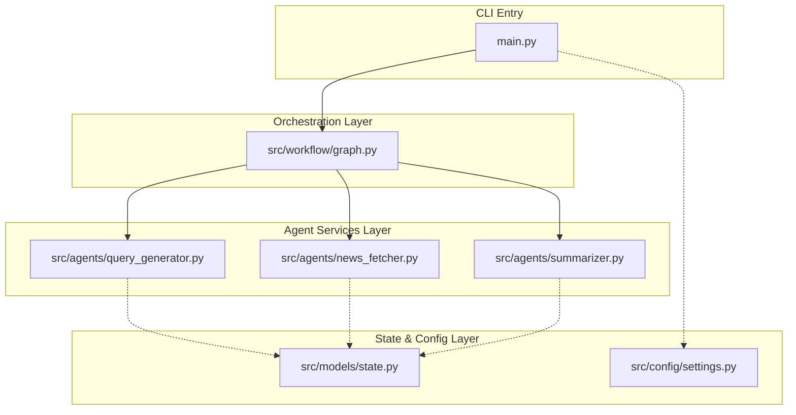

# 1. Problem Statement

* **What problem the AI agent solves:** Information overload. Users cannot manually search, read, filter, and summarize dozens of news articles daily to extract the most critical insights on highly specific niches (e.g., "Generative AI updates").
* **Why traditional software or automation is insufficient:** Traditional RSS feeds or standard web scrapers can pull data, but they lack cognitive filtering. They return raw HTML or full text that still requires manual reading. They cannot dynamically "loosen" search parameters if initial queries yield poor results, nor can they semantically determine which articles are most relevant.
* **Target users and Business objectives:** Researchers, investors, executives, and journalists who need hyper-targeted, deeply summarized intelligence in seconds rather than hours. The objective is to drastically reduce research time and surface actionable insights.
* **Real-world use cases:** Daily morning briefings for C-suite executives, tracking competitor announcements in real-time, or automatically compiling weekly industry newsletters.
* **Why an agentic approach was chosen over traditional LLM wrappers:** A simple LLM wrapper requires the user to paste the text themselves. This agentic approach uses a state machine (LangGraph) to autonomously interact with APIs, scrape the web, read HTML, make decisions on data volume ("Do I have enough articles?"), self-correct by loosening search parameters, and finally summarize—all completely autonomously.

# 2. Solution Overview

* **What the agent does and its Core capabilities:** The News Summarization Agent takes a natural language query, translates it into valid NewsAPI parameters, fetches article URLs, scrapes the raw web pages via BeautifulSoup, uses an LLM to evaluate the relevance of the scraped text, and generates strict, bulleted TL;DR summaries.
* **Supported workflows and Autonomous behaviors:** It features an autonomous "Retry Loop." If a search yields paywalled or empty articles, the graph conditionally loops back, instructing the LLM to relax the search parameters and try again until a satisfactory volume of text is acquired.
* **Human-in-the-loop capabilities:** Currently operates autonomously, though human input is provided at the initialization phase (the query).
* **Key features and End-to-end system overview:** 
  - Dynamic API Parameter Generation via JSON Structured Output.
  - Resilient Web Scraping.
  - Relevance Filtering via LLM.
  - Bulleted Markdown Synthesis.
  - Orchestrated via a Cyclic LangGraph State Machine.

# 3. Impact of the Solution

* **Business and User impact:** Saves users hours of manual web browsing and reading per day. Delivers high-signal-to-noise intelligence directly to the terminal.
* **Productivity improvements and Automation benefits:** Automates the entire research pipeline—from query formulation to data extraction, filtering, and summarization—compressing a 45-minute task into 30 seconds.
* **Cost reduction opportunities and Scalability benefits:** Eliminates the need for paid data-aggregation services or human research analysts for basic news tracking. Highly scalable to run on cron jobs across thousands of specific niches simultaneously.

# 4. Agentic AI Architecture

### Agent Layer
* **Responsibility:** Houses the Query Generator, News Fetcher, and Summarizer nodes.
* **Why it exists:** To separate cognitive tasks. The Query Generator focuses purely on API constraints. The Summarizer focuses purely on natural language synthesis.
* **How it interacts:** Reads from and writes to the centralized `GraphState`.
* **Benefits:** Highly modular; scraping logic can be swapped out without affecting the LLM summarization prompts.

### Workflow Orchestration Layer
* **Responsibility:** The `LangGraph` StateGraph. 
* **Why it exists:** To handle the complex, conditional looping logic (e.g., retrying searches if scraped articles are empty).
* **How it interacts:** Uses conditional edges to evaluate the `GraphState` after the scraping step.
* **Benefits:** Provides a deterministic, robust framework for iterative agentic execution.

### Tool Calling / External Integration Layer
* **Responsibility:** NewsAPI integration and BeautifulSoup HTTP requests.
* **Why it exists:** To bridge the LLM's reasoning with real-time, real-world data on the internet.
* **How it interacts:** The Query Generator LLM formats JSON that this layer consumes to make physical network requests.
* **Benefits:** Grounds the LLM in real-time facts, eliminating news hallucination.

### LLM Layer
* **Responsibility:** OpenAI's `gpt-4o-mini`.
* **Why it exists:** Acts as the cognitive engine for formatting JSON, evaluating relevance, and summarizing text.
* **How it interacts:** Invoked by Langchain Prompts throughout the agent layer.
* **Benefits:** High intelligence, fast inference, and excellent instruction-following for structured outputs.



# 5. Complete Agent Workflow

### Node Execution Flow

```text
┌─────────────────────────────────────────────────────────────┐
│                       LANGGRAPH WORKFLOW                    │
│                                                             │
│                      ┌──────────────┐                       │
│                      │    START     │                       │
│                      └──────┬───────┘                       │
│                             │                               │
│                             ▼                               │
│             ┌───────────────────────────────┐               │
│         ┌──▶│   generate_newsapi_params     │               │
│         │   └───────────────┬───────────────┘               │
│         │                   │                               │
│         │                   ▼                               │
│         │   ┌───────────────────────────────┐               │
│         │   │  retrieve_articles_metadata   │               │
│         │   └───────────────┬───────────────┘               │
│         │                   │                               │
│         │                   ▼                               │
│         │   ┌───────────────────────────────┐               │
│         │   │    retrieve_articles_text     │               │
│         │   └───────────────┬───────────────┘               │
│         │                   │                               │
│         │                   ▼                               │
│         │   ┌───────────────────────────────┐               │
│         └───┤    articles_text_decision     │               │
│[need more]  └───────┬───────────────┬───────┘               │
│                     │               │                       │
│                  [END]         [enough/max]                 │
│                     │               │                       │
│                     │               ▼                       │
│                     │      ┌─────────────────┐              │
│                     │      │ select_top_urls │              │
│                     │      └────────┬────────┘              │
│                     │               │                       │
│                     │               ▼                       │
│                     │  ┌───────────────────────────┐        │
│                     │  │summarize_articles_parallel│        │
│                     │  └────────────┬──────────────┘        │
│                     │               │                       │
│                     │               ▼                       │
│                     │     ┌───────────────────┐             │
│                     │     │  have articles?   │             │
│                     │     └────┬─────────┬────┘             │
│                     │          │         │                  │
│                     │        [No]      [Yes]                │
│                     │          │         │                  │
│                     │          │         ▼                  │
│                     │          │  ┌────────────────┐        │
│                     │          │  │ format_results │        │
│                     │          │  └──────┬─────────┘        │
│                     │          │         │                  │
│                     ▼          ▼         ▼                  │
│                   ┌────────────────────────┐                │
│                   │          END           │                │
│                   └────────────────────────┘                │
└─────────────────────────────────────────────────────────────┘
```

1. **User Request:** The user executes the CLI script passing a natural language string (e.g., "AI news").
2. **Intent Understanding & Planning:** The `Query Generator` reads the query and uses a `JsonOutputParser` to translate it into a valid `NewsApiParams` object, ensuring correct date formatting and source limitations.
3. **Tool Execution (API):** The `News Fetcher` hits the NewsAPI endpoint using the LLM-generated parameters to retrieve article metadata (URLs, titles).
4. **Tool Execution (Scraping):** The agent iterates through the URLs, utilizing `requests` and `BeautifulSoup` to extract the raw HTML text from the target websites.
5. **Conditional Data Processing:** A LangGraph conditional edge (`articles_text_decision`) checks the state. If fewer than 3 valid articles were scraped (due to paywalls or empty text), it routes *back* to step 2, explicitly instructing the LLM to "loosen" its search parameters based on `past_searches`.
6. **Context Gathering (Relevance):** Once enough text is collected, the LLM evaluates all scraped summaries against the user's original query and selects the top URLs.
7. **Response Generation:** The LLM runs a parallel mapping (or sequential loop) over the selected articles, transforming the raw web text into strict, bulleted TL;DRs.
8. **Final Response Delivery:** The CLI formats the strings and uses the `rich` library to print the beautiful markdown output to the terminal.

# 6. Technical Architecture (File-by-File)



* **`main.py`**
  * **Purpose:** The executable entry point for the CLI application.
  * **Responsibility:** Bootstraps the LangGraph, manages the async event loop, and utilizes `rich.progress` to render a beautiful loading spinner and real-time step descriptions to the user.
  * **Internal Communication:** Imports the compiled `create_workflow()` function and passes the initial state dictionary containing the user's query.

* **`src/workflow/graph.py`**
  * **Purpose:** The state machine definition.
  * **Responsibility:** Declares the nodes and wires the directed edges. Crucially, it houses the `articles_text_decision` routing function which controls the cyclic retry loop if scraping fails.
  * **Internal Communication:** Acts as the traffic controller, passing the `GraphState` dictionary from agent to agent.

* **`src/models/state.py`**
  * **Purpose:** Strict typing for the system.
  * **Responsibility:** Defines the `GraphState` TypedDict to prevent key-errors during graph traversal. Also defines the `NewsApiParams` Pydantic model.
  * **Internal Communication:** Imported universally. The `NewsApiParams` schema is physically injected into the LLM prompt via LangChain's JSON parser.

* **`src/agents/query_generator.py`**
  * **Purpose:** Natural language to API argument translation.
  * **Responsibility:** Prompts GPT-4o-mini with the user query and previous failed searches, forcing it to output a valid JSON dictionary matching NewsAPI's requirements.
  * **Internal Communication:** Modifies the `newsapi_params` key in the `GraphState`.

* **`src/agents/news_fetcher.py`**
  * **Purpose:** External network execution.
  * **Responsibility:** Executes the NewsAPI call and performs the `BeautifulSoup` web scraping. It implements basic validation (ignoring articles with < 200 characters) to filter out paywalls.
  * **Internal Communication:** Appends to the `potential_articles` array in the `GraphState`.

* **`src/agents/summarizer.py`**
  * **Purpose:** Cognitive filtering and formatting.
  * **Responsibility:** Prompts the LLM to filter the scraped articles down to the most relevant handful, and then prompts the LLM to generate strict bulleted TL;DRs for the final text.
  * **Internal Communication:** Writes the final markdown string to the `formatted_results` key.

# 7. System Design Learnings

## Agentic AI Learnings
* **Autonomous Workflows:** Iterative retry loops (checking state length and routing backwards) are infinitely more robust than linear "fire-and-forget" chains, especially when dealing with the unpredictable internet.
* **Reasoning Systems:** Using an LLM to evaluate the relevance of raw scraped data *before* summarizing it prevents the agent from hallucinating or summarizing garbage/paywall text.

## AI Engineering Learnings
* **Structured Outputs:** Using LangChain's `JsonOutputParser` paired with a Pydantic model is mandatory when interacting with strict REST APIs (like NewsAPI). It ensures date strings and source arrays are perfectly formatted.
* **Context Optimization:** Passing massive raw HTML dumps to an LLM will blow up the context window. Web scraping must involve tools like BeautifulSoup to strip out HTML tags, scripts, and CSS before the text reaches the LLM.

## Software Engineering Learnings
* **Clean Architecture:** Refactoring a massive Jupyter notebook into a decoupled `src/` directory makes the graph logic highly testable. Web scraping can be unit-tested completely independently of LLM summarization.

# 8. Tech Stack Breakdown

* **LangGraph:** Used for workflow orchestration. Chosen because it natively supports cyclic graphs and conditional routing, which is essential for the "loosen parameters and retry" loop.
* **LangChain Core:** Used for `PromptTemplate` and `JsonOutputParser`. Provides the standard interface for LLM interaction and structured output parsing.
* **NewsAPI (`newsapi-python`):** Used to source real-time article URLs. Chosen because it provides a massive aggregate of global news sources with standard REST parameters.
* **BeautifulSoup4:** Used for raw web scraping. Chosen because it is the industry standard for fast, resilient HTML parsing and text extraction without needing a heavy headless browser.
* **Pydantic:** Used for schema validation. Forces the LLM to adhere to strict API argument typing.
* **Rich:** Used for CLI formatting. Provides enterprise-grade terminal UI (colors, panels, progress spinners) to make the agent's internal thought process visible to the user.

# 9. Resume-Ready Project Summary

### One-Line Summary
Engineered an autonomous LangGraph agent that searches, scrapes, and synthesizes real-time web news into targeted TL;DR summaries using dynamic cyclic retries.

### Three-Line Summary
* Architected a cyclical LangGraph state machine to autonomously translate user queries into NewsAPI parameters and web-scrape live articles.
* Implemented a self-correcting retry loop that evaluates scraped text quality and automatically loosens search parameters if paywalls are encountered.
* Utilized GPT-4o-mini and Pydantic structured outputs to evaluate article relevance and generate highly concise, bulleted markdown summaries via a beautiful CLI interface.

### Detailed Resume Version
* **Agentic Orchestration:** Designed a robust LangGraph state machine that iteratively searches APIs, scrapes the web, and self-corrects search constraints until sufficient data is acquired.
* **Data Extraction & Filtering:** Integrated NewsAPI and BeautifulSoup to fetch live internet data, utilizing LLMs as a cognitive filter to drop irrelevant or paywalled content.
* **Structured AI Outputs:** Enforced strict API parameter generation and bulleted markdown synthesis using LangChain `JsonOutputParser` and Pydantic schemas.
* **Software Architecture:** Refactored experimental notebooks into a production-ready, decoupled Python application featuring a real-time `rich` CLI interface.

### Interview Explanation Version

"In building this News Summarization Agent, I was solving the classic problem of information overload. Traditional RSS feeds or simple web scrapers are 'dumb'—they can pull links, but they force the user to actually read the articles or sift through paywalls. A basic LLM wrapper isn't enough because it can't search the live internet autonomously. I needed an agentic system that could hunt down information, read it, judge its value, and summarize it on its own.

To achieve this, I architected a cyclic state machine using LangGraph. The workflow is highly dynamic: the agent uses GPT-4o to translate a human query into strict JSON parameters for the NewsAPI. It then physically scrapes the web pages using BeautifulSoup. The most interesting engineering decision I made was implementing a self-correcting retry loop. If the agent scrapes the URLs and finds they are paywalled or empty, a LangGraph conditional edge routes the agent *back* to the beginning, explicitly prompting the LLM to 'loosen' its search constraints and try again. 

Ultimately, this architecture delivered massive business value by entirely automating the research pipeline. Instead of spending 45 minutes a day hunting down niche industry news, a user can run a single CLI command and receive a highly relevant, bulleted TL;DR briefing in about 15 seconds, complete with a beautiful terminal UI."

# 10. Future Enhancements

* **Multi-Agent Systems:** Split the summarizer into two agents—a 'Critic' to fact-check the summary against the raw text, and a 'Writer' to format it.
* **Vector Database Integration:** Store daily summaries in ChromaDB to allow the user to ask historical questions (e.g., "What was the trend in AI news last month?").
* **Headless Browser Scraping:** Upgrade from BeautifulSoup to Playwright or Selenium to bypass JavaScript-rendered sites and anti-bot protections.
* **Cron Job & Email Integration:** Deploy the script via GitHub Actions to automatically run at 7 AM daily and pipe the markdown output to a SendGrid email blast.
* **Advanced RAG:** If an article mentions a complex topic, have the agent dynamically spawn a sub-search to define the topic before writing the summary.
* **Audio Generation:** Pipe the final TL;DR markdown into an OpenAI TTS (Text-to-Speech) endpoint to generate a daily podcast MP3.
* **User Preferences Memory:** Implement LangMem so the agent remembers what *type* of news a specific user prefers (e.g., "Always emphasize financial impacts").
* **Redis Caching:** Cache NewsAPI responses to save API credits during development and testing.

# 11. Detailed Errors and Fixes

1. **API Keyword Argument Errors (`from` keyword):**
   * **Error:** The NewsAPI requires a date parameter named `from`. However, `from` is a reserved keyword in Python, so creating a Pydantic model with that attribute fails, and passing it as a `**kwargs` dictionary caused syntax collision in the wrapper.
   * **Fix:** I used the Pydantic `alias="from"` feature and named the attribute `from_param` in the Python schema. In the execution layer, I popped `from_param` out of the dictionary and reassigned it to the string key `"from"` right before passing it to the API wrapper.
2. **Infinite Scraping Loops on Paywalls:**
   * **Error:** Initially, if the NewsAPI returned articles that were behind paywalls (resulting in scraped text being just a "Please subscribe" banner), the agent would fail to summarize anything or loop infinitely trying to find data.
   * **Fix:** Implemented a validation step in the scraping function that requires `len(text) > 200` characters to be considered a valid `potential_article`. Added a decrementing `num_searches_remaining` counter in the state to force the graph to exit gracefully if it fails 10 times.
3. **Context Window Overflow:**
   * **Error:** Passing the raw HTML content of 10 articles into the LLM for summarization resulted in massive token usage and context-window limit errors.
   * **Fix:** Integrated `BeautifulSoup4` utilizing the `soup.get_text(strip=True)` method to strip out all HTML tags, JavaScript, and CSS *before* the text was ever appended to the GraphState, drastically reducing token consumption.
