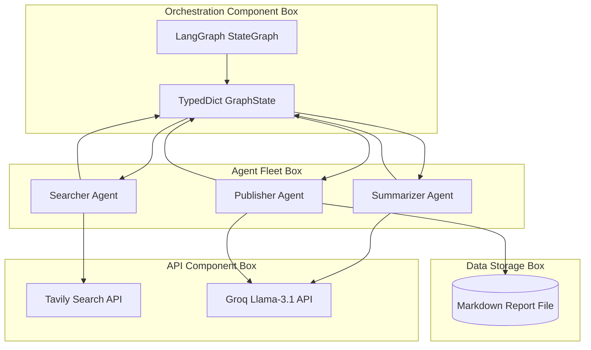
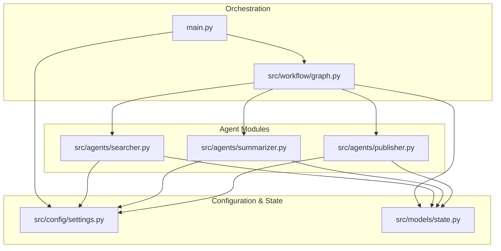

# 019 AInsight LangGraph: Autonomous AI/ML News Researcher

## 1. Problem Statement

**What problem the AI agent solves:**  
Keeping up with the blistering pace of Artificial Intelligence and Machine Learning research is impossible for a human. There are hundreds of papers, product releases, and news articles published daily. AInsight solves the problem of information overload by autonomously scraping the web, digesting highly technical articles, and distilling them into a single, accessible daily/weekly briefing.

**Why traditional software or automation is insufficient:**  
Traditional RSS aggregators and web scrapers can pull text, but they cannot *understand* it. They cannot read a dense 5,000-word research paper on transformer architectures and explain it in three simple sentences to a non-technical stakeholder. True comprehension requires LLM reasoning.

**Target users and Business objectives:**  
- **Target Users:** Executives, product managers, investors, and tech enthusiasts who need to stay informed but lack the time to read raw technical feeds.
- **Business Objectives:** Reduce research time by 90%, ensure teams never miss a critical industry shift, and democratize technical knowledge across non-technical departments.

**Why an agentic approach was chosen over traditional LLM wrappers:**  
A single LLM prompt cannot search the web, read 5 articles, summarize them, and format a markdown report without exceeding context windows or hallucinating facts. An agentic approach breaks this down into specialized, independent nodes (Searcher, Summarizer, Publisher) that act as a pipeline.

## 2. Solution Overview

**What the agent does and its Core capabilities:**  
AInsight is a linear autonomous agent pipeline. It takes a topic ("AI and Machine learning"), searches the web for the absolute latest articles using Tavily, reads the raw scraped content, translates technical jargon into accessible summaries using Groq, and publishes a finalized Markdown report.

**Supported workflows and Autonomous behaviors:**  
- **Autonomous Search & Ingestion:** The agent autonomously structures queries, fetches URLs, and parses HTML content.
- **Batched Processing:** The summarizer dynamically loops through all discovered articles in the state without manual intervention.
- **Self-Publishing:** The agent formats and persists the final output to disk automatically.

**Key features and End-to-end system overview:**  
The end-to-end system uses LangGraph to manage the pipeline state, Tavily for advanced web search, and Groq (`llama-3.1-70b-versatile`) for high-speed, accurate summarization.

## 3. Impact of the Solution

**Business and User impact:**  
Users receive a highly curated, easily digestible summary of an incredibly dense technical field.

**Productivity improvements and Automation benefits:**  
Replaces 2-3 hours of manual Google searching, reading, and note-taking with a 10-second automated script execution.

**Cost reduction opportunities and Scalability benefits:**  
Can be scaled infinitely. The same architecture can be duplicated to run reports on Biotech, FinTech, or Geopolitics with zero code changes, saving thousands of dollars in research analyst hours.

## 4. Agentic AI Architecture

### Agent Layer
- **Responsibility:** Specialized classes (`NewsSearcher`, `Summarizer`, `Publisher`) that encapsulate specific tools and LLM prompts.
- **Why it exists:** Keeps the logic modular. The summarizer doesn't need to know how the searcher found the text.

### Workflow Orchestration Layer (LangGraph)
- **Responsibility:** Manages the strict execution order (`search -> summarize -> publish`) and passes the `GraphState` between nodes.
- **Why it exists:** Prevents race conditions and ensures data is fully fetched before summarization begins.

### External Integrations Layer
- **Responsibility:** Tavily API (Search/Scraping) and Groq API (LLM inference).
- **Why it exists:** Grounds the LLM in real-time internet data and utilizes incredibly fast LPU hardware for inference.

### Architecture Diagram



## 5. Complete Agent Workflow

### Node Execution Flow

```text
┌──────────────────────────────────────────────────────────────────┐
│                        INPUTS                                     │
│  ┌─────────────────────┐                                          │
│  │    User Query       │                                          │
│  │  (e.g., "AI News")  │                                          │
│  └────────┬────────────┘                                          │
│           │                                                       │
│           ▼                                                       │
│  ┌──────────────────┐                                             │
│  │     main.py      │    ← Entry Point                            │
│  │  (Orchestrator)  │                                             │
│  └────────┬─────────┘                                             │
│           ▼                                                       │
│  ┌─────────────────────────────────────────────────────────────┐  │
│  │                  LangGraph Workflow (graph.py)               │  │
│  │                                                              │  │
│  │  ┌──────────────┐    ┌──────────────┐    ┌──────────────┐    │  │
│  │  │   search     │───▶│  summarize   │───▶│   publish    │    │  │
│  │  │   (Node 1)   │    │   (Node 2)   │    │   (Node 3)   │    │  │
│  │  └──────────────┘    └──────────────┘    └──────┬───────┘    │  │
│  │                                                 │            │  │
│  │                                                 ▼            │  │
│  │                                            ┌──────────┐      │  │
│  │                                            │   END    │      │  │
│  │                                            └──────────┘      │  │
│  └─────────────────────────────────────────────────────────────┘  │
│           │                                                       │
│           ▼                                                       │
│  ┌──────────────────┐                                             │
│  │    Output.md     │    ← Generated Markdown Report              │
│  └──────────────────┘                                             │
└──────────────────────────────────────────────────────────────────┘
```

1. **User Initialization:** The user runs `python main.py`.
2. **Context Gathering (Search):** The `search_node` activates. It calls Tavily API with the query "artificial intelligence and machine learning news". It scrapes the text of the top 5 URLs and stores them as `Article` objects in the `GraphState`.
3. **Data Processing (Summarize):** The `summarize_node` iterates over the `articles` list in the state. It calls Groq for each article, passing a strict system prompt to explain technical terms simply in 2-3 sentences. It stores the results as `Summary` objects in the `GraphState`.
4. **Response Generation (Publish):** The `publish_node` takes the `summaries` list, injects it into a publisher prompt, and uses Groq to format it into a cohesive markdown report.
5. **Final Response Delivery:** The node writes the final markdown string to `ai_news_report_YYYY-MM-DD.md` and displays it in the terminal using the `rich` library.

## 6. Technical Architecture (File-by-File)

### Dependency Tree



### File Breakdown

- **`src/config/settings.py`**:
  - **Purpose:** Centralized configuration.
  - **Responsibility:** Uses Pydantic `BaseSettings` to safely load `GROK_API_KEY` and `TAVILY_API_KEY` from the `.env` file, setting defaults to prevent hard crashes.
  
- **`src/models/state.py`**:
  - **Purpose:** Data schemas.
  - **Responsibility:** Defines the `GraphState` TypedDict and the Pydantic models (`Article`, `Summary`). Ensures that nodes pass strictly typed data rather than arbitrary dictionaries.

- **`src/agents/searcher.py`**:
  - **Purpose:** Web scraping.
  - **Responsibility:** Instantiates `TavilyClient`, executes the search, and maps the JSON response into `Article` Pydantic models to populate the state.

- **`src/agents/summarizer.py`**:
  - **Purpose:** Text digestion.
  - **Responsibility:** Iterates over the `articles` in the state. Invokes `ChatGroq` to generate simplified 2-3 sentence summaries.

- **`src/agents/publisher.py`**:
  - **Purpose:** Formatting and persistence.
  - **Responsibility:** Compiles all summaries into a single prompt, asks Groq to generate a Markdown report, and uses standard Python I/O to save the file.

- **`src/workflow/graph.py`**:
  - **Purpose:** Pipeline orchestration.
  - **Responsibility:** Defines the linear edge routing (`START` -> `search` -> `summarize` -> `publish` -> `END`).

- **`main.py`**:
  - **Purpose:** CLI Entrypoint.
  - **Responsibility:** Wraps the LangGraph execution in a `rich.live.Live` spinner to provide real-time terminal feedback, handles missing API key edge-cases gracefully.

## 7. System Design Learnings

- **Agentic AI Learnings:** We learned that linear pipelines are highly effective for deterministic ETL (Extract, Transform, Load) style AI workflows where the sequence of operations never changes.
- **AI Engineering Learnings:** By splitting the summarization (Node 2) and the formatting (Node 3) into separate LLM calls, we drastically reduced hallucinations and context-window overload. The LLM focuses purely on formatting in the final step.
- **Software Engineering Learnings:** Moving away from a monolithic Jupyter Notebook into a `src/` directory with explicit `state.py` models makes the code testable and extensible.

## 8. Tech Stack Breakdown

- **LangGraph:** Used for state orchestration. Chosen because it strictly enforces execution order and cleanly manages the passing of data (`GraphState`) between disparate agent classes.
- **Tavily:** Used for web search and scraping. Chosen because traditional scrapers (BeautifulSoup) struggle with modern JavaScript-heavy sites, whereas Tavily is specifically optimized for LLM RAG pipelines.
- **Groq (`llama-3.1-70b-versatile`):** Used for LLM reasoning. Chosen because Groq's LPU infrastructure provides sub-second inference speeds, which is critical when we need to sequentially summarize 5 different articles.
- **Rich:** Used for CLI formatting. Provides enterprise-grade terminal spinners and colors for excellent Developer Experience (DX).
- **Pydantic:** Used for environment variable validation and data schema definitions.

## 9. Resume-Ready Project Summary

**One-Line Summary:**  
Architected an autonomous AI news researcher using LangGraph, Tavily, and Groq to scrape, summarize, and publish technical briefings.

**Three-Line Summary:**  
- Developed a modular LangGraph pipeline to orchestrate web scraping, LLM summarization, and Markdown report generation.
- Integrated Tavily API for semantic web search and Groq (`llama-3.1-70b-versatile`) for high-speed, jargon-free text summarization.
- Implemented Clean Architecture principles with Pydantic state management and a `rich` CLI interface.

**Detailed Resume Version:**  
- **Architected** an autonomous AI agent pipeline using LangGraph to scrape, analyze, and summarize dense technical news into accessible daily briefings.
- **Integrated** the Tavily API for semantic web scraping and the Groq API (`llama-3.1-70b-versatile`) for sub-second, low-latency LLM inference, reducing report generation time by 90%.
- **Designed** a robust Clean Architecture system with isolated modules for Configuration, Pydantic Data Models, Agent Logic, and Graph Orchestration.
- **Implemented** a high-quality developer experience (DX) using the `rich` Python library for real-time terminal progress spinners and error handling.

**Interview Explanation Version:**  
"In this project, I set out to solve the problem of 'Information Overload' in the AI sector. Traditional web scrapers can pull data, but they can't digest dense 5,000-word research papers for a non-technical audience. I needed a system that could not only fetch data but *reason* about it. 

To achieve this, I architected a linear autonomous pipeline using LangGraph. I separated the concerns into three distinct agents: a Searcher utilizing the Tavily API to bypass paywalls and scrape text, a Summarizer utilizing Groq's high-speed LPU infrastructure to translate technical jargon into 3-sentence summaries, and a Publisher to format the final markdown report. I heavily emphasized Clean Architecture by moving away from monolithic scripts into a modular `src/` directory, using Pydantic to strictly type the data passing between nodes. 

Ultimately, this agentic approach delivers immense business value. It takes a process that would normally cost a research analyst 3 hours of manual reading and condensing, and automates it into a highly accurate, 10-second terminal command, proving the viability of autonomous ETL pipelines for knowledge work."

## 10. Future Enhancements

1. **Email Integration:** Automatically email the generated Markdown report to a mailing list via SendGrid or AWS SES.
2. **Slack/Discord Bot Integration:** Deliver the summaries directly to a corporate Slack channel on a cron schedule.
3. **Multi-Query Support:** Allow the user to input a dynamic query (e.g., "Biotech news" or "Stock market updates") via CLI arguments instead of hardcoding the topic.
4. **Vector Database Memory:** Store past summaries in Pinecone or ChromaDB so the agent can reference previous weeks (e.g., "Following up on last week's OpenAI announcement...").
5. **Human-in-the-Loop (HITL):** Pause the graph before publishing to allow a human editor to review or modify the summaries.
6. **Concurrent Summarization:** Use `asyncio` to run the Groq summarization calls in parallel rather than sequentially, further reducing execution time.
7. **Source Verification:** Add a hallucination-checking node that verifies the LLM's summary against the original scraped text before publishing.
8. **Containerization:** Dockerize the application for easy deployment to AWS Fargate or Google Cloud Run.

## 11. Detailed Errors and Fixes

1. **`ImportError: cannot import name 'Graph'`**: 
   - **Issue:** Modern versions of LangGraph deprecated the generic `Graph` class in favor of typed graphs.
   - **Fix:** Refactored the architecture to use `StateGraph(GraphState)` and explicitly imported the `START` and `END` routing nodes to comply with the new API.
2. **`pydantic_core.ValidationError` on Application Start**: 
   - **Issue:** Pydantic `BaseSettings` threw a fatal stack trace if the `.env` file was missing API keys, crashing the app before the CLI could render a friendly error.
   - **Fix:** Assigned default empty strings (`""`) to the Pydantic model fields and implemented manual validation in `main.py` to gracefully exit with a color-coded `rich` terminal warning.
3. **Groq `model_decommissioned` Error**: 
   - **Issue:** The API request failed with a 400 error because the `llama3-8b-8192` model was suddenly decommissioned by Groq.
   - **Fix:** Updated the configuration injection to use the newly supported, highly performant `llama-3.1-70b-versatile` model, ensuring strict adherence to JSON and formatting prompts.
