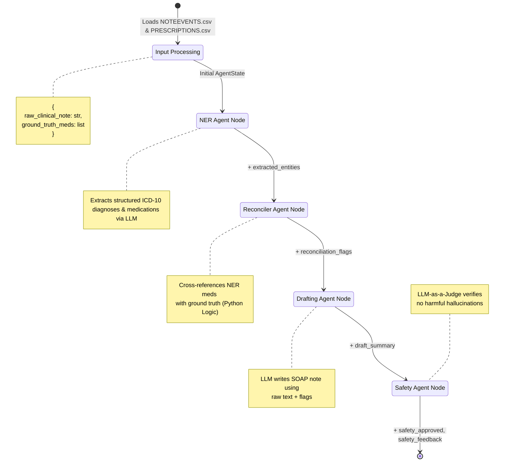
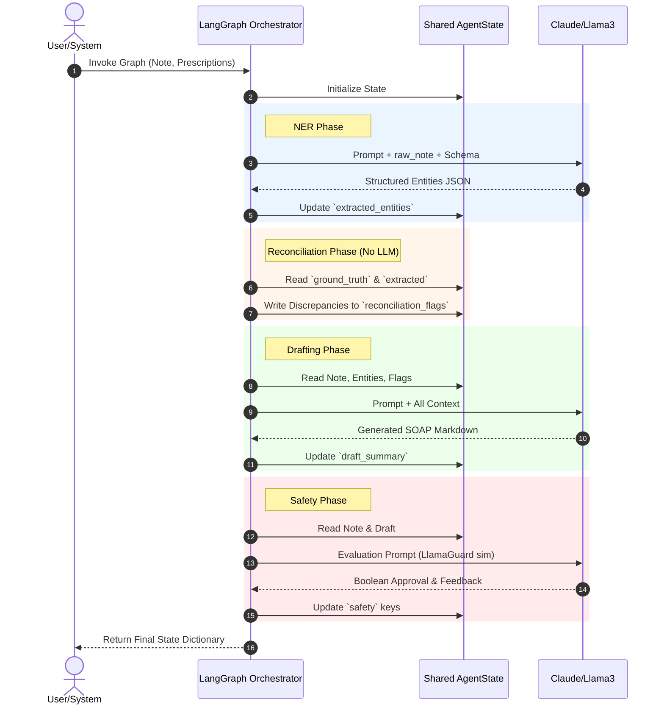
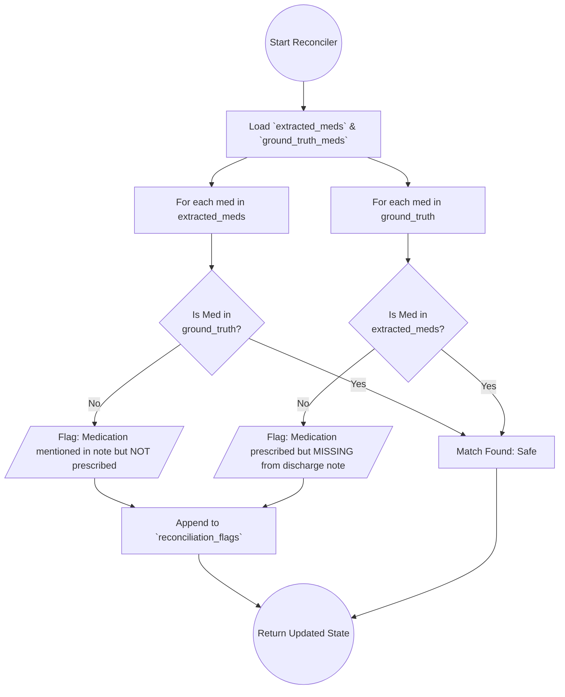
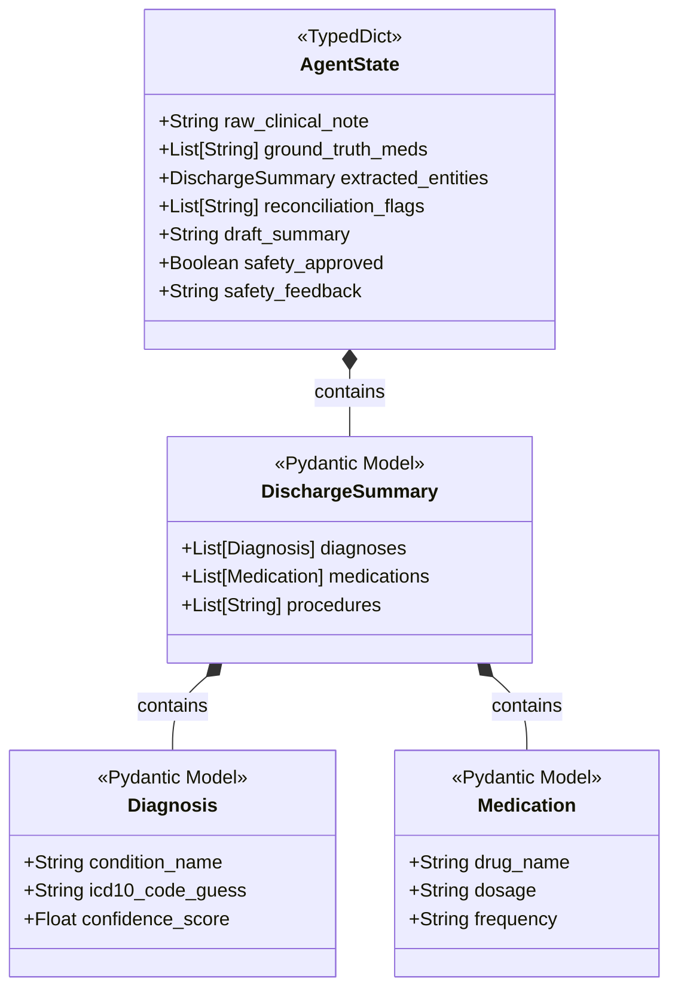
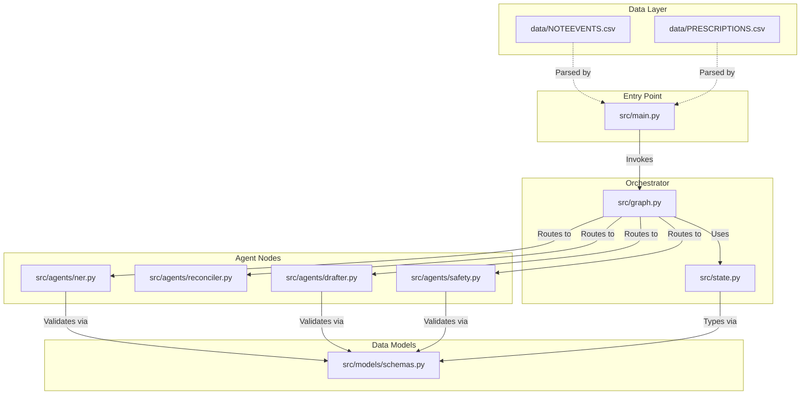

# Visual Architecture & System Diagrams

This document focuses entirely on the structural and visual representation of the **Agentic Patient Discharge Summary Generator**.

## 1. High-Level Enterprise Architecture (Full Spec)
*This diagram represents the complete production environment, including AWS deployment layers, data ingestion, the AI processing core, and final export.*

```mermaid
graph TB
    subgraph "Data Ingestion Layer"
        S3[(AWS S3\nRaw Data)]
        PDF[PDF Uploads]
        HL7[HL7 / CSV Feeds]
        S3 -.-> PDF & HL7
    end

    subgraph "Compute & Orchestration Layer (AWS ECS Fargate)"
        subgraph "LangGraph Core"
            Parser[Document Parser Agent]
            NER[Medical NER Agent]
            Recon[Reconciler Agent]
            Draft[Drafting Agent]
            Safe[Safety Agent]
            
            Parser -->|Extracted Text| NER
            NER -->|Entities| Recon
            Recon -->|Flags| Draft
            Draft -->|Draft| Safe
        end
    end

    subgraph "Human-in-the-Loop & Export Layer"
        UI{{Streamlit Physician UI}}
        Cognito((AWS Cognito Auth))
        DB[(PostgreSQL\nAudit DB)]
        FHIR[[AWS HealthLake\nFHIR Export]]
    end

    PDF & HL7 --> Parser
    Safe -->|If Flags/Issues| UI
    Safe -->|If Approved| FHIR
    UI -->|Manual Override| FHIR
    UI -.-> Cognito
    LangGraph Core -.->|Audit Logs| DB

    %% Styling
    classDef aws fill:#FF9900,stroke:#232F3E,stroke-width:2px,color:white;
    classDef ai fill:#00A4A6,stroke:#005555,stroke-width:2px,color:white;
    classDef data fill:#3F88C5,stroke:#1A3A53,stroke-width:2px,color:white;
    
    class S3,Cognito,FHIR aws;
    class Parser,NER,Recon,Draft,Safe ai;
    class PDF,HL7,DB,UI data;
```

---

## 2. Core LangGraph State Machine (Current MVP)
*This details the exact Directed Acyclic Graph (DAG) executed in `src/graph.py` and how the memory (`AgentState`) is updated at each node.*



---

## 3. Data Flow & State Evolution (Sequence Diagram)
*This visualizes the chronological communication between the Orchestrator, the LLMs, and the shared `AgentState`.*



---

## 4. Medication Reconciliation Logic Tree
*A deep dive into how `src/agents/reconciler.py` determines flags without using generative AI.*



---

## 5. Pydantic Data Models (Class Diagram)
*This shows the strict data contracts defined in `src/models/schemas.py` that force the LLM to output predictable JSON.*



---

## 6. Codebase File Dependency Graph
*Visualizing how the Python files interact and import each other in the `src/` directory.*


